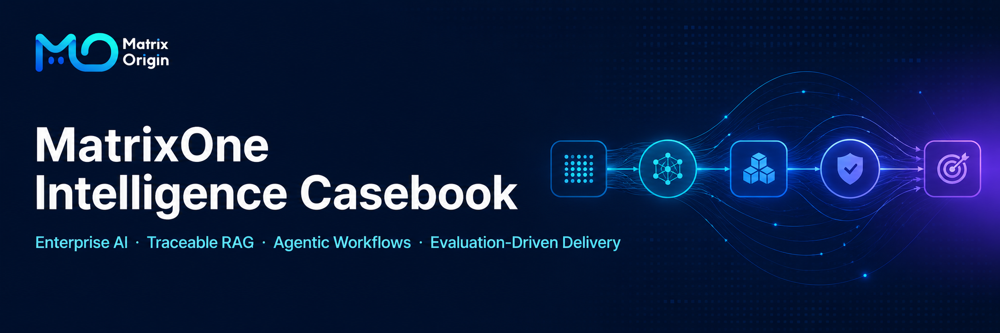
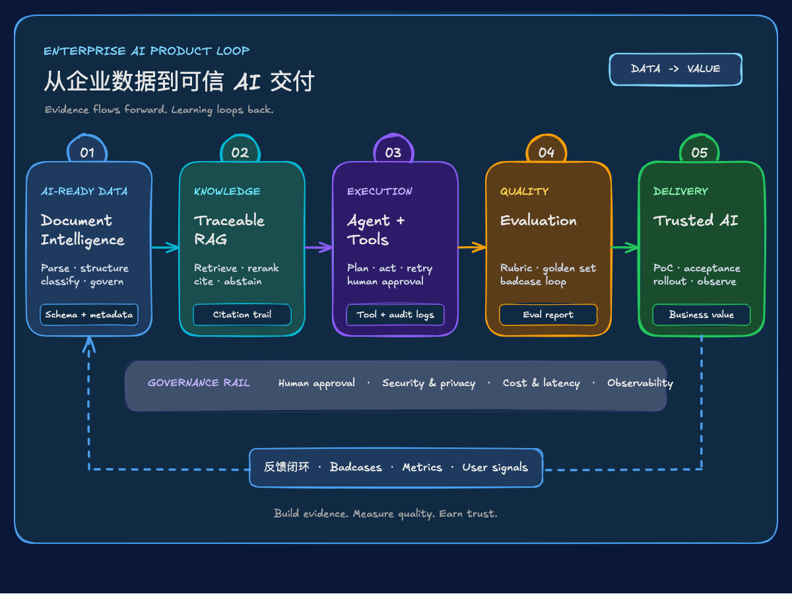

  

# 🐱 MatrixOne Intelligence Casebook

### Enterprise AI Product Casebook

  
  
  

Document Intelligence & RAG · Long-Horizon Agent Systems · AI Product Evaluation & PoC

[Research](docs/research/) · [PRD](docs/prd/) · [PoC](docs/poc/) · [Product](product/) · [中文](README.md)

  

> [!IMPORTANT]
> This is a public-release draft for a personal portfolio. Every asset must be independently recreated, redacted, and approved before publication. The repository must never contain employer code, customer data, internal documents, non-public metrics, or credentials.

## The Product Loop

This casebook explains how enterprise data, models, tools, workflows, evaluation, and human judgment work together to deliver reliable AI products.

| Case | Focus | Evidence |
| --- | --- | --- |
| [Document Intelligence & RAG Design](docs/prd/document-intelligence/) | How complex documents become searchable, traceable knowledge. | Parsing, structured extraction, RAG design, citations, and evaluation. |
| [Long-Horizon Agent System Design](docs/prd/agentic-data-workflow/) | How multi-step tasks are planned, coordinated, recovered, and verified. | Agent architecture, tool contracts, state and memory, recovery, and evaluation. |
| [AI Product Evaluation & PoC](docs/poc/enterprise-ai-solution/) | How evaluation, acceptance, and retrospectives determine whether an AI product is ready to deliver. | Problem framing, PoC scope, acceptance criteria, risks, and rollout plan. |

See the [JD Evidence Matrix](docs/prd/casebook/jd-evidence-matrix.md) for a capability-to-artifact map and [DISCLAIMER.md](DISCLAIMER.md) for the public-release boundary.
