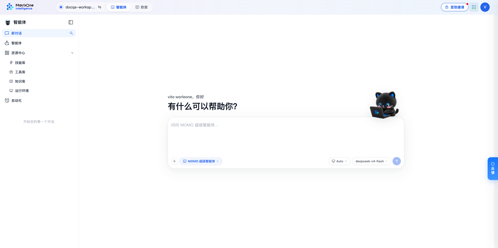
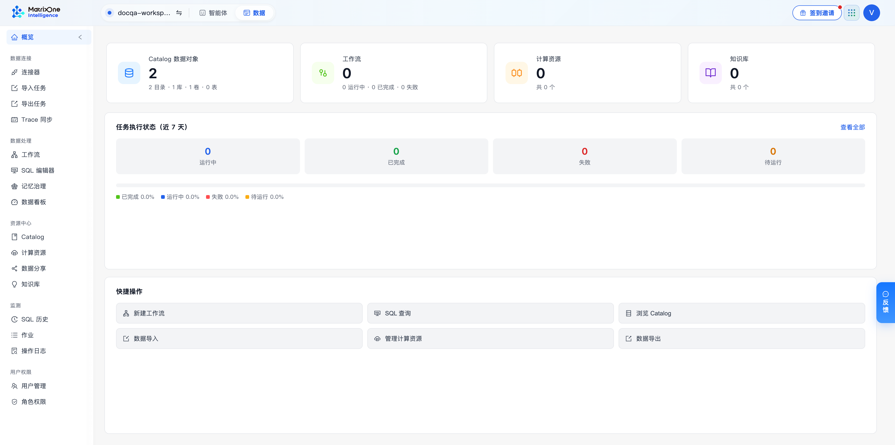

  

# MatrixOne Intelligence Casebook

> An enterprise AI product casebook: from document understanding and task execution to verifiable delivery.
>
> <a href="README.md">中文</a> · <strong>English</strong>

  <a href="https://moi-platform-prototype-qz3dx8ua9-vit30570-4455s-projects.vercel.app/app-dev/index.html"><strong>▶ Explore the MOI platform prototype</strong></a>

<strong>Prototype previews (click to expand)</strong>

 

<em>Agent workbench: conversation entry point and resource center.</em>

  

<em>Data workbench: an overview of data objects, workflows, compute resources, and knowledge bases.</em>

## Contents

### [MOI Platform PRDs](docs/prd/)

Product requirements spanning data ingestion, workflow processing, knowledge retrieval, Agent applications, API integration, and platform governance.

### [RAG Research](docs/research/rag/)

Research and design judgment for enterprise knowledge retrieval, complex document understanding, and traceable evidence.

### [PoC Playbook](docs/poc/)

A delivery approach from problem framing and validation scope through acceptance and retrospective.

## Further reading

[Research](docs/research/) · [Platform PRDs](docs/prd/) · [PoC playbook](docs/poc/) · [Product prototype](product/moi-platform-prototype/) · [Publication policy](DISCLAIMER.md)
