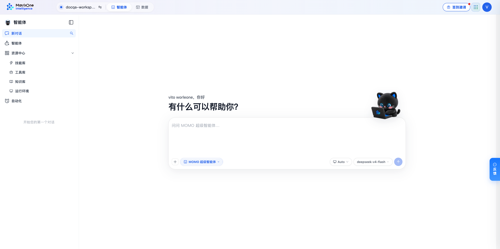
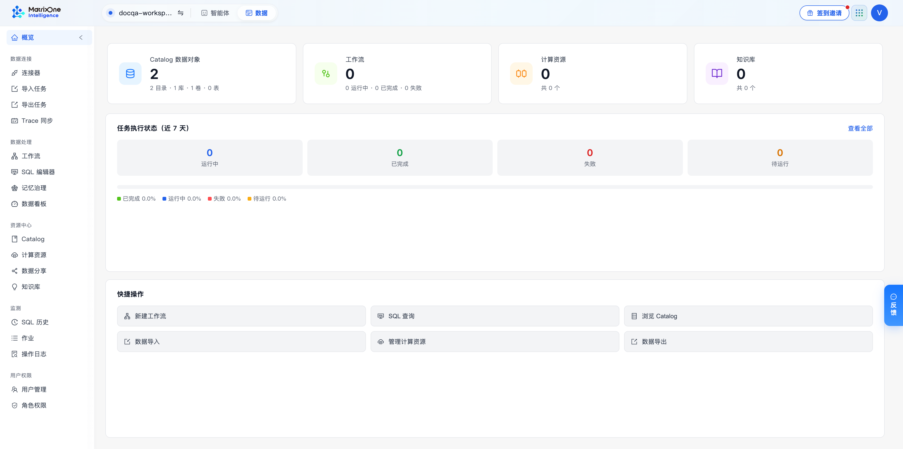

  

# MatrixOne Intelligence Casebook

> An enterprise AI product casebook: from document understanding and task execution to verifiable delivery.

<a href="README.md">中文</a> | <strong>English</strong>

  
  
  

## Workflow interaction demo

This 1080p video shows goal entry, plan formation, and node edits.

https://github.com/user-attachments/assets/242fd58e-8d4c-488a-b59d-9a357e252049

[Read the original workflow design documents](docs/architecture/canvasflow-workflow/)

## Astra runtime demo

See how Astra keeps context for a long CLI task, explains what it cut, and shows the execution analysis. This 90-second video comes from the [official Astra repository](https://github.com/matrixorigin/Astra).

https://github.com/user-attachments/assets/c008be26-4320-413c-9ad6-100aefcfa728

## Prototype previews

<em>Agent workbench: conversation entry point and resource center.</em>

  

<em>Data workbench: an overview of data objects, workflows, compute resources, and knowledge bases.</em>

## Start here: product overview and my work

[Product overview and internship work (Chinese)](docs/product-overview.md)

My work focused on workflow and knowledge-base product design, with participation in agent and Astra integration planning, alongside scenario acceptance design, product documentation, and remote demos. The overview connects concrete product rules to public design cases and explains the scope of each type of material.

## Contents

### [MOI Platform PRDs](docs/prd/)

Product requirements spanning data ingestion, workflow processing, knowledge retrieval, Agent applications, API integration, and platform governance.

[Workflow design source documents](docs/architecture/canvasflow-workflow/) preserve the original decisions, contracts, and observed runs.

### [RAG Research](docs/research/rag/)

Research and design judgment for enterprise knowledge retrieval, complex document understanding, and traceable evidence.

### [PoC Playbook](docs/poc/)

A delivery approach from problem framing and validation scope through acceptance and retrospective.

## Further reading

[Research](docs/research/) · [Platform PRDs](docs/prd/) · [PoC playbook](docs/poc/) · [Product prototype](product/moi-platform-prototype/) · [Publication policy](DISCLAIMER.md)
