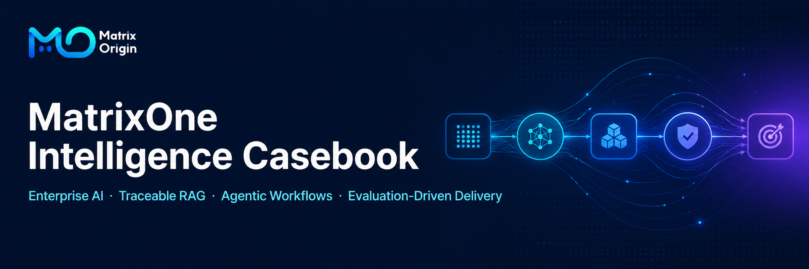
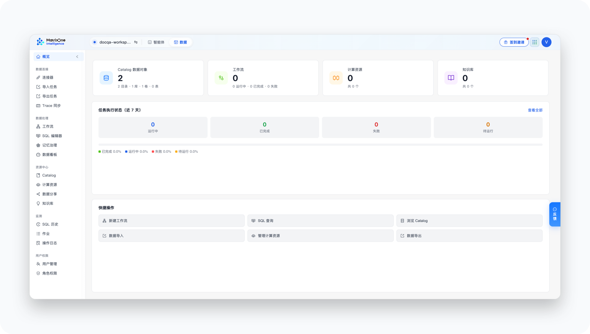
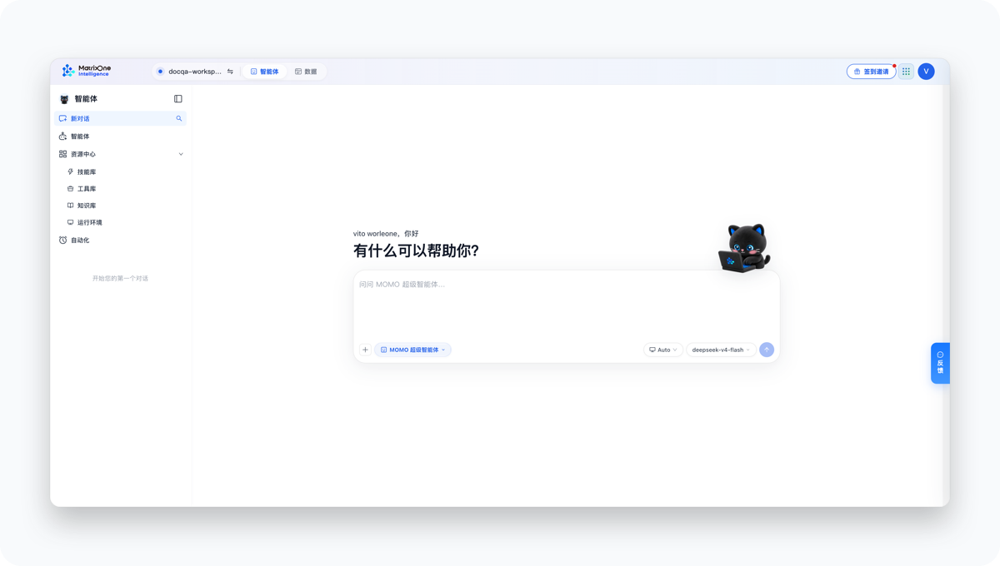

  

# MatrixOne Intelligence

<a href="README.md">中文</a> | <strong>English</strong>

  
  
  

## What is MOI?

MatrixOne Intelligence (MOI) connects enterprise data processing, knowledge management, and agent tasks. This casebook presents interaction prototypes, product rules, and validation scenarios for workflows, knowledge bases, agents, and Astra runtime integration.

## Workflows: processing data and running flows

Workflows organize parsing, cleaning, extraction, and other processing steps into definitions that can be saved and reused. A definition specifies nodes, parameters, and input/output bindings; each run produces job status, node results, and logs so users can inspect outputs or locate failures. The [MOI workflow PRD](docs/prd/02-workflow-processing/complex-workflow-management-prd.md) covers creation, editing, execution, and troubleshooting.

### Workflow interaction demo

https://github.com/user-attachments/assets/22bb82d2-bb80-4fc4-8a91-1febaeabbd1e

> [!NOTE]
> Read more: [Workflow design documents](docs/architecture/canvasflow-workflow/) · [MOI workflow PRD](docs/prd/02-workflow-processing/complex-workflow-management-prd.md)

## Knowledge bases: sources, tables, and semantics

Knowledge bases manage the sources, processing state, and query scope of documents and structured business tables. Documents need traceable parsed content, chunks, index versions, and citations; business semantics define metrics, field meanings, and table relationships. Agentic RAG finds and organizes document evidence for a question, while NL2SQL turns a natural-language question into a query constrained by business definitions. Results should be checkable against source material or SQL. The [knowledge management PRD](docs/prd/03-knowledge-search/knowledge-management-prd.md), [Agentic RAG architecture](docs/architecture/knowledge-base/agentic-rag-query.md), and [NL2SQL semantic layer design](docs/prd/03-knowledge-search/nl2sql-semantic-layer-prd.md) develop these areas.

- [**Data workbench**](product/moi-platform-prototype/) — Entry points for data objects, workflows, compute resources, and knowledge bases. Click the image for full resolution.

## Agents and Astra: configuration and execution

Agents combine a task goal, knowledge bases, skills, tools, and external connections in an editable application configuration. Users can inspect candidate settings and resource permissions, monitor progress and tool results, and save or publish versions. The [agent workbench PRD](docs/prd/04-agent-applications/agent-workbench-prd.md) covers task interaction, resource binding, and outputs.

- [**Agent workbench**](product/moi-platform-prototype/) — Start a task from the conversation entry point and access agents and resources. Click the image for full resolution.

### Astra runtime demo

https://github.com/user-attachments/assets/c008be26-4320-413c-9ad6-100aefcfa728

> [!NOTE]
> Read more: [Astra runtime architecture and design](docs/architecture/astra-runtime/) · [MOI product overview](docs/product-overview.md)

## My work and deliverables

My main product design work focused on workflows and knowledge bases. I also contributed to agent and Astra product integration, then carried the design into scenario acceptance, product guidance, and a remote demo.

| Area | My work and material to explore |
| --- | --- |
|  **Workflow design** | I defined the creation and editing flow, parsing configuration, node input/output bindings, and run diagnostics, including the distinction between a workflow definition, a published version, and an individual run. [Workflow PRD](docs/prd/02-workflow-processing/complex-workflow-management-prd.md) |
|  **Knowledge-base design** | I organized file and business-table management and developed the Agentic RAG, NL2SQL, and semantic-configuration paths, including source scope, citations, and maintenance actions for incorrect answers. [Knowledge-base architecture](docs/architecture/knowledge-base/) |
|  **Agent and Astra integration** | I helped define how knowledge bases, skills, tools, and permissions enter an agent task, and how progress, failures, and outputs return to the product interface. [Integration requirements](docs/product-overview.md#6-astra平台能力如何进入-agent-运行时) |
|  **Storybook scenarios** | I designed prerequisites, fixed inputs, actions, assertions, failure evidence, and cleanup rules so key tasks have reviewable acceptance paths. [Scenario index](storybook/INDEX.md) |
|  **Product guide and demo** | I wrote usage guidance and built a remote demo that connects configuration, task actions, and troubleshooting; resume screening is one example from input material to results. [Work overview](docs/product-overview.md) |

See the [documentation index](docs/) for research, PoCs, and evaluation. These pages present design and acceptance materials; run conclusions depend on recorded evidence. [Publication scope](DISCLAIMER.md)
