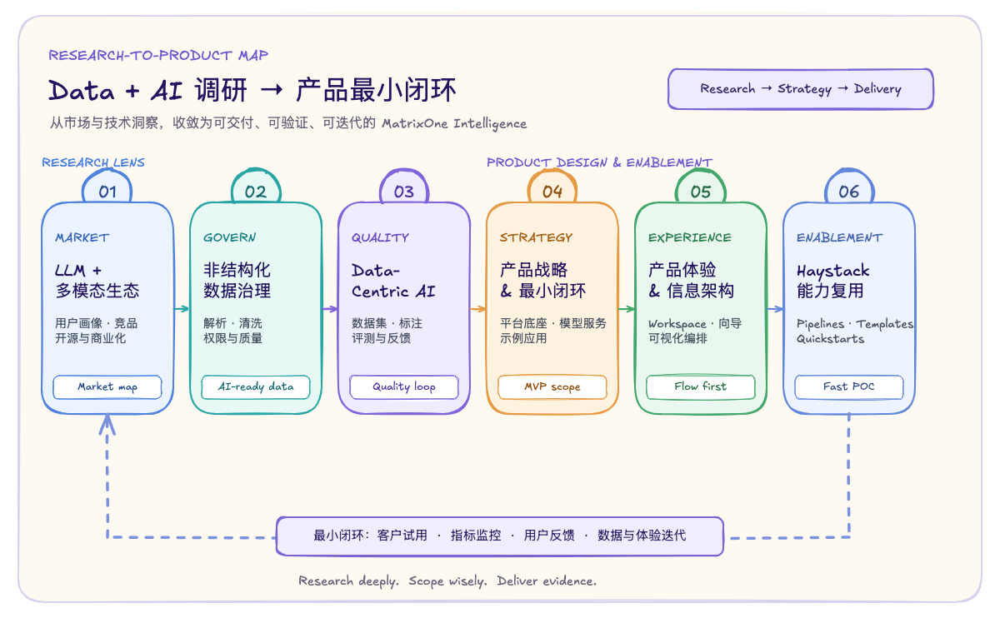

# Data + AI 调研：从数据资产到可信 AI 产品

> 面向 LLM 与多模态场景的产品调研、技术选型与 MatrixOne Intelligence 产品策略导览。

## 什么是 Data + AI

Data + AI 不是把数据库、文档和大模型简单拼接在一起，而是一条把企业原始数据持续转化为可用 AI 能力的产品链路。

在企业场景中，数据往往来自文档、图片、音视频、业务系统、日志和 API。它们需要先被接入、解析、清洗、治理和组织，才能成为可检索、可追溯、受权限控制的知识与数据集；随后，模型、检索、Agent 和应用才能基于这些可信输入提供问答、搜索、自动化工作流等业务价值。最后，用户反馈、质量指标和 Badcase 又会回流到数据与体验层，驱动下一轮迭代。

因此，Data + AI 产品的核心不是单点模型能力，而是建立一个可复用的闭环：

**数据接入与治理 → AI-ready 数据与知识 → 模型和应用 → 效果度量与反馈 → 持续优化。**

对于 MatrixOne Intelligence，这意味着以数据平台作为底座，连接非结构化数据处理、向量检索、安全权限与大模型服务，再用文档问答、智能搜索、Agent 等示例应用验证客户价值。

## 调研到产品落地导览

下图把六个章节串成一条从调研洞察到产品落地的路径。前 3 章回答“要理解什么、解决什么数据问题”；后 3 章回答“产品如何收敛、如何体验、如何快速交付”。底部的反馈回路强调：一个最小闭环需要经过客户试用、指标监控和用户反馈的持续检验。

  

## 章节导读

| 章节 | 关注的问题 | 你将获得什么 |
| --- | --- | --- |
| [01 · LLM 与多模态大模型数据产品调研](chapters/01-llm-multimodal-data-products.md) | 面向 LLM 的数据产品覆盖哪些环节，谁在使用，市场上有哪些开源与商业方案？ | 从数据采集、解析、存储、标注、质量治理、增强合成到管线集成的全景图，以及用户画像、趋势和竞品线索。 |
| [02 · 非结构化数据治理：工具与选型](chapters/02-unstructured-data-governance.md) | 文档、图片、音视频等非结构化数据如何解析、清洗、组织并用于大模型？ | 常见治理工具、能力侧重点与选型思路，帮助识别 AI-ready 数据的关键要求。 |
| [03 · Data-Centric AI：核心数据环节与产品生态](chapters/03-data-centric-ai.md) | 在 LLM 与多模态时代，哪些数据环节最影响模型效果？ | 数据集构建、标注、清洗、增强、版本管理、质量评估和反馈闭环的产品生态与挑战。 |
| [04 · MatrixOne Intelligence：产品战略与最小闭环](chapters/04-product-strategy.md) | 如何从分散功能收敛为用户能理解、能购买、能验证的产品？ | 以“面向大模型的数据平台”为核心，采用平台底座 + 可插拔应用的产品分层，并聚焦可打透的 MVP 场景。 |
| [05 · MatrixOne Intelligence：产品体验与信息架构](chapters/05-product-experience.md) | 如何让数据处理、模型配置与应用使用形成连贯体验？ | 以 Workspace、向导式流程、可视化编排、可观测性和反馈机制连接用户路径。 |
| [06 · Haystack 能力复用与示例应用](chapters/06-haystack-enablement.md) | 如何把已有 Haystack 能力转化为可配置、可体验的产品能力？ | 围绕 Pipeline 构建文档问答、企业 Chatbot、多语言检索和 Agent 等 Quickstart，并补齐监控与调优。 |

## 专题调研

- [训练数据集格式](training-data/training-dataset-formats.md)：LlamaFactory 数据集快照、微调与偏好学习 schema、任务类型与数据格式的对应关系。

## 如何阅读这份调研

**想先判断机会与定位**：从第 1 章理解市场和用户，再阅读第 4 章收敛产品战略，最后用第 5 章检验体验是否能承接这条主线。

**想搭建一条数据到 AI 的工程路径**：从第 2 章明确非结构化数据治理要求，结合第 3 章选择数据质量与数据集策略，再在第 6 章找到可快速落地的 Pipeline 与示例应用。

**想理解完整产品闭环**：按图中顺序阅读 01 → 06。每一章都不是孤立能力：研究输入用于定义产品取舍，产品策略决定体验编排，平台与应用通过反馈数据持续改进。

## 这份调研希望回答的三个问题

1. 企业怎样把复杂、多模态的原始数据，转化为大模型可以可靠使用的知识和数据资产？
2. MatrixOne Intelligence 应该把哪些能力做成共用的产品底座，哪些能力做成可快速验证价值的应用或模板？
3. 如何通过可观察的指标与用户反馈，让数据质量、AI 效果和产品体验形成持续迭代？
