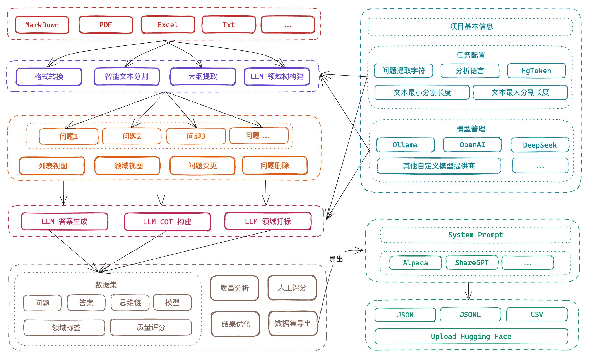
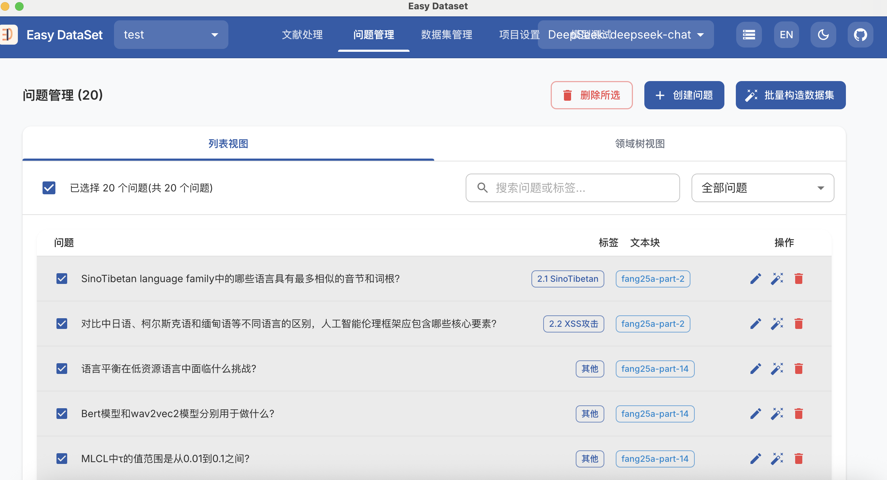
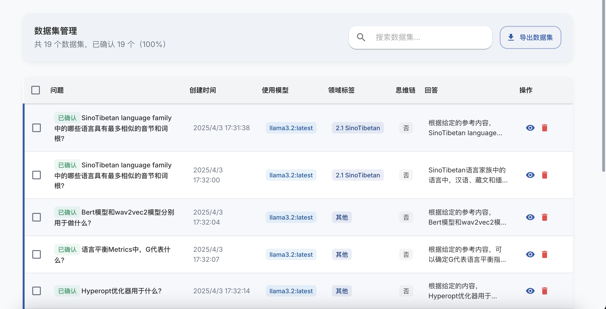
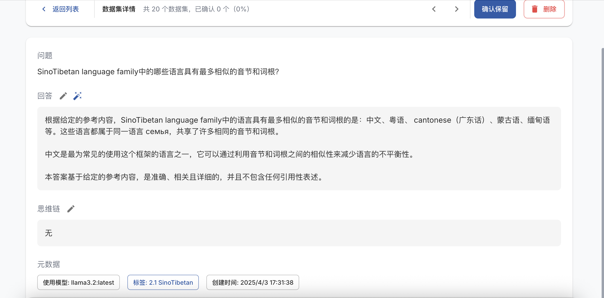
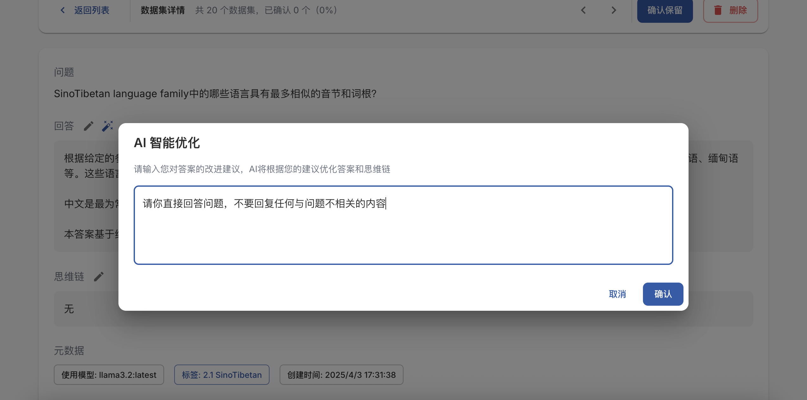
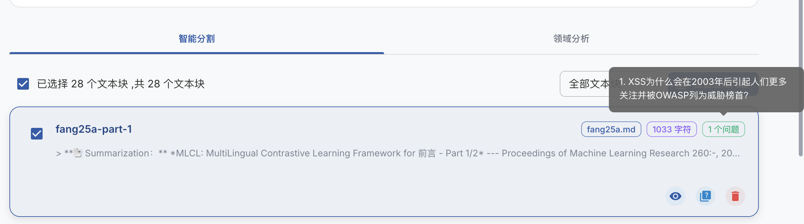
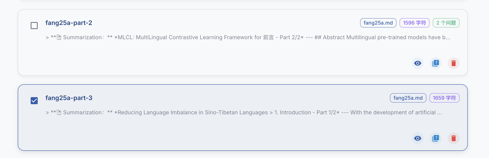
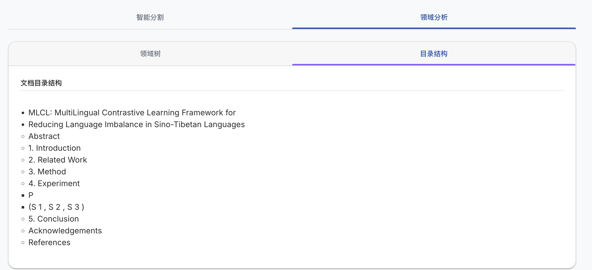
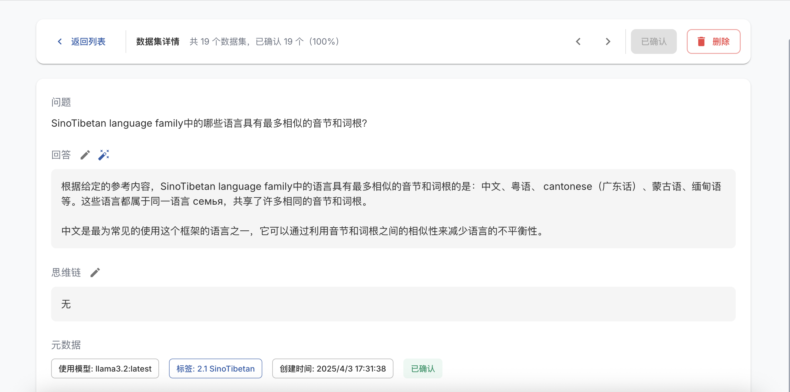
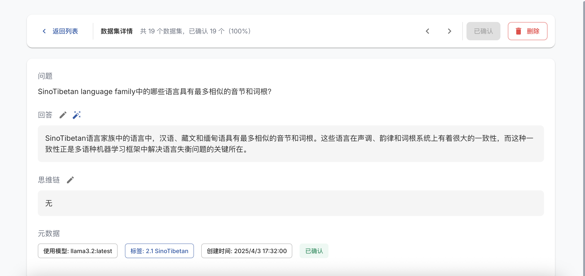

# Easy Dataset 产品调研

> 本文整理自原始调研与一次实际试用记录。已统一产品名称、链接、文件名与 Markdown 结构；测试结论及截图均予保留。

## 产品与资料校验

**Easy Dataset**（项目仓库名为 `easy-dataset`）是面向 LLM 微调数据集、RAG 和评测数据集构建的开源工具。当前官方 README 列出的能力包括多格式文档处理、文本分割、问题 / 答案生成、领域标签树、数据清洗、评测和多种导出格式。

原文中的“仅支持 Markdown”“不建议使用 Ollama”“后续才支持上传 Hugging Face”等描述均应视为当时的**测试配置或历史记录**，而不是当前产品限制：官方 README 现列出 PDF、Markdown、DOCX、TXT、EPUB 等输入，列出 Ollama 为支持的模型提供方，并标注了 Hugging Face 上传及 LLaMA Factory 配置集成能力。

### 参考资料

- [Easy Dataset 官方 GitHub 仓库](https://github.com/ConardLi/easy-dataset)
- [Easy Dataset 官方文档](https://docs.easy-dataset.com/)
- [原始调研参考：知乎文章](https://zhuanlan.zhihu.com/p/29942660863)
- [原始调研参考：Bilibili 视频](https://www.bilibili.com/video/BV1y8QpYGE57/)
- [原始调研参考：微信文章](https://mp.weixin.qq.com/s/0PUMbuiyXPUIXunMuH-otw)

## 概述

**Easy Dataset** 是一个专为创建大型语言模型（LLM）微调数据集而设计的应用程序。它提供了直观的界面，用于上传特定领域的文件，智能分割内容，生成问题，并为模型微调生成高质量的训练数据。

通过 Easy Dataset，您可以将领域知识转化为结构化数据集，且兼容所有遵循 OpenAI 格式的 LLM API，使微调过程变得简单高效。无论您是需要快速整理已有数据集，还是要从文本资料中批量生成问答与思考链（Chain-of-Thought，CoT），Easy Dataset 都能通过可视化和自动化的方式极大地提高生产效率。




## 用户痛点

在对大型语言模型进行微调的实际业务场景中，用户通常会面临以下挑战：

1. **对“如何构建训练集”完全无从下手**
    1. 很多团队此前仅通过人工方式整理数据，效率低且容易出错。
    2. 缺少可视化、自动化工具来辅助数据的生成与管理。
2. **无法直接“丢给 AI”，尤其是大文档的问答生成质量差**
    1. 一次性让模型生成对大文档的问答，往往效果不佳，且上下文丢失或缺陷明显。
    2. 分批生成后又容易出现重复、不连贯或遗漏的提问。
3. **面临上下文限制，难以合理分割长文档**
    1. 大模型有输入长度限制，需要切分文本，但手工切分耗时且易导致语义割裂，后续问答不准确。
    2. 分批生成后容易出现重复问题或重复内容，难以合并管理。
4. **已有初步数据集，但缺乏批量管理、标注和验证的工具**
    1. 数据散落在本地文件或多个格式中，手动校对、标注及版本管理都较繁琐。
    2. 缺少一个统一的“数据集管理中心”，对多份数据集进行合并、筛选、重命名或分发。
5. **想做细分领域标签，却不知道如何构建**
    1. 对特定领域或主题的知识有分层需求，比如“医学 > 内科 > 心血管”，但没有现成的工具可视化或轻松地组织这些标签。
    2. 手动维护字段或标签树可能会过于复杂，容易混淆或管理不善。
6. **想进行微调推理模型，但不知道如何构造思考链（Chain-of-Thought, CoT）**
    1. CoT 是目前提升模型解释性和效果的一种重要策略，但完全依赖手动编写 CoT 内容成本极高。
    2. 缺乏可辅助自动生成或模板化生成思考链的功能。
7. **数据集格式转换痛点**
    1. 从某种格式（例如自定义 JSON 格式）转换为 Alpaca 格式、ShareGPT 格式等，经常需要编写额外脚本或进行繁琐的手动编辑。
    2. 不清楚各格式之间需要如何对应处理，容易出错。

## 产品能力与痛点对应

针对上述痛点，**Easy Dataset** 提供了多项核心功能与优势：

1. **基于 AI 辅助生成数据集，不丢失准确性**
    1. 通过智能分割长文档，逐段生成高质量 QA；内置去重和合并策略。
    2. 结合领域标签与上下文，减少生成的错漏与重复问题。
2. **解决模型上下文限制导致的截断问题**
    1. 自动将文档切分成合适的段落，分段进行问答生成，并确保段落级别的完整性，减少重要内容丢失。
3. **批量构造数据集，自动生成 CoT 且避免重复**
    1. 在生成问答的同时，可插入思考链（CoT），让模型后续推理更具可解释性。
    2. 自动检测重复的问答内容，防止数据集冗余。
4. **灵活构建领域标签，按照“领域树”结构组织数据集**
    1. 将数据集根据“主题/行业/部门/领域”等分类标签进行分层管理，满足细分与大规模组织的需求。
    2. 便于后期检索、对比与模型微调时的选取。
5. **高效管理与质量校验**
    1. 提供可视化或半自动化界面对生成结果进行验证、编辑与批注；
    2. 利于团队协作，一体化存储和版本化的数据管理方式。
6. **便捷的格式转换**
    1. 在界面上或使用 API，直接将生成的数据集一键转换为多种常见格式（如 Alpaca、ShareGPT 等），免去编写转换脚本的烦恼。
    2. 保持兼容所有遵循 OpenAI 格式的微调 API。

## 本次测试：数据、数据集与模型对比

本次测试优先使用 Markdown 格式的输入文件；记录认为当文件数较多时，解析耗时会增加。

- 测试输入：`fang25a.pdfsurvry.md`
- 导出数据集：`test.json`、`test.jsonl`（原文写作 `test.jsonjsonl`，按常见文件后缀拆分）
- 对比方式：运行 `main.py`，对比微调后的 `Qwen2.5-32B-Instruct` 与原始模型输出。原始记录观察到微调模型略有改善，但仍与数据集答案存在距离，推测可能需要进一步调整微调参数。

### 模型输出对比

> 以下为原始测试记录中的 7 组问答。该测试未提供训练轮次、学习率、数据量、评测集或随机种子，因此只能作为一次观察记录，不能据此推导通用模型优劣。

#### 1. 语言平衡在低资源语言中面临什么挑战?

##### 微调模型输出

在低资源语言中实现语言平衡面临的主要挑战是：

1. **数据稀缺性**：低资源语言通常缺乏大量可获得的数字化文本或语音数据。这种稀缺性使得难以训练有效的模型来处理自然语言处理任务，如文本翻译、情感分析等。

2. **技术资源不足**：与高资源语言相比，针对低资源语言的技术和工具支持（如词典、形态分析器）往往较少或完全不存在，这限制了语言技术的开发和发展能力。

3. **人才短缺**：具备开发应用于这些语言的技术的专业人员数量往往很少，这不仅加剧了开发难度，也制约了新技能的学习和传播。

4. **语言和文化差异**：不同语言有着独特的语法结构、词义和使用习惯，比如一些语言中可能存在丰富的人称或格标记；而另一些则可能有复杂的动词变位。这为模型适应各种语言特征带来了挑战性。

5. **评估资源匮乏**：缺乏标准的评测数据集也很常见，这使得难以评估模型在这些语言上的性能。

6. **多模态数据缺乏**：在很多语言中，有声音、图片或视频等形式的多模态数据较少，若在多语言任务中缺乏多模态数据，对低资源语言模型的训练和改进构成了阻碍。

克服这些挑战需要跨学科合作，包括自然语言处理专家、语言学家以及当地社区成员，以便共同为低资源语言的发展做出贡献。

##### 原始模型输出

语言平衡在处理低资源语言时面临多种挑战。低资源语言是指那些缺乏大量数字资源（如文本、语音数据等）的语言。这些语言的平衡与常用语言（如英语、中文）相比，面临更多的难点。主要挑战包括：

1. **数据稀缺**：一个重要且基础的挑战是可用数据量的不足。大规模、高质量的文本和语音数据对于训练有效的机器学习模型至关重要。但低资源语言往往缺乏这样的数据资源，这限制了模型改进和优化的能力。

2. **资源开发成本高**：为一种低资源语言开发必要资源（如词典、标注数据集等）的成本远高于那些已有大量现有资源的语言。这不仅仅包括经济成本，还包括时间和劳动力成本。

3. **专业知识和人才的缺乏**：精通低资源语言且有语言学背景的知识人才匮乏。他们对于语言资源的开发和优化至关重要，但找到这样的人才非常困难。

4. **工具和技术的支持不足**：现有的自然语言处理（NLP）和机器学习技术大多数是基于高资源语言发展而来的，对于低资源语言适用性不高。需要针对低资源语言特点改进现有技术和方法。

5. **跨语言迁移学习的应用挑战**：虽然跨语言迁移学习（将从源语言学到的知识应用到目标语言）被认为是一个有潜力的方法来应对低资源情况，但它仍然面临诸如如何有效利用源语言知识、如何处理语言间差异等挑战。

6. **方言和多样性问题**：低资源语言中往往包含了多种方言和地区变体。这些变体之间的差异需要在技术开发过程中加以考虑，但现有资源往往不足以支持新变体的开发。

7. **文化和社会环境因素**：某些语言可能存在特有的文化和社会环境因素，如使用频率低、使用者分布广泛等，这些都会给技术开发带来额外挑战。

解决这些问题需要跨学科的努力，包括语言学、计算机科学、社会文化和语言技术开发者之间的紧密合作。

#### 2. Bert模型和wav2vec2模型分别用于做什么?

##### 微调模型输出

BERT（Bidirectional Encoder Representations from Transformers）和Wav2Vec2是两种不同的深度学习模型，它们分别在自然语言处理（NLP）和语音识别领域内发挥了重要作用，各自有着特定的应用场景。

1. **BERT模型**：BERT是2018年由Google发布的一种预训练模型，用于处理自然语言处理任务。它是一个基于Transformer架构的双向编码器表示，通过大量未标注文本进行预训练，之后可以根据具体任务进行微调。BERT被广泛应用于文本分类、情感分析、命名实体识别、问答系统等多个NLP任务上，展现了强大的性能。

2. **Wav2Vec2模型**：Wav2Vec2是由Facebook于2020年发布的一种用于语音识别任务的自监督模型。与传统的基于HMM（Hidden Markov Model）或RNN（Recurrent Neural Network）的语音识别不同，Wav2Vec2基于Transformer架构，能够直接从原始音频波形中提取特征，并预测段落级别的上下文信息。该模型在语音识别任务上取得了非常显著的效果，在不同程度和场景下的语音识别准确度上都有优异表现。

简而言之，BERT模型主要用于处理文本相关的NLP任务，而Wav2Vec2主要用于从音频波形中进行语音识别任务。

##### 原始模型输出

Bert模型和wav2vec2模型是两种不同类型的任务中使用的模型，它们在自然语言处理（NLP）和语音处理领域都非常流行。

1. **Bert模型（Bidirectional Encoder Representations from Transformers）**：

- **用途**：主要用于自然语言处理任务。它可以自动从大量无标注文本中学习词和短语的表示，而这些表示可以被用于多种下游的NLP任务，如文本分类、命名实体识别、情感分析、问答系统等。

- **特点**：Bert模型是一种基于Transformer架构的深度学习模型，其核心特点是双向编码——这意味着它同时考虑了上下文的影响，从而能够更好地理解单词在句子中的含义。

2. **wav2vec 2.0**：

- **用途**：主要用于语音处理任务，特别是语音识别。它可以将语音转换为文本，也适用于语音分类和语音理解等任务。

- **特点**：wav2vec 2.0 是一个自监督学习模型，意味着它能够在无需大量标注数据的情况下学习语音表示。它通过处理原始音频波形来学习良好的语音表示，这使得它能够在多种语音处理任务中表现突出。相比于第一代的wav2vec，wav2vec 2.0利用了Transformer架构，从而获得了更好的性能。

总结来说，Bert主要用于自然语言处理任务，而wav2vec 2.0主要用于语音处理任务。两者都是各自领域内重要的技术进步，通过在大规模数据集上进行预训练，它们可以更好地应用于具体的任务中。

#### 3. SinoTibetan language family中的哪些语言具有最多相似的音节和词根？

##### 微调模型输出

Sino-Tibetan 语言家族是一个非常大的语言家族，包括了汉语、藏语以及其他多种语言。这个语言家族内部的语音和词汇系统在不同语言之间有各种各样的相似之处，但相似程度较高的一般是在同一个分支内部的语言之间。例如：

1. **汉语和华南的一些语言**：比如南方的一些方言与中国西南语众如壮语、苗瑶语等都有不少相似的音节和词根。

2. **藏缅语族内**：比如藏语与现代川西边界的某些语言（例如嘉绒语、羌语）具有相似的音节和词汇，这些语言共享部分的词根。

然而，具体的音节和词汇的相似程度需要通过具体语言学分析来确定。例如，很多藏缅语族的语言都在它们的词根和语音系统中保持着相似的声音或模式，这是由于这些语言源自共同的祖先语言的原因。

就Sino-Tibetan语系而言，即便不同语言之间具有某些相似之处，但它们之间的词汇和语法差异可能仍然很大。而语言的相似度往往会随着它们在全球地理分布上的接近和共同历史的发展而有所增加。

##### 原始模型输出

Sino-Tibetan 语言家庭内包括了汉语和藏缅语族等多种语言。在讨论这些语言之间的相似性时，特别是音节和词根的相似性，必须注意到具体的语言分支和次分支。汉语和藏语是这个语系中两个最大和最知名的分支，但大多数具体的相似性研究通常集中在声音和词汇结构上。

不同语言中的音节和词根相似性主要取决于它们之间的历史联系和进化过程。一般来说，由于进化过程、地理隔离和语言接触等因素，即使是属于同一语系的两种语言也可能显示出显著的差异。

1. 汉语: 作为Sino-Tibetan 语系中一个独特的分支，汉语本身的各个方言之间体现了相当程度的相似性，尤其是在某些通用词汇上。例如，“山”、“水”等基本词汇在汉语的不同方言中有很多共同点。

2. 藏语与汉语：尽管同属Sino-Tibetan 语系，但是藏语跟汉语之间显示出巨大的差异，这种差异主要体现在词汇和语法方面。就藏语与汉语而言，由于音节结构和语音特征的巨大差异，要找出它们之间大量相似的音节可能比较困难。

3. 藏缅语族：藏语、羌语、景颇语及缅语等均属于藏缅语族，因此在词根和音节方面显示出一定程度的相似性。比如动植物名称、自然现象或是日常生活词汇。

要找具体的哪些语言之间在音节或词根上有高度相似性比较难以直接指出，需要具体考察各个语言之间的共性和差异。通常这些信息需要依赖于详细的语言学研究和比较语言学的方法来确定。如果对不同语言之间的相似性有更深的兴趣，建议查阅专业语言学文献或者由相关领域专家提供的研究结果。

#### 4. 人工智能安全性措施是什么？

##### 微调模型输出

人工智能的安全性措施通常是指一系列策略、技术和协议，以确保人工智能技术的安全、稳定、可靠的运作。这包括但不限于以下几个方面：

1. 数据保护：由于大多数AI系统依靠大数据训练和运行，因此对数据的处理往往需要严格遵循数据保护和隐私保护的准则。比如使用去标识化，差分隐私等技术保护用户的个人信息；

2. 风险分析和缓解：定期进行AI系统的风险评估，识别潜在漏洞和威胁，实施相应的防护策略进行问题解决；

3. 访问控制：对敏感的AI系统和数据应设法限制访问权限，例如运营、维护和调试等操作，都应该进行身份验证，审计跟踪等措施，确保只有经过授权的人员才能进行访问；

4. 内在的AI防护：对于AI自身，应该坚持开发透明、可解释的AI系统，通过可解释性增强对系统的理解，并方便在问题出现时进行诊断和整改。

5. 算法审查：在模型开发阶段，就应进行安全和伦理的审查，确保所使用的算法和模型没有偏见，并公平地对所有数据进行处理；

6. 过滤规则与决策验证：设置合适的过滤规则来控制并避免对抗性样本、脏话、黄色、低俗的文字图片和视频流内容的生成；

7. 宜建立常态化的安全培训班，以提高员工的网络安全素养。

以上的基本流程，即是在构建、评估和使用人工智能过程中都需要关注并落实的保护措施。随着人工智能技术的不断发展，相应的安全措施也会不断完善，并与相关法律法规保持同步。

##### 原始模型输出

人工智能的安全性措施是为了确保AI系统的可靠运行，防止未经授权的访问、恶意威胁和数据泄露等风险。以下是一些常见的AI安全性措施：

1. **数据安全**：保护AI系统中使用的数据不受未经授权的访问、滥用或泄露。这通常涉及数据加密、访问控制和数据清洗等技术。

2. **算法安全**：确保用于训练AI模型的算法本身是安全的，能够抵抗对抗样本攻击。这种攻击指的是在输入数据中引入微小但精心设计的扰动，导致AI系统输出错误的预测结果。

3. **模型安全**：防止模型被逆向工程或窃取。通过加密模型部署、对抗检测技术等方式增加模型的安全性。

4. **访问控制**：实施细粒度的访问控制策略，限制谁可以访问特定的AI系统功能或者数据集。

5. **安全审计**：定期进行安全审计，包括对系统的安全配置、日志分析等，以发现潜在的安全漏洞和异常行为。

6. **隐私保护**：采取措施如差分隐私或联邦学习等技术来保护用户隐私不被侵犯。

7. **容错设计**：构建能够容忍部分组件故障的安全架构，确保AI系统即使在部分组件发生故障时仍能正常运转。

8. **对抗攻击防御**：开发算法和技术来检测和防御各种类型的对抗性攻击，如数据投毒和模型窃取等。

9. **伦理和法规符合性**：确保人工智能系统的设计和应用符合相关法律法规和社会伦理标准，防止滥用。

以上只是AI安全性的一部分措施，具体的安全方案可能根据应用场景的具体需求和挑战来定制。

#### 5. 人工智能伦理的核心问题是什么?

##### 微调模型输出

人工智能伦理的核心问题涉及多个维度，旨在确保人工智能技术的健康发展和公正合理的应用。下面是一些重要的方面：

1. **隐私保护**：随着大量数据的收集和分析，人工智能的发展也带来了个人隐私保护的问题。确保处理个人信息时遵守相关法规和标准，避免未经同意的数据泄露或滥用。

2. **责任归属**：当涉及到因AI系统失误导致的伤害或损失时，应如何界定制造者、使用者以及维护者的责任？明确各方责任界限是保证人工智能健康发展的关键。

3. **公平性与偏见**：算法决策时可能会产生种族、性别等层面的不平等待遇。消除人工智能学习过程中因训练数据偏差而产生的歧视性结果，实现更加公平公正的人工智能服务。

4. **透明度**：人工智能系统的内部工作原理往往复杂难解，这导致外界难以理解其决策过程。提升技术的可解释性让使用者和监管者能够了解AI的决策依据。

5. **安全防护**：防止恶意利用人工智能技术对个人或社会造成危害，比如通过算法伪造虚假信息进行传播等行为。加强技术本身的安全性和对抗干扰的能力。

6. **就业影响**：考虑自动化和智能化对劳动力市场的影响，确保技术进步能够促进而不是取代人与人之间的合作。同时也要关注由此带来的社会问题如失业率提高等。

7. **赋能作用与资源分配**：探讨如何利用人工智能为人类带来福祉，不仅是经济上的，还有教育、医疗等民生领域的提升。同时确保科技发展的成果能够公平地分配给不同地区和社会群体。

这些问题表面上看似单独存在，实际上相互交织、影响深远。面对这些挑战，既需要技术层面的不断突破，也需要国家、社会各个层面的协作努力。

##### 原始模型输出

人工智能伦理的核心问题涉及多个方面，从数据隐私到算法偏见，每个方面都反映了在人工智能开发和应用过程中需要细心考虑的问题。以下是几个核心问题：

1. **隐私权保护**：随着人工智能技术的进步，数据收集和分析的能力也在增强，这导致了个人隐私泄露的风险增加。确保收集、使用和存储个人信息的过程中尊重个人隐私权是一个重要问题。

2. **算法偏见**：人工智能系统的决策主要依据其背后算法的逻辑以及训练它所使用的数据集。如果这些数据集包含了某些偏差或偏见（如性别、种族等），那么系统可能会学习并放大这些偏见，导致不公平的决策。

3. **决策透明度与可解释性**：许多复杂的人工智能模型（如深度学习网络）被视为“黑箱”，即它们如何做出特定决策的过程难以被人类直接理解和解释。这对于需要高透明度和问责制的领域来说是一个重大的挑战。

4. **责任归属与法律框架**：当人工智能系统导致伤害或损失时，确定责任归属变得复杂。现有的法律框架可能无法完全适应人工智能带来的新型责任问题。

5. **就业和社会影响**：自动化可能会导致某些职业消失，而与此同时有可能创造出新的就业机会。如何平衡人工智能发展与保护工人利益之间的关系，是一个重要的社会问题。

6. **安全性和鲁棒性**：确保人工智能系统安全可靠，不易受到恶意攻击或破坏，这是保障其广泛应用的基础之一。

这些问题反映了人工智能伦理的复杂性，需要跨学科的研究和国际合作来不断探索解决方案。

#### 6. 人工智能和机器学习应用在医疗行业的发展趋势是什么?

##### 微调模型输出

近年来，人工智能和机器学习在医疗领域的应用得到了迅速发展，并已经产生了许多令人兴奋的应用。未来，人工智能和机器学习预计将在医疗领域继续发挥作用，可以预见的一些发展包括：

1. 提高疾病诊断能力：人工智能在医学图像识别和病理学方面的应用，可以帮助医生准确地识别和诊断疾病。医院和诊所可以使用人工智能进行病理图像分析，快速识别早期癌症等病症；还可以通过分析大量的医疗图像数据，快速识别疾病特征，帮助医生快速作出诊断；

2. 个人化医疗：通过分析病人的基因序列数据，人工智能可以为患者提供个人化的治疗方案。将大数据应用于疾病防治领域，医生可以对基因信息等大量数据进行分析，制定出更加个性化、科学化的治疗方案；

3. 机器人手术和自动手术：人工智能可以为手术提供自动机控制，使得手术更加智能化、精确化。未来，部分医学动作可能被人工智能控制的机械臂或者人工植入机取代，医生可以将人工智能大规模应用于等待时间长，处理难度较高、劳动强度大的领域。患者可以通过计算机或其他平台远程获取医生的医疗建议，从而避免到医院排队等待挂号，减少医院就诊人数压力，也减轻了患者看病难、看病贵的问题；

4. 医疗资源优化：医疗机构可以套用人工智能技术建立起完善的信息服务系统，对病人们的就诊时间进行合理的安排，降低医患纠纷，将医生的工作时间放在重要的工作上。

5. 疾病预测和预防：基于个体风险因素进行传染病预测，以及基于大数据公共安全风险的评估，包括疫苗投入、人口流动、治愈率、潜伏期等因素。

可以看出，人工智能和机器学习在医疗行业的应用还有很大的发展空间，也有望为医疗提供更加个性化、高效、智能的服务，同时也有望降低医疗成本，提高病人的治疗效果。

##### 原始模型输出

人工智能（AI）和机器学习（ML）在医疗行业中的应用正在经历快速的发展，并展现出广泛的应用潜力。当前的主要发展趋势包括但不限于以下几个方面：

1. **诊断辅助和早期识别**：使用AI和机器学习来分析医学影像（如X射线、CT扫描和MRI图像），以辅助医生识别疾病（如癌症、糖尿病视网膜病变）的早期迹象。AI也可以用于其他类型的医疗数据，帮助医生做出更准确的诊断。

2. **个性化治疗方案**：通过分析患者的历史健康记录、基因组数据、生活习惯等信息，AI可以帮助医生为每个患者制定更为精准和个性化的治疗计划。

3. **药物研发**：AI和技术可以加速新药物的发现流程，通过模拟和分析巨大的化合物数据库，迅速筛选出潜在的有效成分，大大缩短了药物开发的周期，降低了成本。

4. **患者管理和监测**：使用智能设备（如可穿戴设备）收集患者的健康数据，医疗工作者可以通过AI来持续监测患者的健康状况，以及变化趋势，及时预防疾病的发展或复发。

5. **促进医疗资源优化配置**：AI可以用于分析医疗服务的需求模式，预测特定时间段内的病人数量，帮助医院更有效地分配资源，提高效率和响应速度。

6. **医疗教育和培训**：AI为医疗专业人士提供了新的学习平台，比如虚拟现实中模拟手术和其他医疗程序，为医学教育和在职培训提供了更丰富有效的手段。

随着技术的不断进步以及对AI伦理和隐私保护关注的加深，我们可以预见AI和机器学习将在医疗领域发挥更加重要的作用，不断推动医疗行业向着更加个性化、高效和人性化方向发展。

#### 7. 人工智能的安全性措施是如何确保?

##### 微调模型输出

人工智能的安全性措施确保主要包括以下几个方面：

1. 数据安全：保护AI系统训练所需的数据不被非法使用或泄露，确保数据隐私和隐私权益。在收集、处理、存储和传输数据过程中应遵循合法性的相关法律法规，例如GDPR、网络安全法。

2. 系统安全：确保AI系统的输入、控制、计算和输出等核心组件的安全运行。这涉及到网络安全、权限管理、抵御攻击等措施。例如，采用防火墙和数据加密技术，确保AI系统和相关数据不易受到黑客攻击、篡改和恶意软件感染。

3. AI算法：完善算法设计，增强算法的鲁棒性和准确性，减少因训练不充分、过拟合等情况出现误判和错误判定。还能使用对抗训练来应对人工智能攻击，人为模拟攻击行为，引入更强的扰动输入样本来提升AI系统的抗攻击性。

4. 人工智能决策的透明度：开发具有良好解释能力的AI系统，让决策者能够更好地理解系统的工作原理，为复杂而又动态的环境中做出更好的调整。提高透明度可以增强用户对AI系统的信任感，使其在社会各领域发挥更大的作用。

5. 在最后一层环节中，建议制定AI伦理道德准则，确保AI技术的合理使用，不用于危害人类的行为，避免技术被滥用或误用。妥善处理人工智能应用于军事等敏感领域的伦理问题，并尽可能降低以往偏见所造成的影响。

6. 在实际应用过程中，针对特定领域可能出现的安全风险，实施定制化安全策略。而且企业可以在方案落地前，先开展技术评审和风险评估，要确保AI技术符合隐私法及相关政策要求。

综上所述，确保人工智能的安全性需要采取综合多样的措施，不仅要依靠技术手段，还需加强制度建设和降低安全隐患，共同维护人工智能的安全。

##### 原始模型输出

人工智能系统的安全性涉及多个层面，包括数据安全，算法的公平性与透明度，系统抵抗攻击的能力等。确保人工智能安全性的措施可以从以下几个方面进行：

1. **数据安全**：确保训练和输入数据的质量和真实性是人工智能系统可靠性的基础。确保数据加密、限制访问权限、匿名处理个人敏感信息等方法可以有效保护数据不被非法获取或篡改。

2. **算法安全**：

- **对抗性防御**：针对可能的故意扰乱使用特殊技术如对抗性训练来增强算法的鲁棒性，防止被恶意干扰输入误导。

- **公平性考量**：确保算法不会因为数据偏见而做出不公平的决策，同时考虑不同群体的需求和权益，避免算法歧视。

- **透明度和可解释性**：提高AI决策过程的透明度，使用户可以理解和相信系统的操作逻辑，对于关键决策系统尤为重要。

3. **系统安全性**：加强AI系统的网络安全防护措施，防止外部攻击。这包括但不限于软件的安全更新、防火墙设置、入侵检测系统等。

4. **伦理与合规性**：遵循相关的法律法规、行业标准和伦理准则，比如《欧洲一般数据保护条例》（GDPR）以及对AI特定应用领域的指导方针。

5. **持续监控与反馈机制**：建立有效的监测机制，及时发现并处理异常情况；同时设立反馈渠道，鼓励用户提供关于系统安全性和性能的意见或建议，不断优化改进。

确保AI的安全性是一个持续的过程，需要相关领域研究人员、开发者和技术使用者等多方面共同努力。


## 使用流程概览

> 下列步骤来自原始试用记录。关于输入格式与模型提供方的当前支持范围，请以本文“产品与资料校验”及官方文档为准。

1. **准备和上传文件**

   - 本次测试使用 Markdown；对于 PDF、Word 等输入，记录中采用 MinerU 等第三方工具先转换为 Markdown。
   - 转换完成后，将 Markdown 文件上传至 Easy Dataset，并点击「上传并处理文件」。

2. **选择并配置模型**

   - 原始记录建议选择普通问答模型而非推理模型，以控制处理开销；并按这次试用经验偏向使用约 70B 参数量的 API。该建议是单次测试的配置取舍，不代表产品兼容性限制。
   - 处理过程包括文档的**智能分割**：将 Markdown 内容按章节、段落、字数等规则自动拆分。

3. **文本块分割与可视化**

   - 系统会自动对 Markdown 内容进行分割，生成带字数统计的多个“文本块”；点击可查看文本块的摘要和正文。
   - 若分块过大或过小，可在「项目设置 - 任务配置」中调整最小与最大分割长度。
   - 原始调研归纳的分块思路如下：
     1. 设定文本块的最小、最大分割长度；
     2. 识别 Markdown 标题层级（如 `#`、`##`、`###`）；
     3. 对识别到的章节计数，在大于最小且小于最大分割长度时分段；
     4. 对超出最大长度的段落执行递归分段，尽量保持语义完整性。

4. **领域树分析**

   - 在「领域分析」选项卡中，可查看由 AI 生成的“领域树”，以帮助将文档内容按多层级主题分类。


- 若自动生成的领域标签有不准确的地方，用户可手动增删或修改标签；建议在生成问题前确认领域树的合理性。

5. **生成问题和问题管理**

   - 在「智能分割」页面，点击每个文本块右侧的「问题」图标，系统会基于该文本块内容自动生成若干问题。
   - 也可批量选中多个文本块，一键生成问题。问题数量与文本块字数等参数相关，可在「项目设置 - 任务设置」中调整；原始记录中的初始设定为每 240 个字符生成一个问题，2,000 字符的分块生成 8 个问题。
   - 生成完成后，在「问题管理」模块查看所有自动生成的问题，以及其所属的文本块与领域标签。



- 可以删除低质量或与主题无关的问题，也可以在领域树视图下统一查看问题分布。

6. **生成答案**

   - 在「问题管理」中，点击问题右侧的「魔法棒」图标，调用模型自动生成答案。
   - 同样支持批量操作，并可选择是否让模型输出思考链（CoT）。原始记录建议在需要较好推理过程时切换至推理模型（如 DeepSeek-R1）生成带 CoT 的答案。

7. **数据集管理**

   - 问答生成完成后，系统会将数据统一纳入「数据集管理」模块，每条数据包含问题、答案、思维链（若有）和领域标签等信息。






- 可对答案进行二次编辑或删除不满意的结果，也可让 AI 进一步优化。




8. **数据集导出**

   - 在「数据集管理」中点击右上角的「导出数据集」，可选择导出为 **JSON** 或 **JSONL** 格式，并支持 **Alpaca**、**ShareGPT** 或自定义风格。
   - 可以配置系统提示词、是否包含思维链等选项。原文将 Hugging Face 上传列为后续能力；该能力已在当前官方 README 中列出。

通过以上流程，用户可在 Easy Dataset 中对文献进行拆分、提问、回答与领域标签管理，最终形成质量较高且便于微调的大语言模型数据集。若有更多格式需求或自定义要求，可等待后续版本或结合第三方转换工具加以实现。

## 总结与展望

- **Easy Dataset** 主要针对 LLM 微调的数据集生成、整理和管理而生，通过自动分割文档、AI 生成问答和 CoT、可视化管理领域标签等功能，大幅度提升了中小型团队在数据准备阶段的效率。
- 它很大程度上解决了“切分长文档”“生成高质量问答对”“管控重复和上下文丢失”“灵活标签管理”等关键痛点，适合想快速落地微调模型的团队使用。
- 后续，随着 LLM 的发展，Easy Dataset 可能进一步强化对自定义推理策略的支持，并与其他数据处理与可视化工具深度集成，为企业或科研项目提供更完备的微调数据管理解决方案。

**综上所述，Easy Dataset** 致力于成为一个围绕“LLM 微调数据集”的多合一管理平台，用更直观、更自动化的方式，让用户将专业知识转化为能被模型学习和推理的结构化训练数据，减少在数据准备阶段的时间和人力成本，加速 AI 业务落地。

## 测试中发现的问题

1. 生成了不相关的问题，刚好这个问题是作者demo里演示的问题




1. ~~不知道是什么原因，有的分段没有生成问题，手动执行也失败~~（应该是这个分段的内容不足240个字符，所以不足以生成一个问题）




1. ~~目录识别出错，用户不能手动进行修改~~（是PDF 转 Markdown过程的问题，跟Easy Dataset无关）




1. 出现了生成相同问题，但答案不一样







1. 领域分析效果一般，可能跟给的文档少有关系


## 不同任务的数据集格式

> 以下为原始调研整理的任务 schema 示例，用于说明数据组织方式；它们并非 Easy Dataset 当前支持范围的完整清单。

### 1. 文本分类（Text Classification）

- **任务描述**：给定一段文本，对其进行分类（如情感分析、主题分类、垃圾邮件检测等）。
- **数据格式**：典型 JSON 记录如下。

```json
{"text": "我非常喜欢这家餐厅", "label": "positive"}
```

也可以使用 CSV/TSV：

```csv
text,label
我非常喜欢这家餐厅,positive
```

如果是多标签分类，`label` 可以是数组或以分隔符连接的多个标签：

```csv
text,label
今天的会议非常重要,"[""urgent"",""business""]"
```

### 2. 序列标注（Sequence Labeling）

包括命名实体识别（NER）、分词、词性标注（POS Tagging）、文本分块（Chunking）等，需要对序列中的每个 token 进行标注。

#### 命名实体识别（NER）

**任务描述**：标记文本序列中各个 token 所对应的实体类型（如人名、地名、机构名等）或标记为非实体。

**数据格式**：最常见的是「token + 标签」逐行存储；一句话结束后空行分隔。例如：

```text
北京  B-LOC
天安门  I-LOC
是  O
中国  B-LOC
的  O
标志  O

我  O
喜欢  O
李雷  B-PER
```

也可能打包为 JSON 格式：


```json
[
  {
    "tokens": ["北京", "天安门", "是", "中国", "的", "标志"],
    "labels": ["B-LOC", "I-LOC", "O", "B-LOC", "O", "O"]
  },
  {
    "tokens": ["我", "喜欢", "李雷"],
    "labels": ["O", "O", "B-PER"]
  }
]
```

#### 词性标注（POS Tagging）

**任务描述**：为每个 token 赋予词性（如名词、动词、形容词等）。

**数据格式**：与 NER 类似，每行一个「token + POS 标签」。

```text
我  PRON
喜欢  VERB
北京  PROPN
```

也可能是 JSON 样式：


```json
{
  "tokens": ["我", "喜欢", "北京"],
  "pos_tags": ["PRON", "VERB", "PROPN"]
}
```

#### 分词（Word Segmentation）

**任务描述**：将原始文本切分为一个个词或词组，对于中文等语言常见。

**数据格式**：通常以原始句子 + 分好词的标准答案对进行存储：

```text
原句：我喜欢北京天安门
分词：我 / 喜欢 / 北京 / 天安门
```

可以是并列存储：


```json
{
  "text": "我喜欢北京天安门",
  "segments": ["我", "喜欢", "北京", "天安门"]
}
```

### 3. 自然语言推理（Natural Language Inference, NLI）

- **任务描述**：给定一个「前提（premise）」和一个「假设（hypothesis）」，模型需要判断两者之间的关系（如“蕴含（entailment）”、“矛盾（contradiction）”、“中立（neutral）”）。
- **数据格式**：

```json
{
  "premise": "一个男人在街上弹吉他。",
  "hypothesis": "有人在演奏一件乐器。",
  "label": "entailment"
}
```

对于 NLI，标签通常是 entailment、contradiction 或 neutral，也可能是其他指定的类目。

### 4. 阅读理解 / 问答（Machine Reading Comprehension / Question Answering）

- **任务描述**：给定一段文本（段落/文章）和一个问题，模型需要在原文中找到或生成答案。
- **数据格式**：常见有两种类型：
  - **抽取式问答**（Extractive QA）：答案通常是原文中的某个片段。

```json
{
  "context": "世界上第一台计算机诞生于1946年...",
  "question": "世界上第一台计算机是哪一年诞生的？",
  "answer_start": 18,
  "answer_text": "1946年"
}
```

**生成式问答**（Generative QA）：答案可能需要基于上下文进行生成，并不一定直接出现。

```json
{
  "context": "1989年，XXX开始进行研究，...",
  "question": "XXX是什么时候开始研究的？",
  "answer": "1989年"
}
```

也有多段落、多文档 QA，或不需要显式的 answer_start；视数据集而定。

### 5. 机器翻译（Machine Translation）

- **任务描述**：将源语言句子翻译成目标语言句子。
- **数据格式**：典型就是成对的「源文本 + 目标文本」。可以是句子级，也可以是段落级。
  - 文本文件：一行中文，一行英文，或两列 TSV。

```text
我喜欢吃苹果。
I like to eat apples.
```

JSON/CSV 示例：

```json
{
  "src": "我喜欢吃苹果。",
  "tgt": "I like to eat apples."
}
```

### 6. 摘要生成（Text Summarization）

- **任务描述**：给定一篇（或多篇）文章，需要生成一个简明摘要。
- **数据格式**：

```json
{
  "document": "这里是一大段文章内容...",
  "summary": "简要的总结内容..."
}
```

有时会提供多个参考摘要（多参考答案场景），则 summary 可能是一个数组。

### 7. 对话系统 / 多轮对话（Dialogue Systems）

- **任务描述**：多轮对话中，给定对话历史，生成下一句应答（或进行对话状态跟踪、对话意图分类等子任务）。
- **数据格式**：
  - **开放域对话**（Open-domain Chatbot）：

```json
{
  "history": [
    "你好呀！",
    "你好，我想问一下附近有没有好吃的餐厅？"
  ],
  "response": "当然有的，我推荐你尝试一下小张烤串店。"
}
```

  - **任务型对话**（Task-oriented Dialogue）：可能包含对话状态、意图、槽位信息等：

```json
{
  "dialogue_id": 123,
  "turns": [
    {
      "user": "附近有没有好吃的餐厅？",
      "system": "",
      "dialog_state": {},
      "intent": "request_restaurant",
      "slots": {}
    },
    {
      "user": "",
      "system": "你想吃什么菜系的呢？",
      "dialog_state": {"cuisine": null},
      "intent": "ask_for_cuisine",
      "slots": {}
    }
  ]
}
```

原文以 `...` 表示可继续追加对话轮次。

### 8. 文本生成（Text Generation）

- **任务描述**：根据输入（可能是一句话、关键词等）生成相应的文本（如诗歌、故事、新闻稿）。
- **数据格式**：视任务而定，有时只包含「输入 prompt + 输出文本」；有时是「上下文 + 待续写的部分」。
  - 简单形式：

```json
{
  "prompt": "请写一首关于春天的诗。",
  "response": "春风拂面，万物复苏，花开遍野..."
}
```

### 9. 风格迁移 / 语体转换（Style Transfer）

- **任务描述**：将一句文本转换为不同风格，如将网络用语改为正式场合语言、将古文转换为现代文。
- **数据格式**：

```json
{
  "input_text": "这个菜真心不错！",
  "target_style": "formal",
  "output_text": "这道菜确实非常好。"
}
```

有时也只给出「原文本 + 转换后文本」成对出现。

### 10. 检索 / 排序（Information Retrieval / Ranking）

- **任务描述**：给定一个查询（query），需要从候选文档/段落中找到最相关的。或对候选做排序评分。
- **数据格式**：通常包含「查询 + (文档/段落) + 标签（相关度）」
  - 举例：

```json
{
  "query": "世界上最高的山峰",
  "candidates": [
    {"passage": "珠穆朗玛峰高8848米。", "label": 1},
    {"passage": "乔戈里峰是世界第二高峰。", "label": 2},
    {"passage": "中国有很多名山。", "label": 0}
  ]
}
```

  - `label` 可以是二元（相关 / 不相关）或者更细的相关度分数。
