# 训练数据集格式调研

> 本文整理自原始调研文档；字段样例与示意图均予保留，并统一了产品、格式与字段名称的大小写。

## 使用范围与校验说明

LlamaFactory 的官方名称为 **LlamaFactory**。其 `dataset_info.json` 用于登记已预处理的本地与在线数据集；自定义数据集也可以通过该文件接入。因此，下表应理解为调研时点的**内置数据集样例**，而非框架固定或唯一支持的数据集清单。

官方文档当前以 **Alpaca** 与 **ShareGPT** 为基础格式，分别覆盖监督微调、预训练、偏好训练、KTO、多模态等任务；其中 OpenAI messages 格式作为 ShareGPT 格式的特例处理。实际字段映射应以项目所用版本和训练目标为准。

- [LlamaFactory 数据准备文档](https://llamafactory.readthedocs.io/en/latest/getting_started/data_preparation.html)
- [LlamaFactory `dataset_info.json`](https://github.com/hiyouga/LlamaFactory/blob/main/data/dataset_info.json)

## LlamaFactory 内置数据集样例（调研快照）

| 数据集名称 (Identity) | 典型训练方式 (Typical Training Method) | 常见数据格式 (Common Data Format) |
| --- | --- | --- |
| Stanford Alpaca | 指令微调 (Instruction Tuning) | Alpaca/GPT-3 style (prompt-response) |
| Stanford Alpaca (zh) | 指令微调 (Instruction Tuning) | Alpaca/GPT-3 style (prompt-response) |
| Alpaca GPT4 | 指令微调 (Instruction Tuning) | Alpaca/GPT-3 style (prompt-response) |
| Glaive Function Calling V2 | 函数调用训练 (Function Calling Training) | 对话格式，包含函数调用指令和响应 |
| LIMA | 对话微调 (Dialogue Tuning) | 对话格式 (multi-turn conversation) |
| Guanaco Dataset | 指令微调 (Instruction Tuning) | 对话格式 (multi-turn conversation) |
| BELLE 2M | 指令微调 (Instruction Tuning) | 指令-响应对或简单对话格式 |
| BELLE 1M | 指令微调 (Instruction Tuning) | 指令-响应对或简单对话格式 |
| BELLE 0.5M | 指令微调 (Instruction Tuning) | 指令-响应对或简单对话格式 |
| BELLE Dialogue 0.4M | 对话微调 (Dialogue Tuning) | 对话格式 (multi-turn conversation) |
| BELLE School Math 0.25M | 指令微调 (Instruction Tuning) | 问答对或解题步骤格式 |
| BELLE Multiturn Chat 0.8M | 对话微调 (Dialogue Tuning) | 对话格式 (multi-turn conversation) |
| UltraChat | 对话微调 (Dialogue Tuning) | ShareGPT/UltraChat style (multi-turn conversation) |
| OpenPlatypus | 指令微调 (Instruction Tuning) | 指令-响应对或类似Alpaca格式 |
| CodeAlpaca 20k | 代码生成/指令微调 (Code Generation/Instruction Tuning) | Alpaca/GPT-3 style (prompt-response, often code related) |
| Alpaca CoT | 思维链微调 (Chain-of-Thought Tuning) | 包含中间推理步骤的指令-响应对 |
| OpenOrca | 指令微调 (Instruction Tuning) | Orca/GPT-4 style (instruction-response with system message) |
| SlimOrca | 指令微调 (Instruction Tuning) | Orca/GPT-4 style (instruction-response with system message) |
| MathInstruct | 数学问题求解/指令微调 (Math Problem Solving/Instruction Tuning) | 问答对或解题步骤格式 |
| Firefly 1.1M | 指令微调 (Instruction Tuning) | 指令-响应对或简单对话格式 |
| Wiki QA | 问答 (Question Answering) | 问答对 (question-answer pairs) |
| Web QA | 问答 (Question Answering) | 问答对 (question-answer pairs) |
| WebNovel | 文本生成/摘要 (Text Generation/Summarization) | 长文本或小说内容 |
| Nectar | 对话微调 (Dialogue Tuning) | 对话格式 (multi-turn conversation) |
| deepctrl | 对话微调/强化学习 (Dialogue Tuning/RLHF) | 对话格式 (multi-turn conversation) |
| Advertise Generating | 广告文案生成 (Ad Copy Generation) | 描述-广告文案对 |
| ShareGPT Hyperfiltered | 对话微调 (Dialogue Tuning) | ShareGPT style (multi-turn conversation) |
| ShareGPT4 | 对话微调 (Dialogue Tuning) | ShareGPT style (multi-turn conversation) |
| UltraChat 200k | 对话微调 (Dialogue Tuning) | ShareGPT/UltraChat style (multi-turn conversation) |
| AgentInstruct | 代理行为训练/指令微调 (Agentic Behavior/Instruction Tuning) | 包含工具使用、规划等指令-响应对 |
| LMSYS Chat 1M | 对话微调 (Dialogue Tuning) | 对话格式 (multi-turn conversation) |
| Evol Instruct V2 | 指令进化/指令微调 (Instruction Evolution/Instruction Tuning) | 指令-响应对 |
| Cosmopedia | 预训练/文本生成 (Pre-training/Text Generation) | 大规模文本语料库 |
| STEM | 科学/技术/工程/数学问答 (STEM QA) | 问答对或解题步骤格式 |
| Ruozhiba | 对话微调/指令微调 (Dialogue/Instruction Tuning) | 对话格式或指令-响应对 |
| Neo-sft | 指令微调 (Instruction Tuning) | 指令-响应对 |
| Magpie-Pro-300K-Filtered | 指令微调 (Instruction Tuning) | 指令-响应对 |
| Magpie-ultra-v0.1 | 指令微调 (Instruction Tuning) | 指令-响应对 |
| WebInstructSub | 指令微调 (Instruction Tuning) | 指令-响应对 |
| OpenO1-SFT | 指令微调 (Instruction Tuning) | 指令-响应对 |
| Open-Thoughts | 思维链/推理 (Chain-of-Thought/Reasoning) | 包含中间推理步骤的指令-响应对 |
| Open-R1-Math | 数学问题求解/推理 (Math Problem Solving/Reasoning) | 问答对或解题步骤格式 |
| Chinese-DeepSeek-R1-Distill | 指令微调/蒸馏 (Instruction Tuning/Distillation) | 指令-响应对 |
| LLaVA mixed | 多模态指令微调 (Multimodal Instruction Tuning) | 图像-文本对，可能包含对话 |
| Pokemon-gpt4o-captions | 图像描述生成/多模态 (Image Captioning/Multimodal) | 图像-文本描述对 |
| Open Assistant | 对话微调 (Dialogue Tuning) | 对话格式 (multi-turn conversation) |
| Dolly 15k | 指令微调 (Instruction Tuning) | 指令-响应对 |
| Alpaca GPT4 (de) | 指令微调 (Instruction Tuning) | Alpaca/GPT-3 style (prompt-response) |
| OpenSchnabeltier | 指令微调 (Instruction Tuning) | 指令-响应对 |
| Evol Instruct (de) | 指令进化/指令微调 (Instruction Evolution/Instruction Tuning) | 指令-响应对 |
| Dolphin | 对话微调 (Dialogue Tuning) | 对话格式 (multi-turn conversation) |
| Booksum | 文本摘要 (Text Summarization) | 长文本-摘要对 |
| Airoboros | 指令微调 (Instruction Tuning) | 指令-响应对，通常包含一些复杂的指令 |
| Ultrachat (de) | 对话微调 (Dialogue Tuning) | ShareGPT/UltraChat style (multi-turn conversation) |
| DPO mixed | DPO (Direct Preference Optimization) | 偏好对（chosen, rejected responses） |
| UltraFeedback | 对齐训练 (Alignment Training), RLHF | 偏好数据，可能包含细粒度反馈 |
| COIG-P | 对齐训练 (Alignment Training), 偏好学习 | 偏好对或评分数据 |
| RLHF-V | RLHF (Reinforcement Learning from Human Feedback) | 偏好数据，通常是人工标注的偏好对 |
| VLFeedback | 多模态对齐训练 (Multimodal Alignment Training) | 图像-文本对的偏好数据，包含视觉反馈 |
| RLAIF-V | RLAIF (Reinforcement Learning from AI Feedback) | AI 生成的偏好数据或评分 |
| Orca DPO Pairs | DPO (Direct Preference Optimization) | 偏好对（chosen, rejected responses） |
| HH-RLHF | RLHF (Reinforcement Learning from Human Feedback) | 偏好数据，通常是人工标注的偏好对 |
| Nectar | 对话微调 (Dialogue Tuning) | 对话格式 (multi-turn conversation) |
| Orca DPO (de) | DPO (Direct Preference Optimization) | 偏好对（chosen, rejected responses） |
| KTO mixed | KTO (Kahneman-Tversky Optimization) | 偏好对（chosen, rejected responses），可能带有损失函数权重 |

## 微调数据集格式

> 下表为原始调研归纳的常见 schema。字段名并非所有框架的通用契约；接入训练框架时应按其版本文档配置映射。原文中空白的“场景”列未保留。

| 常见格式 | 类别 | 样例（字段示意） | 示意图 |
| --- | --- | --- | --- |
| Alpaca 格式 | Alpaca Format | { instruction:str input:str output:str } | 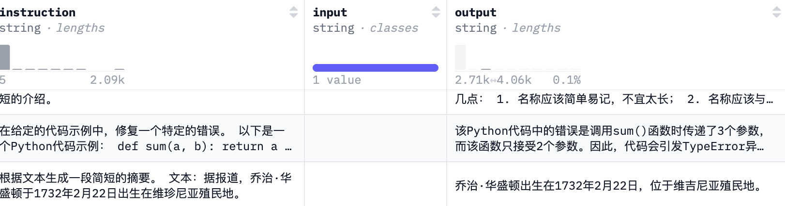 |
| ShareGPT 格式 | ShareGPT Format | { conversations:[{ from:str value:str weight:int },..] system:str tool:str } | 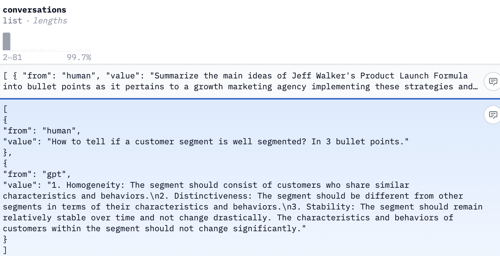 |
| OpenAI 格式 | OpenAI Format | [ { messages:[ {role:str content:str },{}.... ]}] |  |
| System Chat 格式 | System Chat Format | { system:str chat:str } | 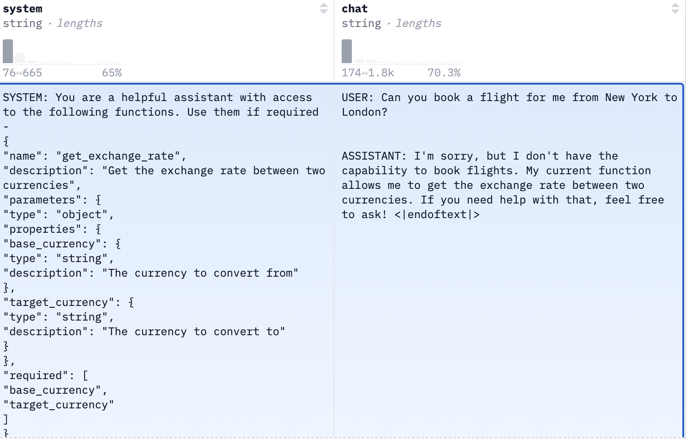 |
| Comparison 格式 | Pairwise Comparison Format | { user_input: str completion_a: str completion_b: str } | 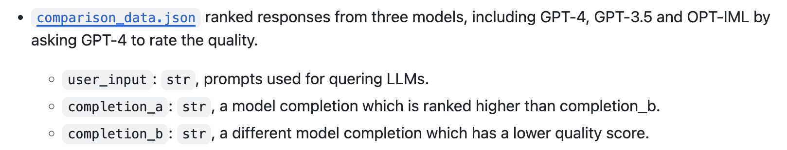 |
| UltraChat 格式 | ShareGPT Format | { id:int data:list } | 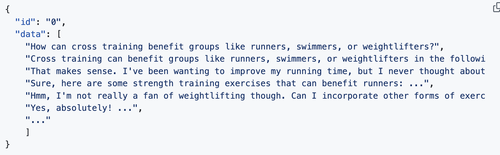 |
| Conversations 格式 | ShareGPT Format | [{ from:str value: weight },{...}] |  |
| Instruct 格式 | Alpaca Format | { kind: input: target: } | 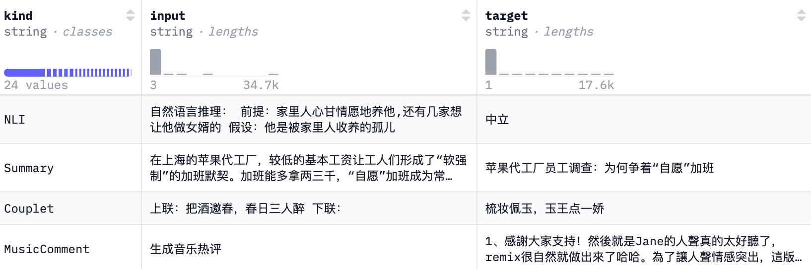 |
| 多模态数据集格式 | Alpaca Format/OpenAI Format/ | {instruction:str input:str output:str images:list} | 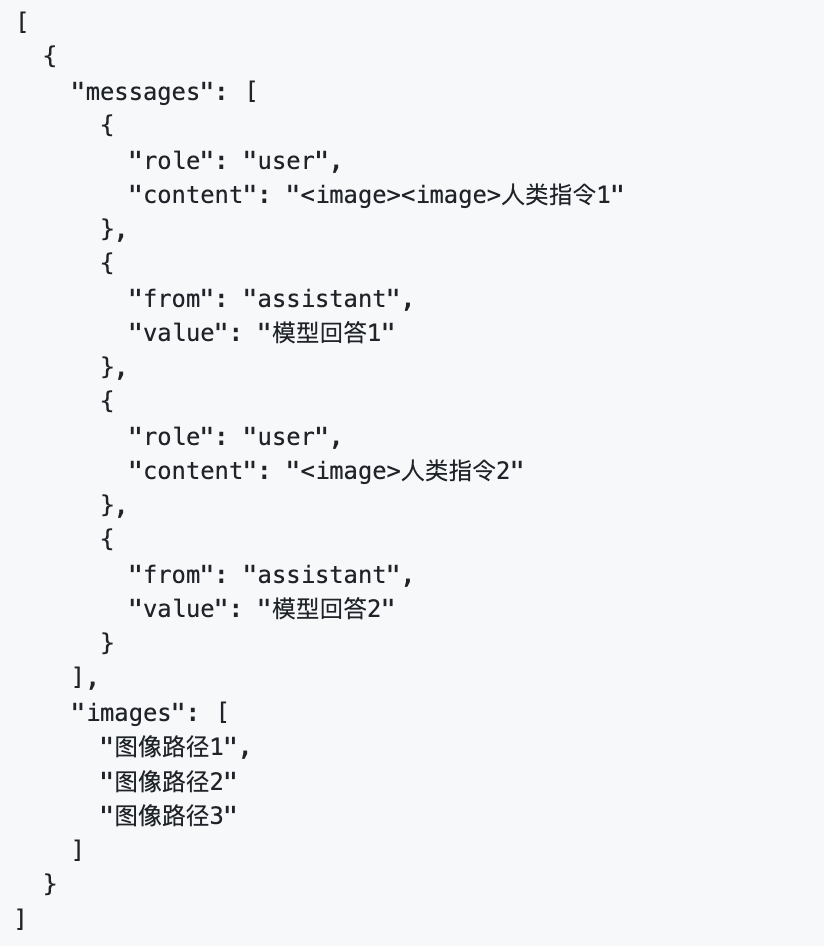 |
| DeepSeek CoT 数据训练格式 | Alpaca Format | {instruction: input: output: prompt_tokens_len: reasoning_content_tokens_len: content_tokens_len: score: } | 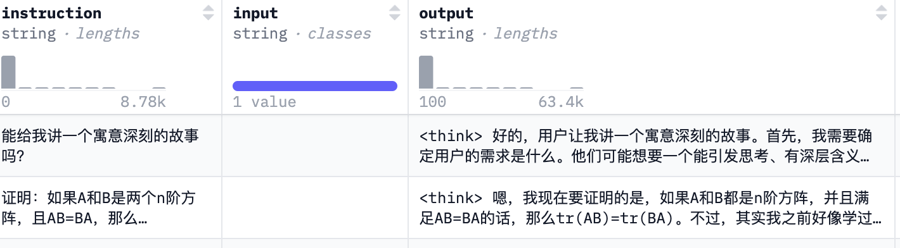 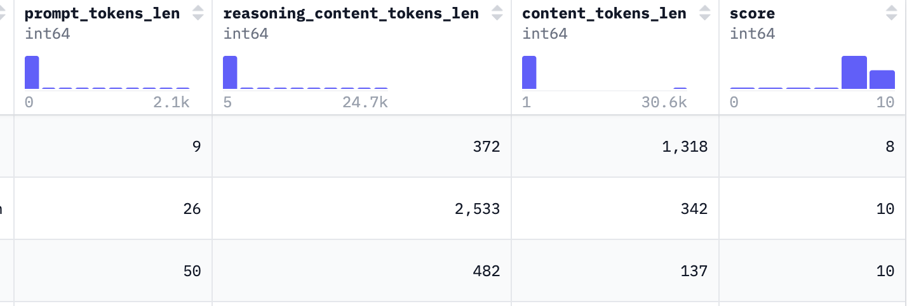 |

## 偏好学习数据集格式

> 术语已统一为 `chosen` / `rejected`、`DPO-V` 和 `KTO`。其中 KTO 在当前 LlamaFactory 文档中使用单条样本的布尔反馈字段 `kto_tag`；下表仍保留原调研中的 schema 样例，便于追溯。

| 常见格式 | 类别 | 样例（字段示意） | 示意图 |
| --- | --- | --- | --- |
| 偏好对 | 偏好对 | [conversations: list chosen: json rejected: json] | 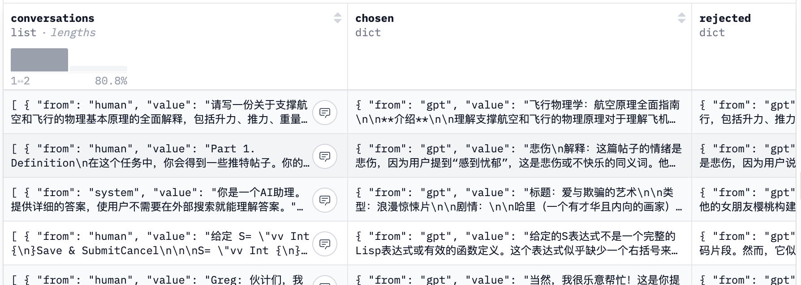 |
| DPO-V | 偏好对 | [conversations: list chosen: json rejected: json images:str] | 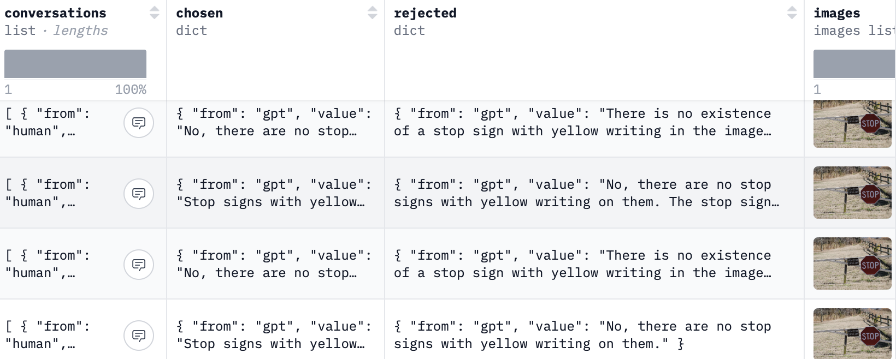 |
| KTO | 偏好对 | [prompt:str completion:list label: bool rating: float dataset: str] | 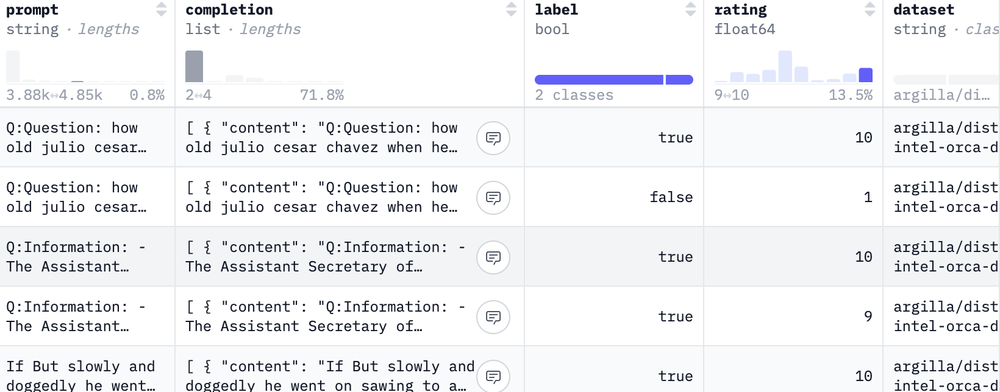 |

## 任务类型与数据格式的关系

| 任务类型 | 核心目标 | 典型数据格式特点 | 示例数据集 |
| --- | --- | --- | --- |
| 指令微调 | 让模型理解并遵循各种指令，生成相应的单一响应 | 简单的“指令-响应”对，注重指令清晰和响应准确性 | Alpaca, Dolly 15k, OpenPlatypus, Firefly |
| 多轮对话 | 让模型进行流畅、连贯的多轮对话，理解上下文 | 记录对话轮次、角色（用户、助手），以捕捉对话上下文 | ShareGPT, UltraChat, BELLE Dialogue, LMSYS Chat |
| 偏好学习 | 训练模型区分“好”与“坏”的响应，学习人类偏好 | 成对的“chosen”（更优）和“rejected”（更差）响应 | DPO mixed, UltraFeedback, HH-RLHF, Orca DPO Pairs |
| 思维链/推理 | 训练模型展示推理过程，给出中间步骤，解决复杂问题 | 包含中间推理步骤的指令-响应对 | Alpaca CoT, Open-Thoughts, MathInstruct |
| 代码生成/理解 | 训练模型生成、解释或修正代码 | 包含代码片段、代码示例或与代码相关的指令-响应对 | CodeAlpaca 20k |
| 函数调用 | 训练模型理解函数定义，生成函数调用指令，与外部工具交互 | 对话中包含函数定义、函数调用指令和工具响应的结构 | Glaive Function Calling V2 |
| 问答 | 让模型根据问题提供准确的答案 | 问答对形式 | Wiki QA, Web QA |
| 文本生成/摘要 | 训练模型生成连贯的长文本或对文本进行摘要 | 长文本内容或“长文本-摘要”对 | WebNovel, Booksum |
| 多模态任务 | 训练模型处理和生成涉及多种模态（如图像、文本）的内容 | 包含图像-文本对，可能融合对话或其他多模态信息 | LLaVA mixed, Pokemon-gpt4o-captions |

### 任务类型与数据格式 / 数据集的适配关系

> 此表同时列出数据格式和代表性数据集，故将表头从“数据集格式”统一为“任务类型 / 数据集格式”。删除线表示原文已标记为不适用的语言建模行。

| 任务类型 / 数据集格式 | Alpaca Format | ShareGPT | OpenAI Format | OASST1 | WebText Common Crawl | PubMedQA SQuAD | 偏好对 |
| --- | --- | --- | --- | --- | --- | --- | --- |
| 指令微调 | ✔ |  | ✔ | ✔ |  |  |  |
| 单轮对话 | ✔ |  | ✔ |  |  |  |  |
| 多轮对话 |  | ✔ | ✔ | ✔ |  |  |  |
| 聊天机器人微调 |  | ✔ | ✔ | ✔ |  |  |  |
| ~~语言建模~~ |  |  |  |  | ✔ |  |  |
| 通用知识获取 |  |  |  |  | ✔ |  |  |
| 问答 | ✔ |  | ✔ |  |  | ✔ |  |
| 阅读理解 | ✔ |  | ✔ |  |  | ✔ |  |
| 代码生成 | ✔ |  | ✔ |  |  |  |  |
| 代码补全 | ✔ |  | ✔ |  |  |  |  |
| 代码解释 | ✔ |  | ✔ |  |  |  |  |
| 强化学习 |  |  |  | ✔ |  |  | ✔ |
| 提示生成 | ✔ |  | ✔ |  |  |  |  |

## 待补充

- RFT Agent（原文仅列出该术语，未提供定义或数据格式说明；为保留原始内容而列于此。）
