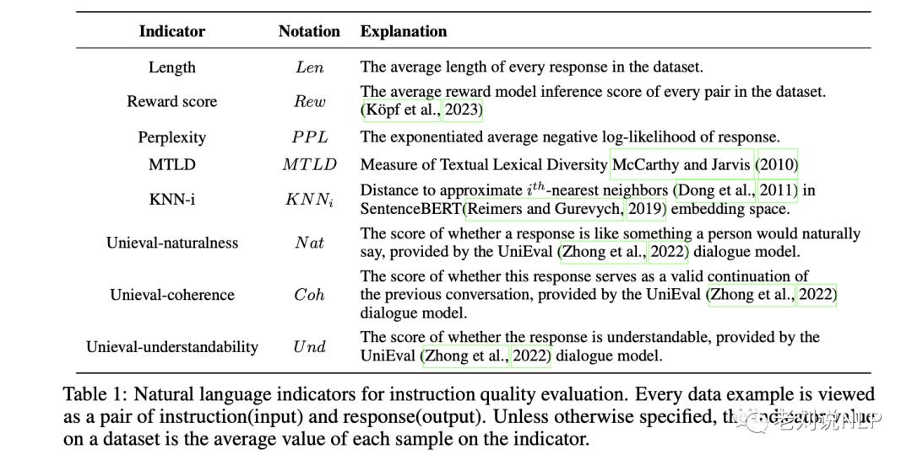
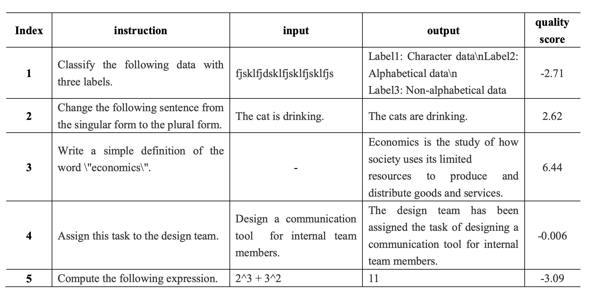
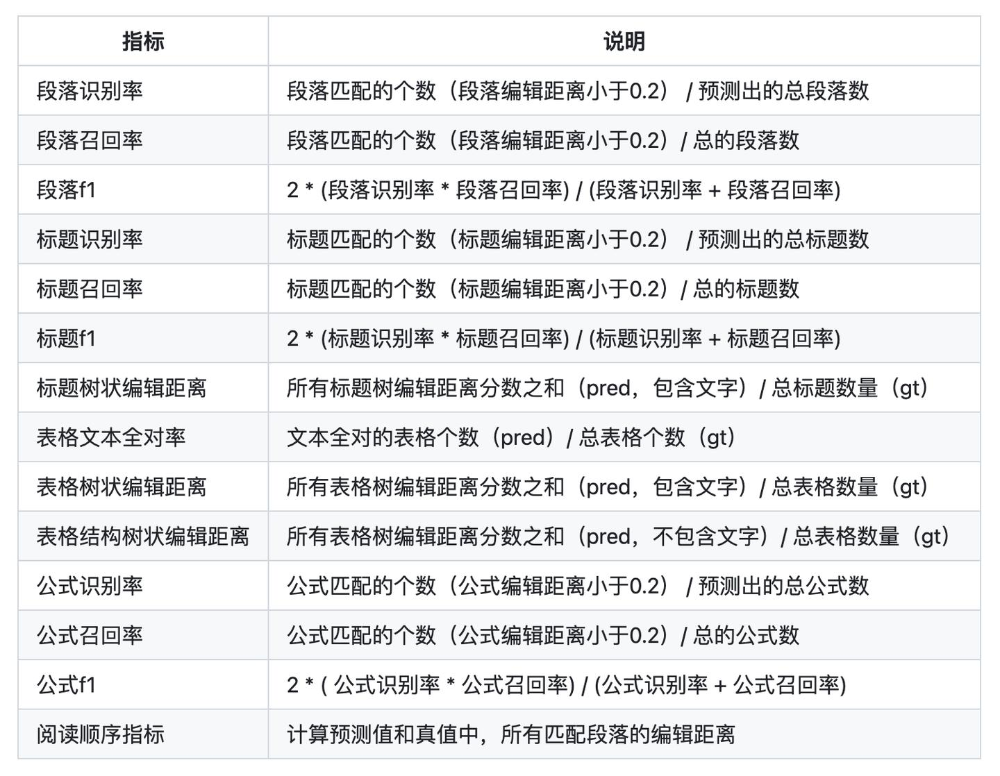

# 数据质量与文档解析效果评测调研

> 本文涵盖两类评测：微调数据集质量评估，以及文档解析效果评估。

## 微调数据集质量评估

### 指标一：自然语言指标

| 指标 | 含义 |
| --- | --- |
| Length | 数据集中每个回复的平均长度。 |
| Reward score | 数据集中每组答案的平均奖励模型推理得分。 |
| Perplexity | 回复的指数化平均负对数可能性。 |
| MTLD | 文本词法多样性度量。 |
| KNN-i | 在 SentenceBERT 嵌入空间中到近似第 *i* 个最近邻的距离。 |
| UniEval-naturalness | UniEval 对话模型给出的“回答是否像人自然会说的话”的得分。 |
| UniEval-coherence | UniEval 对话模型给出的“回复是否为前序对话有效延续”的得分。 |
| UniEval-understandability | UniEval 对话模型给出的“回答是否可理解”的得分。 |

### 指标二：数据集质量维度

| 指标类别 | 指标名称 | 指标含义 |
| --- | --- | --- |
| 样本多样性（Sample Diversity） | 指令多样性 | 考察样本中指令的覆盖范围是否广泛，是否包含各类任务类型、难度级别以及多样化的指令结构和表达方式，确保模型微调后能应对多种复杂情境。 |
| 样本多样性（Sample Diversity） | 内容多样性 | 检查样本中的文本内容是否涵盖不同主题、文体、长度和语境，以避免模型在特定领域或文本类型上过拟合，确保其具备良好的泛化能力。 |
| 答案质量（Answer Quality） | 准确性（Accuracy） | 评估答案是否准确响应给定指令和内容，是否忠实反映任务要求，且不包含事实性错误、逻辑矛盾或语义模糊。 |
| 答案质量（Answer Quality） | 完备性（Completeness） | 考察答案是否覆盖指令要求的全部任务点；对于多步骤或复合任务，答案应体现所有必要的操作结果。 |
| 答案质量（Answer Quality） | 简洁性与清晰度（Conciseness & Clarity） | 衡量答案是否言简意赅、表达清晰，避免冗余信息或含糊表述，确保微调后的输出易于理解和使用。 |
| 一致性（Consistency） | 内部一致性 | 检查同一指令对不同内容的处理结果是否保持一致，即模型在相似情境下应给出相似答案。 |
| 一致性（Consistency） | 外部一致性 | 将样本答案与已知知识库、专家判断或公认基准结果对比，确保答案符合领域共识和常识。 |
| 难度适配（Difficulty Calibration） | 难易程度分布 | 分析样本集中简单、中等、复杂任务的比例，确保微调数据包含不同难度级别的样本，有助于模型逐步提升处理复杂指令的能力。 |
| 噪声控制（Noise Reduction） | 标签错误检查 | 识别并剔除标注错误或不一致的样本，确保答案与指令、内容之间的映射关系正确。 |
| 噪声控制（Noise Reduction） | 数据清洗 | 去除重复样本、无关内容或低质量文本，提升数据集整体纯净度。 |

### 数据质量评估方法

1. **LLM-Judge（LLM-as-a-Judge）**：LLM 评审可能引入偏差；可先由人工筛选少量种子样本，为 LLM 评审提供校准参考。
2. **[MoDS：面向模型的数据选择](https://github.com/CASIA-LM/MoDS)**：从质量、覆盖度和必要性三个方面筛选适合特定 LLM 的指令数据。
   - **Quality Evaluation**：使用模型为数据打分，分数可作为筛选高质量数据的信号；阈值需要结合任务校准。
   - 参考模型：[OpenAssistant/reward-model-deberta-v3-large-v2](https://huggingface.co/OpenAssistant/reward-model-deberta-v3-large-v2/tree/main)。

3. **自训练打分模型**：针对特定任务训练专用质量评分器。
4. **人工筛选**：对高价值、难判定或高风险样本进行人工复核。
5. **[DEITA](https://github.com/hkust-nlp/deita)**：先对数据复杂性和质量评分，再结合多样性进行筛选。
6. **DataFlow**：使用大模型从多个维度对文本打分，覆盖多样性、统计指标、准确性和安全性等方面；其质量评估体系包括：
   - 文本结构；
   - 多样性与复杂性；
   - 流畅性和可理解性；
   - 安全性；
   - 教育价值；
   - 准确性和有效性。

### 小结

1. **模型无关的数据质量**：对各类模型普遍有益或有害的样本，可通过先验规则或奖励模型筛选；该过程与待训练模型相对异步。
2. **面向模型的数据选择**：是否适合当前模型需要结合当前模型判断。可从 prompt 与 response 两个维度，用 loss、不确定性等基于 token 概率的信号进行抽象组合，区分样本的重要性。
3. **质量与多样性**：质量可由打分模型作为基础信号，多样性可通过聚类后的距离等指标衡量。

### 参考资料

- [MoDS 论文：Model-oriented Data Selection for Instruction Tuning](https://arxiv.org/abs/2311.15653)
- [MoDS 代码库](https://github.com/CASIA-LM/MoDS)
- [DEITA 代码库](https://github.com/hkust-nlp/deita)
- [OpenAssistant 奖励模型](https://huggingface.co/OpenAssistant/reward-model-deberta-v3-large-v2/tree/main)
- [知乎文章](https://zhuanlan.zhihu.com/p/688789438)
- CSDN 博文：如何自动筛选高质量的指令微调数据喂给大模型？_reward-model-deberta-v3-large-v2

## 文档解析效果评估

### TextIn Markdown Tester

[TextIn Markdown Tester](https://github.com/intsig/markdown_tester) 将文档解析结果分为表格、段落、标题、阅读顺序和公式五个维度进行定量测评；可通过其[在线体验入口](https://cc.co/16YSIy)了解工具。

### OmniDocBench

[OmniDocBench](https://github.com/opendatalab/OmniDocBench) 是用于文档解析与评估的基准，论文发表于 CVPR 2025。它覆盖以下评测维度：

- 端到端评测，包括 `end2end` 与 `md2md` 两种方式；
- 版面（Layout）检测；
- 表格识别；
- 公式识别；
- 文本 OCR。

相关资料：[OmniDocBench 论文](https://arxiv.org/abs/2412.07626)。
