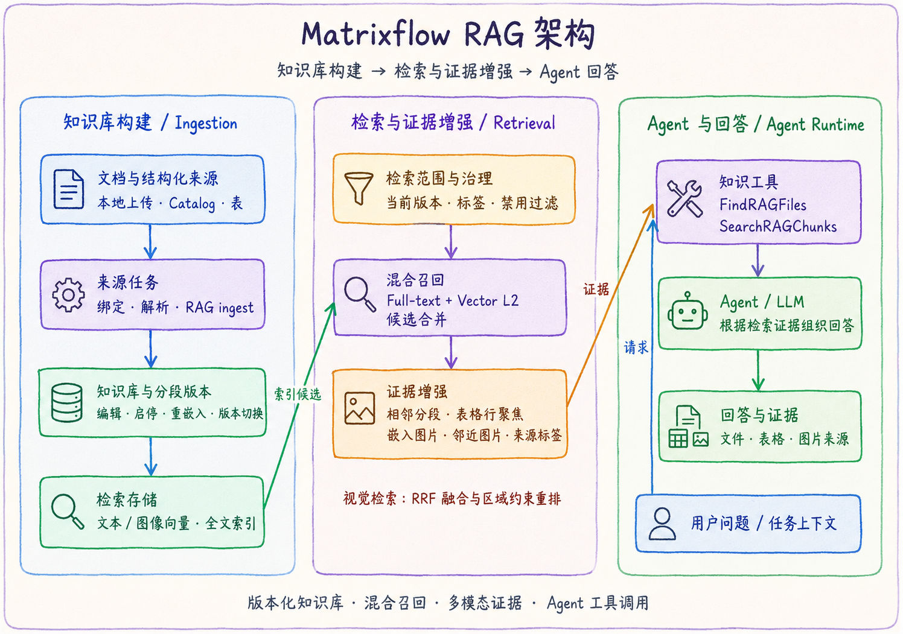

# Matrixflow RAG

本目录把 RAG 调研、产品选型判断与 Matrixflow 当前代码中的实现事实放在一起阅读。三类内容必须区分：调研资料用于了解候选能力，策略文档用于说明投入边界，架构文档只描述代码中已确认的实现，不能相互替代。

> [!NOTE]
> 本模块同时提供研究资料、架构说明、能力边界与对应的[源码快照](../../../packages/matrixflow-rag/)。调研中的外部产品能力不会自动计入 Matrixflow 的现有能力。

## 架构总览

  

图中的视觉检索还会对文本与图片命中做 RRF 融合，并可按文本/表格区域约束做后处理。它与主文本检索链路并列存在，不应误解为“所有文本 RAG 请求都已接入 cross-encoder Rerank”。

[查看高清架构图](../../../assets/architecture/matrixflow-rag-architecture.png)

## 已确认的能力快照

| 能力层 | Matrixflow 的实现事实 | 状态 |
| --- | --- | --- |
| 知识库接入 | 支持本地文件、Catalog 文件、Catalog 表及来源选择；来源通过持久化作业推进。 | 已实现 |
| 分段与索引 | 初始分段导入、编辑/新增/启停/删除、重嵌入、历史版本切换；文本和可选图片向量分开管理。 | 已实现 |
| 多粒度索引 | 默认 ingest 可生成 `doc / section / chunk` 三层条目；检索以 doc 定位文件、以 chunk 召回，文件级表格命中可按 section 范围扩展证据。 | 已实现 |
| 文本检索 | 全文和 `vector_l2` 两条路由并行取候选、合并排序，再扩展邻近证据。 | 已实现 |
| 表格与图像证据 | 命中后可聚焦表格行，并关联嵌入图片与邻近图片；视觉检索融合文本和图片命中。 | 已实现 |
| 来源治理 | source 启用状态、有效期、标签和当前索引版本会影响可检索范围。 | 已实现 |
| Agent 调用 | Agent 可以使用 `find_rag_files` 和 `search_rag_chunks` 取得检索结果。 | 已实现 |
| 独立 Cross-encoder Rerank | 提供 `/v1/rerank` 服务、Go 客户端与测试。 | 已实现 |
| 主文本检索接入 Rerank | 独立 rerank 服务当前不是 `search_rag_chunks` 的默认处理步骤。 | 未默认启用 |
| 视觉融合与重排 | 视觉检索有 RRF 融合及区域/对象约束重排。 | 已实现 |
| GraphRAG | 当前公开版本不包含实体关系抽取、图存储/图查询或社区报告链路。 | 当前未提供 |
| RAPTOR | 已有非递归的三层索引，但不包含递归聚类、模型摘要节点与树形检索。 | 当前未提供 RAPTOR |

## 文档导航

- [RAG 能力与平台调研](rag-research.md)：MaxKB、RAGFlow、AnythingLLM、DataFlow 等产品与能力观察。
- [RAG 策略与选型](rag-strategy-and-selection.md)：是否投入 RAG、优先场景与选型维度。
- [Matrixflow RAG 架构](matrixflow-rag-architecture.md)：数据如何进入知识库、如何被检索、如何变成 Agent 可用证据。
- [Matrixflow RAG 能力映射与边界](matrixflow-rag-capability-map.md)：将调研能力逐项映射到当前实现，并说明当前版本的能力范围。
- [Matrixflow RAG 源码快照](../../../packages/matrixflow-rag/)：知识库、检索、视觉搜索、Agent 工具、Rerank 与对应测试。

## 阅读边界

`rag-research.md` 中的分块模板、自动关键词/问题抽取、知识图谱、RAPTOR、Tavily 深度检索等，主要是对外部产品的调研记录。除非在“架构”或“能力映射”中标为已实现，否则不能作为 Matrixflow 当前产品能力对外表述。
