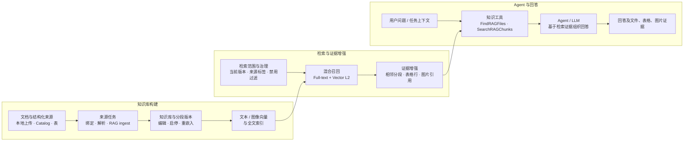

# Matrixflow RAG

本目录把 RAG 调研、产品选型判断与 Matrixflow 当前代码中的实现事实放在一起阅读。三类内容必须区分：调研资料用于了解候选能力，策略文档用于说明投入边界，架构文档只描述代码中已确认的实现，不能相互替代。

> [!NOTE]
> 本模块的实现判断基于 2026-08-25 对 Matrixflow `moi-backend`、`moi-core/agent-tools/knowledge`、`moi-core/rerank` 与知识库前端模块的静态代码审阅；没有把调研中的产品能力默认视为 Matrixflow 已具备的能力。

## 架构总览

图中的视觉检索还会对文本与图片命中做 RRF 融合，并可按文本/表格区域约束做后处理。它与主文本检索链路并列存在，不应误解为“所有文本 RAG 请求都已接入 cross-encoder Rerank”。可编辑的 Excalidraw 元素源见 [matrixflow-rag-architecture.mcp.json](../../../assets/architecture/matrixflow-rag-architecture.mcp.json)。

## 已确认的能力快照

| 能力层 | Matrixflow 的实现事实 | 状态 |
| --- | --- | --- |
| 知识库接入 | 支持本地文件、Catalog 文件、Catalog 表及来源选择；来源通过持久化作业推进。 | 已实现 |
| 分段与索引 | 初始分段导入、编辑/新增/启停/删除、重嵌入、历史版本切换；文本和可选图片向量分开管理。 | 已实现 |
| 文本检索 | 全文和 `vector_l2` 两条路由并行取候选、合并排序，再扩展邻近证据。 | 已实现 |
| 表格与图像证据 | 命中后可聚焦表格行，并关联嵌入图片与邻近图片；视觉检索融合文本和图片命中。 | 已实现 |
| 来源治理 | source 启用状态、有效期、标签和当前索引版本会影响可检索范围。 | 已实现 |
| Agent 调用 | Agent 可以使用 `FindRAGFiles` 和 `SearchRAGChunks` 取得检索结果。 | 已实现 |
| Rerank | 提供独立 rerank 服务；视觉检索有 RRF 与约束重排。未确认主文本 RAG 已接入 cross-encoder。 | 部分具备 |
| GraphRAG / RAPTOR | 本轮审阅未在上述生产链路中找到实现。 | 不应宣称已实现 |

## 文档导航

- [RAG 能力与平台调研](rag-research.md)：MaxKB、RAGFlow、AnythingLLM、DataFlow 等产品与能力观察。
- [RAG 策略与选型](rag-strategy-and-selection.md)：是否投入 RAG、优先场景与选型维度。
- [Matrixflow RAG 架构](matrixflow-rag-architecture.md)：数据如何进入知识库、如何被检索、如何变成 Agent 可用证据。
- [Matrixflow RAG 能力映射与边界](matrixflow-rag-capability-map.md)：将调研能力逐项映射到当前实现，并标出尚未确认或未发现的部分。

## 阅读边界

`rag-research.md` 中的分块模板、自动关键词/问题抽取、知识图谱、RAPTOR、Tavily 深度检索等，主要是对外部产品的调研记录。除非在“架构”或“能力映射”中标为已实现，否则不能作为 Matrixflow 当前产品能力对外表述。
