# RAG 调研

|  |  |  |
| --- | --- | --- |
| Native RAG / Vanilla RAG | R+A+G |  |
| Advanced RAG | RAG + 检索优化（如 Rerank） |  |
| Graph RAG | KG + RAG |  |
| Agentic RAG | 拆解问题+多轮检索+综合生成 |  |

# 1 **MaxKB**

官网：MaxKB \- 强大易用的企业级智能体平台，飞致云旗下的开源产品

教学视频：https://space\.bilibili\.com/510493147/lists/4018018?type=season

成功案例：https://space\.bilibili\.com/1538710292/lists/5307430

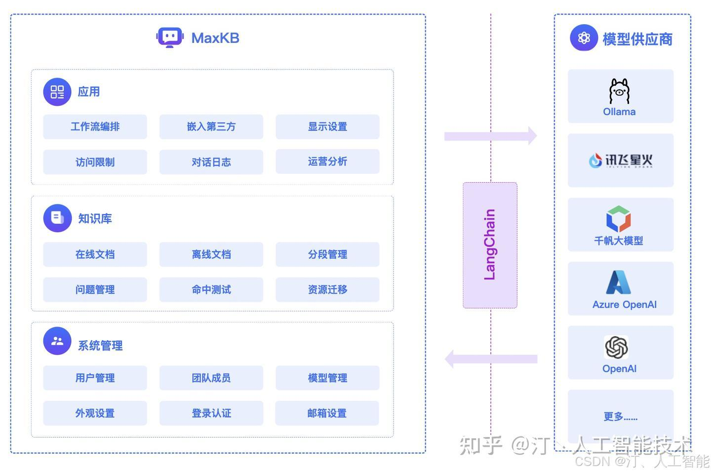

架构：

原理：经典的 RAG 流程

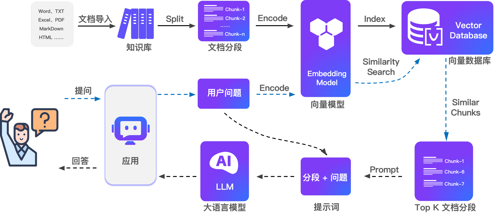

支持三种知识库类型：

- 通用知识库：MD、TXT、PDF、DOCX、HTML、EXCEL、CSV
- Web 站点知识库：输入 Web 根地址，自动递归同步文本数据
- 飞书知识库：飞书文档（含表格文档）导入到 MaxKB 中管理

通用知识库

分段规则：智能分段、高级分段

- 智能分段：标题 \+ MaxSize  \-\-它的分段方式比较简单
  - MD：按标题（至多6级），每段最多 4096 字符
  - HTML、DOCX：转换成 MD
  - TXT、PDF：按标题，没有标题按 4096 字符分段
- 高级分段：
  - 分段标识符：\#、\#\#、\#\#\#\.\.\.\.、空行、回车、空格、分号、逗号、句号\.\.\.、正则
  - 单分段长度：50\-4096
  - 自动清洗：自动去掉重读的符号，如空格、空行、制表符  \-\-没有单独的清洗节点，清洗动作就在分段完直接做了
- 支持分段预览
- 分段“关联问题”：将分段的标题设置为分段的“关联问题”  \-\-这东西有点意思，不知道综合效果会如何，用人工换准确度的方法 @方佳俊（fangjj0621）
  - 每个分段都会有标题，但非必填
  - 匹配时会预先匹配“关联问题”，然后再映射分分段内容，从而提升效率和准确度

Web 知识库

根地址：用户填写根地址，系统自动获取根地址及子地址的数据资料

选择器：可以设定获取某个 div 那的数据，默认 body 数据，一个 div 被同步为一个文档

\-\-没看到分段操作，但看结果是分段了，可能用了通用知识库的默认分段逻辑

知识库操作

- 同步：对于 Web 知识库，重新获取 Web 站点文档，覆盖替换已有文档或全部文档
- 向量化：更换向量模型后，仅对新增文档生效，需要对旧数据手动点击重新向量化
- 导出：
  - 导出为 Excel：每个文档一个 sheet，每个分段一行
  - 导出为 Zip：将引用的图片一起导出

命中处理设置

- 模型优化：命中分段后，会按照应用的提示词生成 prompt 发给模型优化后返回答案 \-\-没理解，得试一下这个提示词在哪填写
- 直接回答：命中分段后，直接返回分段内容，适用于需要将图片、链接等信息返回的场景

生成问题

- 选择一至多个文档，选择生成问题的模型、填写生成问题的提示词，自动生成问题并关联分段
- 可在“问题列表”中手动创建问题并关联分段
- 知识库管理员需要收集用户可能提出的问题，并长期维护问题列表，以提高问答的准确度

分段管理：添加、编辑、迁移、删除、启用、禁用、添加关联问题

应用：包括“简单配置”和“高级编排”两种类型

- 简单配置：满足大多数基本的问答需求，适用于需要快速上线的智能体应用
  - LLM、系统角色描述、系统提示词、关联知识库
  - 检索行为：
    - 检索模式、相似度阈值、Top\-N
    - 最大引用字符数：对入选分段再做字符截断，确保总长度不超过设定上限
    - 无引用时的回答策略：允许 LLM 基于通用知识做到或统一回复“无相关资料”
    - 问题优化开关：系统先将用户问题做改写，提高检索命中率
- 高级编排：引入更多功能，满足用户问题分类、敏感词检索等高级要求
  - 将 AI 模型、知识库、业务逻辑、外部工具等节点自由组合，进行调试与发布
  - 每个工作流有且必须有“基本信息”和“开始”两个基础节点
    - 基本信息：应用元数据，包括应用名称、描述、开场白、语音开关等
    - 开始：工作流执行的起点
  - 其他功能组件节点，分为几大类
    - AI 能力类：AI对话、问题优化、图片生成、图片理解、语音转文本、文本转语音
    - 知识库类：知识库检索、多路召回
    - 业务逻辑类：判断器、表单收集、变量赋值、指定回复
      - \-\-这里的判断器有点类似我们想做的过滤节点，根据不同的条件执行不同的下游节点
    - 其他类：用户输入、接口传参、MCP调用、文档内容提取
    - 工具类：自定义（通过函数、脚本、API 等方式灵活处理复杂需求）

# 2 **RAGFlow**

一款基于深度文档理解构建的 RAG 引擎

## **知识库**

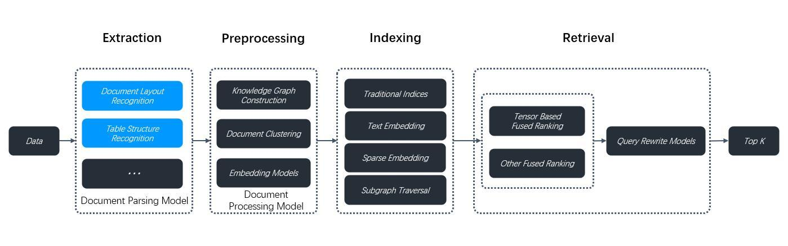

**解析**

对于 PDF 文件，提供两种解析策略：视觉模型 和 Native

- 视觉模型：可以更好的识别文档结构，找到标题、文本、图片、表格的位置
- Native：只获取 PDF 中的纯文本，但比较快

**分块**

RAGFlow 提供了多种业务场景的分块模版

| 场景 | 适用文件类型 | 切片与召回策略 |
| --- | --- | --- |
| 通用 | MD、DOCX、PPT、PDF、TXT、XLS、JPG、JSON、HTML.. | 切片 • 页面分块**并行任务**解析，每块的页数用户可自定义（默认12页一块） • 先按照文本标识符分段，再根据文本大小合并分段（分段合并至不大于设置的文本块大小值） • 表格转 HTML： ◦ 这里的表格是指 xls、xlsx ◦ 未开启该功能时，表格会被解析为键值对，因此仅适用于简单表格 ◦ 已开启该功能时，表格会被解析为 HTML 格式，并按照 12 行一个分块 召回 • 为文件设置元数据，使用 json 来定义，元数据参与检索召回 • 关键词提取：为每个分块自动提取 N 个**关键字**，N 默认 0，最大 30，N 不是越大越好，太大边际效应会降低，1000 个字符的分段建议设置为 3-5，可手动增改关键字。 • 页面排名：在聊天助手回答**多知识库检索**时，该排名值的设置会影响最终检索评分，最终评分 = 检索评分 + 页面排名 • 问题提取：为每个分块提取 M 个**问题**，M 默认 0，最大 10 ，M 不是越大越好，太大边际效应会降低，1000 个字符的分段建议设置 1-2，可手动增改问题。这些问题用于提高用户查询的匹配度。 --跟 MaxKB 的 “分段关联问题” 差不多 • [标签集](https://github.com/infiniflow/ragflow/blob/main/docs/guides/dataset/configuration.md)：知识库级别，用户手动维护一个封闭集，再将文本块自动关联这些标签。 • RAPTOR 策略：一种检索增强策略，将分好的块**根据语义相似性递归聚类**，旨在解决多跳问答问题。用户可以设置分块总结token数、分块间相似度阈值和最大聚类数，此过程会消耗大量计算资源。 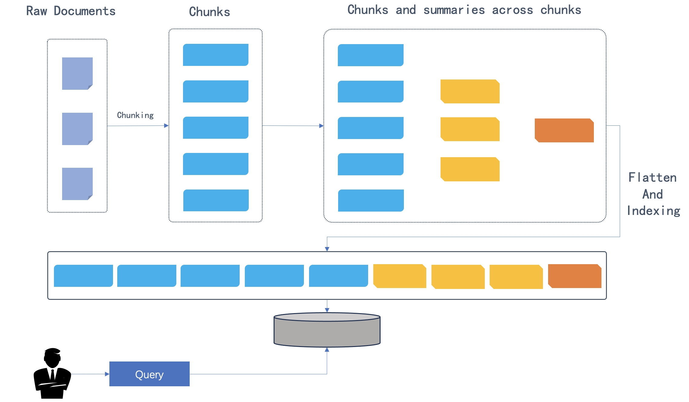 • 知识图谱：一种检索增强策略，将分好的块，旨在解决多跳回答和复杂问题的正确性。 ◦ 实体类型：提供默认（组织、人员、事件和类别），也可以增删 ◦ 提供两种构建方式：General、Light ◦ 实体归一化：默认关，打开后会合并相似实体 ◦ 社区报告生成：默认关，为每个社区（由关系连接的实体群体）生成摘要 |
| Q&A | xlsx、csv、txt | 原始文件要求 • xls：两列组成，问题、答案 • csv、txt：UTF-8编码，并 TAP 分开问题和答案 切片：无说明，猜测是一行一个分块 召回：只有标签集和页面排名 |
| 表格 | xlsx、csv、txt | 原始文件要求 • 第一行必须是标题列 • 列名必须是有意义的术语，方便 LLM 理解，最好写成这样 gender/sex(male,female) 切片 • 每一行一个块 召回：只有页面排名 |
| 简历 | docx、pdf、txt | 切片：no，做结构化提取，模版预置且看不到、改不了 召回：只有标签集和页面排名 |
| 书籍 | docx、pdf、txt | 切片 • 设置页面范围 • 切片策略没有提及，应该是比较定制化的 召回：只有页面排名、关键词提取、问题提取、RARPTOR |
| 法律文件 | docx、pdf、txt | 切片 • 使用文本**特征来检测分割点** • 所有上层文本都会包含在 chunk 中 召回：同“通用” |
| 手册 | pdf | 切片 • 按最低子标题切 • 图和表不会被切开 召回：同“通用” |
| 论文 | pdf | 切片：按标题切 召回：同“通用” |
| 演示文稿 | pdf、pptx | 切片 • 按页切，缩略图会被单独存储 • --每一页内的文字是否要切没说，得试一下 |
| One | docx、xlsx、pdf、txt | 切片：不切片，用户要保证所选的 LLM 上下文长度大于文档长度 召回：同“通用”，但没有知识图谱 |
| Tag | xlsx、csv、txt | 用于标签集 |

**检索**

- 相似度阈值
- 关键字相似度权重
- rerank 模型
- 使用知识图谱

## **聊天**

**聊天助理设置**

| **配置项** | **配置内容及含义** |
| --- | --- |
| 助理姓名 |  |
| 助理描述 |  |
| 助理头像 |  |
| 空回复 | 未检索到数据时的默认回复 如果不填写则在未检索到数据时会提出自己的意见 |
| 显示引文 |  |
| 关键词分析 | 提取用户问题中强调的关键词，适用于长查询 |
| 文本转语音 | 用语音回复 |
| Tavily API KEY | 利用 Tavily 加入网络搜索作为知识库的补充 |
| 知识库 |  |

**提示引擎**

| **配置项** | **配置内容及含义** |
| --- | --- |
| 系统提示词 |  |
| 相似度阈值 | 加权 “关键词相似度” 和 “向量余弦相似度” |
| 关键字相似度权重 |  |
| Top N |  |
| 多轮对话优化 | 多轮对话中，优化用户的问题 |
| 使用知识图谱 | 在多跳问答检索过程中使用知识库中的知识图谱 |
| 推理 | 类似推理大模型的推理过程，聊天模型会在遇到未知主题时自主融入深度研究，动态搜索外部知识，并通过推理生成最终答案。结合 Tavily 实现深度搜索 |
| Rerank 模型 | 使用后，reranker评分会替换向量相似度评分 |
| 跨语言搜索 | 将用户问题默认翻译成所选的目标语言 |
| 变量 | 在系统提示词中引入变量信息 |

**模型设置**

| **配置项** | **配置内容及含义** |
| --- | --- |
| 模型 | LLM-Chat |
| 自由度 | LLM 回答的权衡度：即兴创作(0.8,0.9,0.1,0.1)、精确(0.2,0.75,0.5,0.5)、平衡(0.5,0.85,0.2,0.2)，这三种风格由以下参数控制，暂不支持修改 • 温度： 较低的值会导致更确定和可预测的输出，更高的价值会带来更具创造性和多样化的产 • Top P：通过设置阈值P并将采样限制为累积概率超过P 的标记，降低生成重复或不自然文本的可能性 • 存在处罚：存在惩罚值越高，模型就越有可能生成尚未包含在生成文本中的标记 • 频率处罚：阻止模型在生成的文本中过于频繁地重复相同的单词或短语。 |

## **搜索**

1. 可以选择多个知识库
2. 搜索时只会用到部分检索策略：关键词 \+ 向量 相似度，不会使用高级检索策略：知识图谱、问题

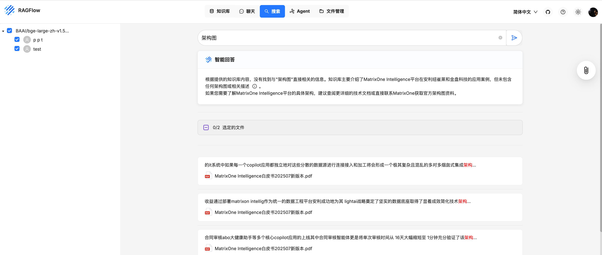

## **Agent**

# 3 **AnythingLLM**

一体化 AI 应用程序，可以执行 RAG、AI Agent 等

GitHub：[Mintplex Labs / AnythingLLM](https://github.com/Mintplex-Labs/anything-llm)

文档：[AnythingLLM 官方文档](https://docs.anythingllm.com/)

没有找到什么关于分段和召回策略的细节说明，比较黑盒

# 4 **DataFlow**

**简介**

OpenDCAI 发布的一款产品，于 2025/6/28 发布，主打概念：以数据为中心的 AI 系统（DCAI，Data Center AI）。

DataFlow 是一个数据准备系统，旨在从噪声数据源（PDF、纯文本、低质量问答）中解析，生成，加工并评估高质量数据，以提升大语言模型（LLMs）在特定领域的表现，支持预训练、监督微调（SFT）、强化学习训练以及基于知识库的 RAG 系统。

github：DataFlow/README\-zh\.md at main · OpenDCAI/DataFlow · GitHub

在线 UI：智能数据平台

手册：DataFlow中文文档

## **产品架构**

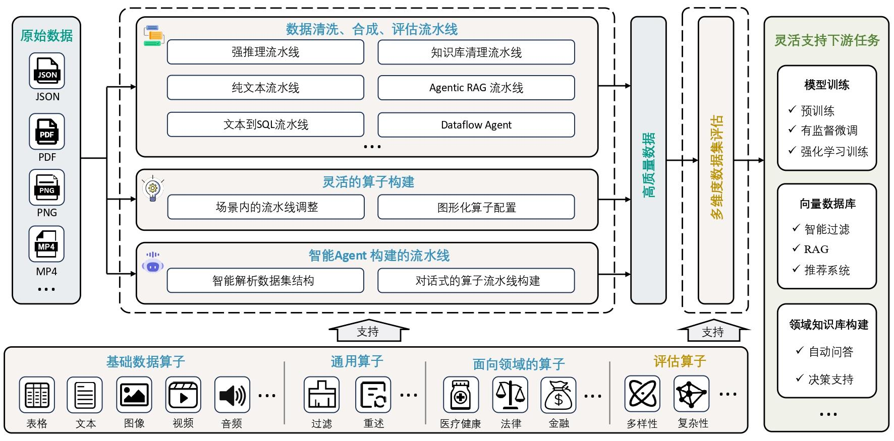

|  |  |  |
| --- | --- | --- |
| 算子层/operator | 通用算子 | 【80+】涵盖文本评估、处理和合成 |
| 算子层/operator | 领域算子 | 【40+】针对特殊领域（医疗、金融、法律）的专业处理 |
| 算子层/operator | 评估算子 | 【20+】从 6 个维度全面评估数据质量 |
| 流水线/pipeline | 纯文本处理流程 | • **低质量文本 -> 高质量文本（预训练数据集的品质提升）** • **低质量文本 -> 高质量文本 -> phi-4 预训练数据集（文本到 QA 对）** • **低质量 SFT 数据集 -> 高质量 SFT 数据集** • **低质量文本 -> 低质量 SFT 数据集 -> 高质量 SFT 数据集** |
| 流水线/pipeline | 强推理流程 | • **低质量文本（数学问题） -> 高质量扩增文本（大规模数学预训练数据生成）** • **低质量数据集 -> 高质量扩增的推理数据集** |
| 流水线/pipeline | Text2SQL 流程 | • **低质量 SQL 数据集 -> 高质量扩增 SQL 数据集（含提示词、思维链、SQL 打分）** • **数据库 Schema -> SQL 数据集（含提示词、思维链、SQL 打分）** |
| 流水线/pipeline | RARE 数据合成 | • **文本 -> 推理数据集** |
| 流水线/pipeline | 知识库清洗流程 | • **原始文件 -> 分段数据 -> 多跳 QA 对** |
| 流水线/pipeline | Agentic RAG 流程 | • **低质量文本 -> 高质量问答对（含提示词、评分）** |
| 流水线/pipeline | 函数调用数据合成流程 | • **文本数据集 -> 多轮对话数据集** |
| 流水线/pipeline | 智能 Agent 构建的流水线 | 自动编排算子、自动便携数据算子、自动解决数据分析任务 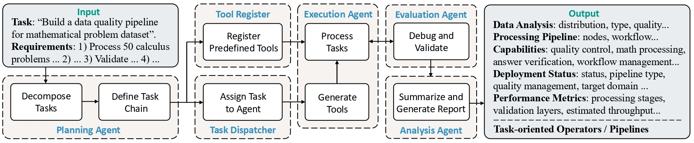 |
| 数据管理/storage | 通过 pandas 的 DataFrame 来作为载体实现读写数据，目前依赖文件系统作为读写数据的载体 |  |
| 大模型后端/LLMServing |  |  |

## **纯文本流水线**

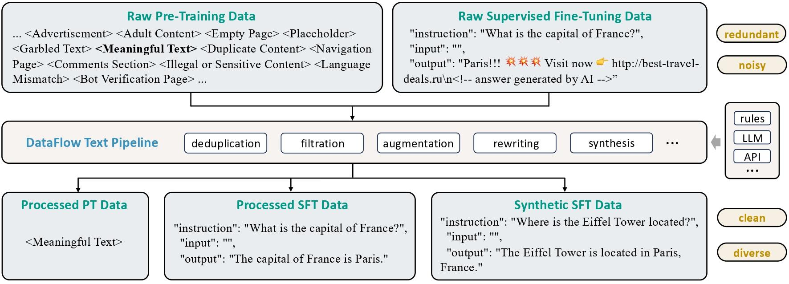

| 处理场景 | 处理内容 | 处理算子 |
| --- | --- | --- |
| 预训练数据过滤 | 对原始预训练文本进行去重、改写和过滤操作，得到高质量的预训练文本数据 | 语言过滤（仅保留特定语言的文本）、删除多余空格、删除表情符号、删除 HTML 标签、 MinHash 数据去重、敏感词过滤、单词数量过滤（保留单词数据在[20,100000]中的文本）、冒号结尾过滤（过滤以冒号结尾的文本）、语句数量过滤（保留句子数量范围为[3,7500]）、省略号结尾过滤（过滤省略号结尾句子比例大于 0.3 的文本）、空文本过滤、平均单词长度过滤（保留平均单词长度在[3,10]的文本）、符号/单词比例过滤（过滤符号/单词比例大于 0.4 的文本）、HTML 标签过滤（过滤含 HTML 标签的文本）、 ID Card 过滤（隐私保护，过滤含 ID Card 相关信息多的文本，如“身份证”，“ID NO.”等）、无标点符号过滤（过滤无标点符号的文本）、特殊符号过滤（过滤含有特殊符号的文本）、水印过滤（过滤含水印的文本，如 watermark 、copyright）、括号比例过滤（过滤掉括号比例大于 0.025 的文本）、大写字母比例过滤（过滤掉大写字母比例高于 0.2 的文本）、 Lorem Ipsum 过滤（过滤含 lorem ipsum 的文本，其常用于排版设计的随机假文）、 Unique 单词过滤（过滤独立单词比例小于 0.1 的文本）、字符数量过滤（过滤字符数少于 100 的文本）、项目符号开头过滤（过滤以项目符号开头比例大于 0.9 的文本）、含 Javascript 过滤（过滤含 Javascript 数量大于 3 的文本）、文本质量打分器（使用质量打分器进行文本质量打分，基于 bge 模型，使用 gpt 对文本承兑比较打分后训练而成，[模型地址](https://huggingface.co/zks2856/PairQual-Scorer-zh)） |
| 预训练类 phi-4 数据合成 | “预训练数据过滤” -> 使用 QA 对话形式复述预训练文档，合成对话形式预训练数据，并对合成后的数据进行质量过滤，得到高质量的类phi-4格式预训练数据。 | • 预训练数据合成：合成 Phi-4 风格的 QA 问答对数据 • Qurating 质量打分过滤：从 writing_style、required_expertise、facts_and_trivia、educational_value 四个维度打分并过滤合成后的文本。[模型地址](https://github.com/princeton-nlp/QuRating) |
| SFT 数据过滤 | 对原始SFT格式数据进行质量过滤，得到高质量SFT数据 | • 输出长度过滤：保留 output 在 20-1000 的数据 • 指令 IFD 分数过滤：按照指令 IFD 分数过滤数据，[模型地址](https://github.com/tianyi-lab/Superfiltering) • 指令质量得分过滤：按照指令质量得分过滤，[模型地址](https://huggingface.co/hkust-nlp/deita-quality-scorer) • Instruction 标签数过滤：按照 instrctuon 标签数过滤，[模型地址](https://github.com/OFA-Sys/InsTag) |
| SFT 数据合成 | “预训练数据过滤” -> 合成 SFT 格式数据 -> “SFT 数据过滤” | • SFT 数据合成：使用 LLM 根据种子文档合成 SFT 格式数据 |

共 32 个算子

## **强推理数据合成**

核心目标：通过数学问答数据的合成与处理，扩展现有数据集的规模和多样性，从而为模型调优提供更加丰富的训练数据。

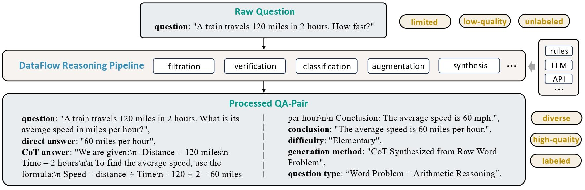

| 处理步骤 | 处理内容 | 处理算子 |
| --- | --- | --- |
| 输入数据 |  | instruction：问题文本，通常为数学问题或任务描述； golden_answer：标准答案（如果存在），适用于包含标准答案的数据集； solution：已知的解答或推理过程（如果存在）。 |
| 问题处理 | 过滤非数学问题、合成新问题、验证问题正确性、进行难度评分和类别分类。 | • 问题过滤：通过“问题过滤器”剔除无效的数学问题 • 问题合成：基于已有的问题生成新的数学问题，增强数据集的多样性和规模 • 问题过滤：过滤掉不符合条件的合成问题 • 问题难度分类：为每个问题进行难度评分（0-10 分） • 问题类别分类：将每个问题按数学类别分类，如代数、几何、概率 |
| 答案生成与处理 | 根据问题的标准答案或模型生成的答案进行处理，包括格式过滤、长度过滤和正确性验证等。 | • 答案分支：判断数据是否包含“标准答案”，分别进入两个分支处理流程 • 答案生成：对于包含“标准答案”的数据，生成带有推理过程的答案；对于不包含的数据，对其多次问答同一个问题，投票选出频率最高的答案，最为伪答案 • 答案格式过滤：过滤出符合预设格式要求的答案 • 答案长度过滤：剔除过长或过短的答案 • 答案验证：与“标准答案”对比，验证准确性 |
| 数据去重 | 对生成的问答数据进行去重，确保数据集的质量。 | • 答案去重：使用 N-gram 算法去除重复的答案 |
| 输出数据 |  | instruction：问题文本 generated_cot：模型生成的长链推理过程 output：模型生成的最终答案 golden_answer：标准答案（如果有） Synth_or_Input：标记数据来源，input表示原始数据，synth表示流水线合成的数据 Difficulty：问题的难度评分（0–10） primary_category：问题的主要类别 secondary_category：问题的次要类别 |

共 11 个算子

## **Text2SQL 数据合成流水线**

核心目标：通过清洗和扩充现有的Text\-to\-SQL数据，为每个样本生成包含训练提示词（prompt）和思维链（chain\-of\-thought）的高质量问答数据。

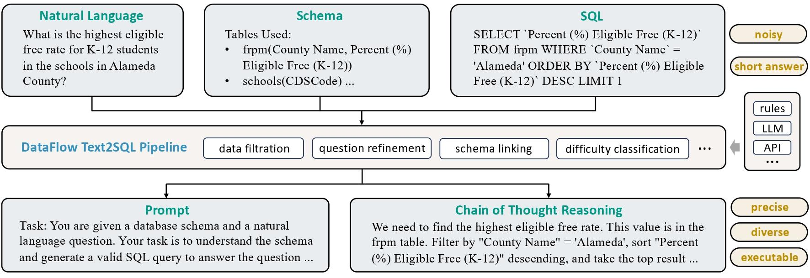

| 处理步骤 | 处理内容 | 处理算子 |
| --- | --- | --- |
| 输入 |  | 数据库 ID 、自然语言问题、标准 SQL 答案 |
| 数据过滤 |  | • SQL 执行过滤器：剔除无效 SQL 和无法执行的 SQL 语句 • SQL 一致性过滤器：确保问题、SQL 与数据库 Schema 三者一致 |
| 数据生成 |  | • SQL 生成器：基于数据库 Schema 生成 SQL 查询语句 --扩增 SQL • SQL 变体生成器：基于现有 SQL 语句生成多个功能等价的变体 SQL • 问题生成器：基于 SQL 和 Schema 生成对应的自然语言描述 |
| 训练数据构建 |  | • 提示词生成器：根据问题和数据库schema生成用于模型训练的提示模板 • 思维链生成器：为 SQL 构建分步推理过程（Chain-of-Thought） |
| 数据分级 |  | • 组件难度评估器：分析SQL语句的组件复杂度，为数据样本标注难度等级。 • 执行难度评估器：评估SQL查询的执行难度，基于多次生成结果进行综合判断。 |
| 输出 |  | jsonl 文件，包括： db_id: 数据库id question: 自然语言问题 SQL: 标准SQL答案 prompt: 用于训练的提示词，包含自然语言问题、数据库Schema和提示信息 cot_reasoning: 长链推理数据，包含推理过程和最终答案，用于模型训练 sql_component_difficulty: SQL组件复杂度评估 sql_execution_difficulty: SQL执行复杂度评估 |

共 9 个算子

## **AgenticRAG 数据合成流水线**

从已有问答或知识库中挖掘需要外部知识才能作答的问答对，用于训练 Agentic RAG 模型。

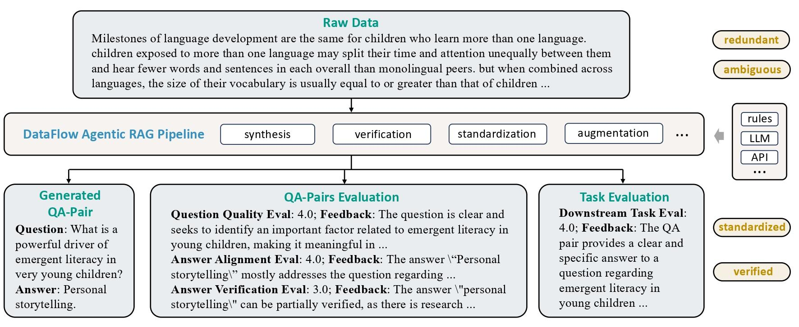

Alpha

| 处理步骤 | 处理内容 | 处理算子 |
| --- | --- | --- |
| 输入 |  | text |
| 内容选择 |  | • 内容选择器：从大型数据集中选择一部分文本内容（随机 or k-center-greedy） |
| 问答生成 |  | • 自动提示生成器：为问答生成自动专用 • 问答生成器：为每个文本内容及其对应的提示语生成问答对 • 问答评分器：对生成的问答对进行质量评估 |
| 输出 |  | output_question_quality_key="question_quality_grades", output_question_quality_feedback_key="question_quality_feedbacks", output_answer_alignment_key="answer_alignment_grades",         output_answer_alignment_feedback_key="answer_alignment_feedbacks", output_answer_verifiability_key="answer_verifiability_grades", |

共 4 个算子

Beta

| 处理步骤 | 处理内容 | 处理算子 |
| --- | --- | --- |
| 输入 |  | text |
| 原子问答生成 |  | • 原子任务生成器：从大型数据集中生成问题、参考答案、精简的参考答案、可替代（验证）以及在提供原始文档下 LLM 对问题的回答 |
| 问答生成质量评估 |  | • F1 打分器：为精简的参考答案与提供原始文档下 LLM 对问题的回答之间的 F1 分数进行评估 |

共 2 个算子

## **RARE 数据合成流水线**

Retrieval\-Augmented Reasoning Modeling：通过解耦知识存储和推理优化来提升大型语言模型（LLM）在特定领域智能的端到端框架

- 知识外化：将领域知识存储在可检索的外部来源中。
- 推理内化：在训练过程中，让模型专注于学习和内化特定领域的推理模式。

| 处理步骤 | 处理内容 | 处理算子 |
| --- | --- | --- |
| 输入 |  | text |
| 生成知识和推理密集型问题 |  | • Doc2Query 算子：根据输入的文档，利用大语言模型（LLM）生成需要复杂推理才能回答的问题和场景 ◦ 输入：text ◦ 输出：question、scenario |
| 挖掘困难负样本 |  | • BM25HardNeg 算子：利用 BM25 算法为每个问题从整个数据集中检索并筛选出“困难负样本” ◦ 输入：question、text ◦ 输出：hard_negtives |
| 蒸馏推理过程 |  | • ReasonDistill 算子：将问题、场景、一个正样本和多个困难负样本组合在一起，构建一个复杂的提示（Prompt）。然后，它利用一个强大的“教师”LLM（如 GPT-4o）来生成一个详细的、分步的推理过程（Chain-of-Thought），展示如何利用提供的（真假混合的）信息来最终回答问题。 |

共 3 个算子

## **知识库清洗流水线**

从表格、PDF 和 Word 文档等非结构化数据源中提取并整理知识，将其转化为可用于下游 RAG 或 QA 配对生成的可用条目。

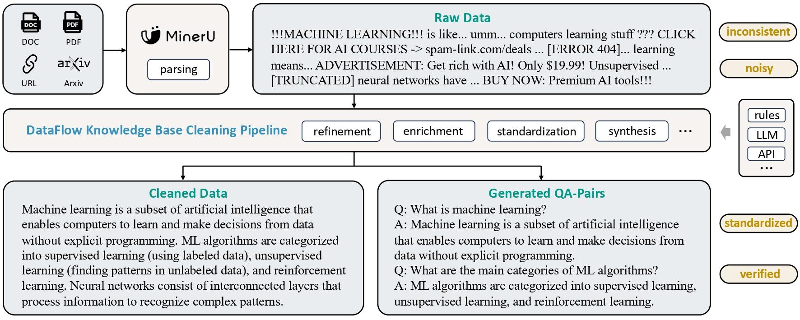

| 处理步骤 | 处理内容 | 处理算子 |
| --- | --- | --- |
| 输入 |  | text |
| 信息提取 | 借助MinerU, trafilatura等工具从原始文档中提取文本信息。 | • KnowledgeExtractor：将各种格式的原始文档转换成 markdown 文本（利用 MinerU） |
| 文本分段 | 借助chonkie将文本切分成片段，支持通过Token，字符，句子等分段方式。 | • CorpusTextSplitter：按 token 、字符、句子、语义等维度分块，输出 json [GitHub - chonkie-inc/chonkie: 🦛 CHONK your texts with Chonkie ✨ — The no-nonsense RAG chunking library](https://github.com/chonkie-inc/chonkie) |
| 知识清洗 | 从冗余标签，格式错误，屏蔽隐私信息和违规信息等角度对原始文本信息进行清洗，使文本信息更加清洁可用。 | • KnowledgeCleaner：智能清洗和格式化 |
| QA 构建 | 利用长度为三个句子的滑动窗口，将清洗好的知识库转写成一系列需要多步推理的QA，更有利于RAG准确推理。 | • MultiHopQAGenerator：针对每一条文本合成一组多跳问答 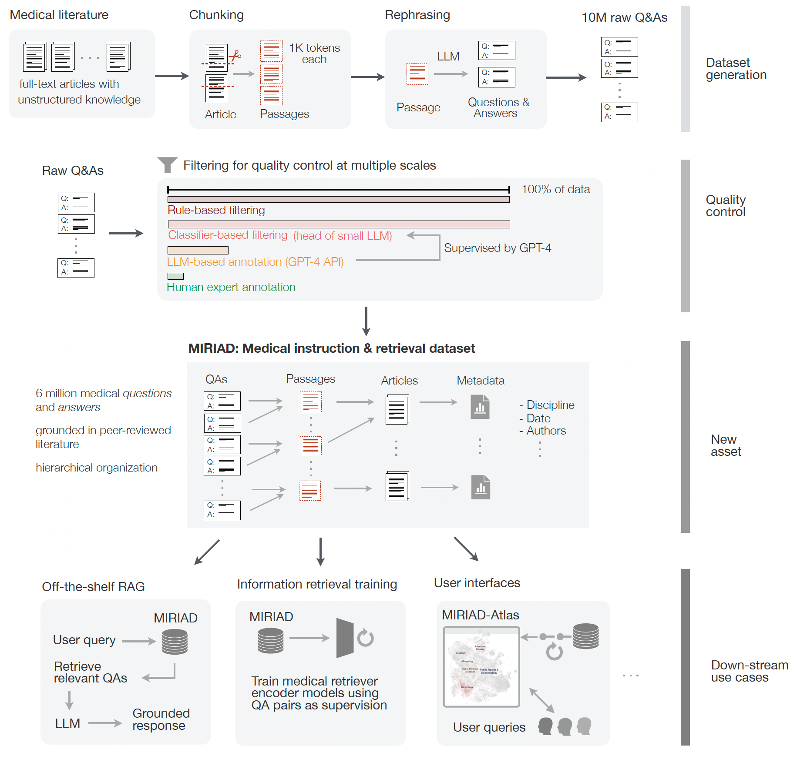 |

## **函数调用数据合成流水线**

通过函数/工具调用多轮对话数据的合成，扩展现有文本数据集的多样性，为模型在下游任务上的优化提供更加丰富的训练数据。

| 处理步骤 | 处理内容 | 处理算子 |
| --- | --- | --- |
| 输入 | 从对话数据中提取真实任务场景信息，给出简短描述。 | 对话数据 |
| 场景提取 | 根据提取出的场景信息生成原子化的任务，并将原子化的任务组织成更加复杂的组合任务，最后对任务的合理性进行验证。 | • 场景提取器：在对话数据中提取对话发生的场景信息 • 场景扩展器：扩展已有的场景到新的场景 |
| 任务生成、扩展与验证 | 根据组合任务及其原子化子任务生成所需的函数调用 | • 原子化任务生成器：根据场景主题生成对应的原子化任务 • 序列任务生成器：根据之前生成的原子化任务生成它的后继任务，并将他们组合成复杂任务 • 组合任务过滤器：对组合任务及其子任务的完备性进行验证，并对不符合要求的任务进行过滤。 |
| 函数生成 | 根据组合任务及其原子化子任务生成所需的函数调用。 | • 函数生成器：根据输入的组合任务生成所需函数工具 |
| 多智能体多轮对话生成 | 根据任务及其函数调用生成多轮对话数据。 | • 多轮对话生成器：根据输入的任务和函数工具，生成由用户，助理，工具三个智能体生成的多轮对话 |

# 5 **EasyLink**

官网：EasyLink AI官网

产品：EasyDoc 、 EasyVideo 、 EasyRAG

## **EasyDoc**

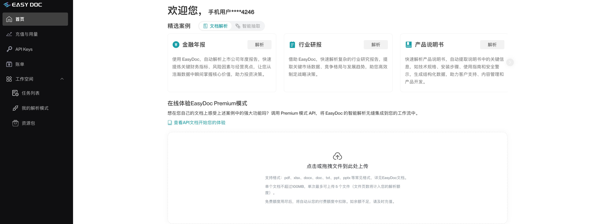

手册：欢迎使用EasyDoc

blog根源解决RAG幻觉！EasyLink \| 推出颠覆性的文档解析服务：EasyDoc ，可在线体验！

# 技术优势（官方宣称，实际上没那么好）

## **语义分块**：“传统的分块方法往往基于字数、标点或页数等规则，而EasyDoc则「基于语义识别进行分块」，例如将段落、表格、图表及其标题和注释视为独立的语义单元，并且能智能合并跨页或跨栏的内容，确保每个语义单元都是逻辑完整的。”

## **上下文增强**：“提供层级结构，为每个语义单元赋予文档路径上下文，从而「保留了全局关联性」。这极大地提升了检索的召回率与准确率，让大模型在理解文档时能够更好地把握其整体脉络。”

## **精准溯源**：“提供页码和视觉坐标信息，「支持LLM高效定位信息源」，有效避免了“幻觉”的产生，确保信息的可追溯性和准确性 。”

# 产品功能

## 文档解析&分段

### 解析和分段是做到一起的，而且是全自动的

### 有两个文件和三种表现形态

#### 层次结构树：按照标题将分块数据变成一棵树，可以做到“原文段落”到“树节点”的映射，节点点击展示详情

\-\- 试了一下，对 pdf 的标题层次结构识别的不准确

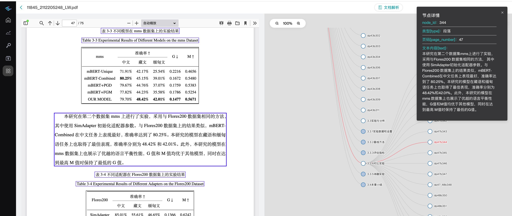

#### JSON：由节点组成，“层次结构树”应该就是 json 的 nodes 使用前端技术（看样子像是 d3）连接而成

##### nodes 字段：id 、 Text 、 type（文本、公式、表格、图片）、parent\_id（父节点的 id）、 path（所有祖先节点）、composing\_blocks（分段在原文中的位置）

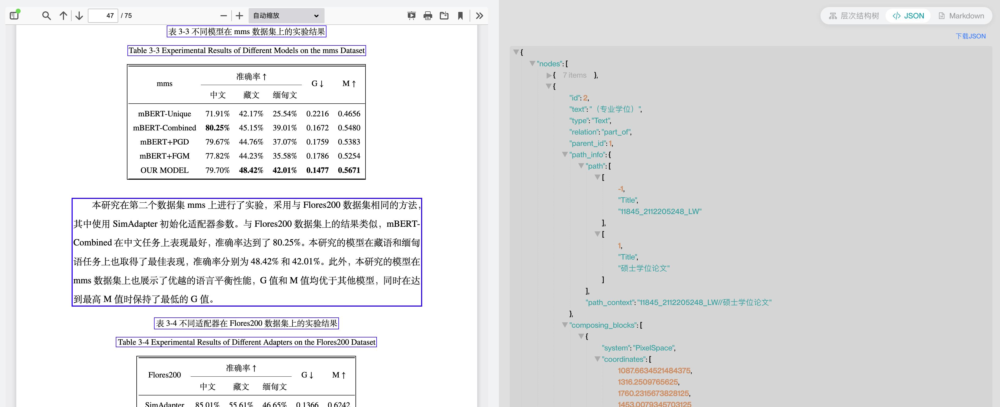

#### markdown：json 的 node text 拼接，非文本类型都以 oss\_url 替代，相当于全部都转成图片了

### 解析分段效果

#### 表格：

##### 识别成一个 json 数组，每一个 json object 的 key 是第一列的值，value 是每一列标题和值的 json

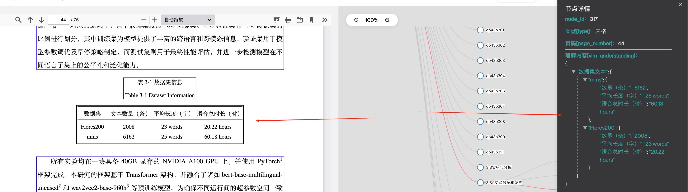

##### 跨页表：只有第一页被转换成 json，此外，多页还被识别成一个 ocr 平铺信息，不怎么样

##### 合并单元格：效果不好

#### 图片：使用 vlm，先将图片分区域，再逐个识别内容，这对于图片中分区域描述的信息还行，但流程图这样讲究整体性的图片效果就很差了

#### 图表/chart：被识别成图片了，只有 ocr 的内容

#### 公式：只能识别出“公式”类型，内容都是空

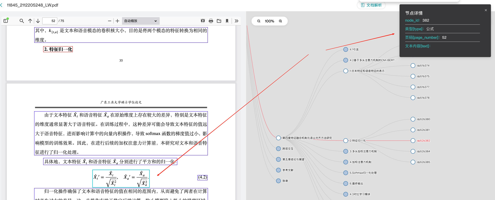

#### 分块：

##### 先按类型切，再将文本类型按自然段切。

##### 对于表格和图片块，会把下一个文本块的内容也放到这个文本块中，但会专门做一个 note 字段

### 初步判断

#### 分块逻辑跟 MOI 的差不多，但没有区分解析和分段两个步骤，导致结果还存在短文本，不能直接给 rag 使用

#### 分块关系做得不错，不但按照标题建了树形结构，而且在分块信息里有着完整的路径和祖先节点的记录，这与 moi 4\.1 设计相同

#### 表格的解析能力一般：一方面跨页的表格虽然识别出来，但只有部分解析成 json 格式；另一方面合并单元格的表格理解能力不太行

#### 公式智能识别类型、不能识别内容

#### 图表类型无法识别，只能当做图片 ocr

#### 图片识别在某些场景下会比较好，因为它能且只能先分区快后逐个识别，不同场景下各有优劣，这块取决于 vlm 的能力

#### 原文比对做得更好，做了 layout，moi 由于使用的 mineru 所以没有这个能力，只能做到比对到页。

## 智能抽取

### 没找到上传自己文件试一下的地方

### 从样例来看，结构简单，只能平铺

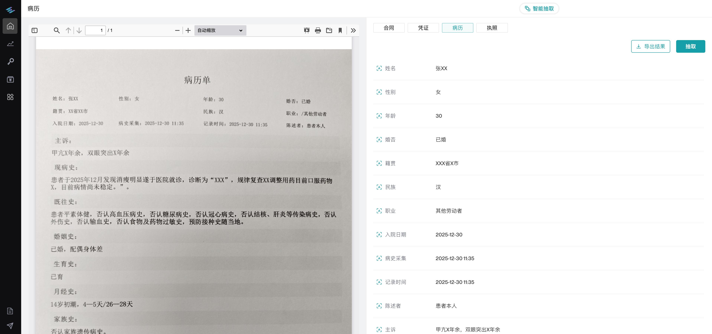

### 导出结果也挺粗糙

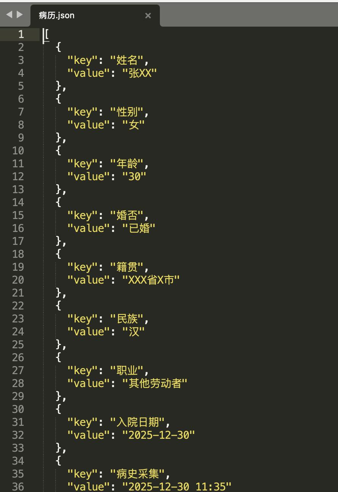

# 6 **FastGPT**

# 7 **HippoRAG**

# 8 **LangChain\-chatchat**

# 9 **QAnything**

# 10 **RAG\-GPT**

# 11 **FlashRAG**

# 12 **kotaemon**

# 13 **TurboRAG**

# 14 **AutoRAG**

# 15 **GraphRAG**

# 16 **LightRAG**

# 17 **nano\-GraphRAG**

# 18 **KAG**
