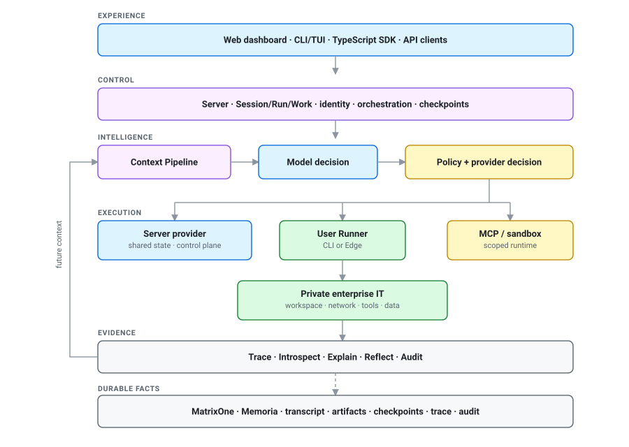

# Astra 运行时：架构与设计

Astra 承接智能体从任务上下文到模型调用、工具执行和结果核验的运行过程。这里按运行时职责组织架构与设计材料，便于从整体架构进入具体机制，再回到 [MOI 的产品适配要求](../../product-overview.md#6-astra平台能力如何进入-agent-运行时)。

这些文档描述设计目标与系统契约。某项设计是否已经实现，应以运行中的系统和验证记录为准。

## 整体架构

从 [架构总览](design/architecture.md) 开始，了解客户端、持久控制骨干、上下文管线、执行能力和状态层之间的关系。[设计文档索引](design/README.md)列出全部职责域和各自负责的契约。

## 按任务阅读

| 关注的问题 | 设计材料 |
| --- | --- |
| 一次任务如何进入运行、暂停、恢复并结束 | [运行生命周期](design/runtime-lifecycle.md) · [持久化运行](design/durable-agent-runs.md) · [多会话容量](design/multi-session-scale.md) |
| 上下文如何组装、压缩和进入模型请求 | [上下文与提示词](design/context-and-prompt.md) · [提示词生命周期](design/prompt-lifecycle.md) · [上下文窗口管理](design/context-window-management.md) · [记忆](design/memory.md) |
| 模型、工具、Skill 和其他能力如何选择与调用 | [模型接入与推理](design/model-access-and-inference.md) · [模型路由](design/model-routing.md) · [能力系统](design/capability-system.md) · [能力提供者运行时](design/capability-provider-runtime.md) · [Skill 与工具](design/skills-and-tools.md) |
| 多智能体如何协作，运行在哪一侧 | [编排](design/orchestration.md) · [多智能体运行时](design/multi-agent-runtime.md) · [云边执行](design/edge-cloud-execution.md) · [云边同步](architecture/edge-cloud-sync-architecture.md) |
| 执行权限、隔离与安全边界如何成立 | [运行时工具边界](design/edge-runtime-tool-boundary.md) · [安全与权限](design/safety-and-permissions.md) · [权限同步](design/permission-sync.md) · [信任与安全](design/trust-and-safety.md) |
| 如何观察过程、解释结果并定位问题 | [可观测平面](design/observation-plane.md) · [Explain 模式](design/explain-mode.md) · [自省与反思](design/introspect-and-reflect.md) · [会话可观测性](design/session-observability.md) · [产物与调试包](design/artifacts-and-debug-bundles.md) |
| 数据、版本与评测如何支持复现和改进 | [数据与存储](design/data-and-storage.md) · [数据版本化](design/data-versioning.md) · [评测](design/evaluation.md) · [反馈控制环](design/feedback-control-loop.md) · [调优任务](design/tuning-jobs.md) |

## 关键链路图

- [上下文管线图](assets/context-pipeline.svg)对应[上下文与提示词](design/context-and-prompt.md)，展示进入模型请求前的上下文组织。
- [运行生命周期图](assets/run-lifecycle.svg)对应[运行生命周期](design/runtime-lifecycle.md)，展示任务与运行状态的推进。
- [Runner 执行边界图](assets/runner-boundary.svg)对应[运行时工具边界](design/edge-runtime-tool-boundary.md)，展示用户环境中的工具执行。

## 阅读范围

- [完整设计文档索引](design/README.md)还包含认证、客户端、后台任务、文档架构、质量防线等专题。
- [配套操作材料](guides/)用于理解模型路由、登录和记忆判断的具体操作背景；运行命令依赖完整工程环境。
- [MOI 智能体工作台 PRD](../../prd/04-agent-applications/agent-workbench-prd.md)定义产品侧的配置与交互；本专题定义运行时的职责与边界。

本专题文档及图示适用 [Apache License 2.0](LICENSE)。
