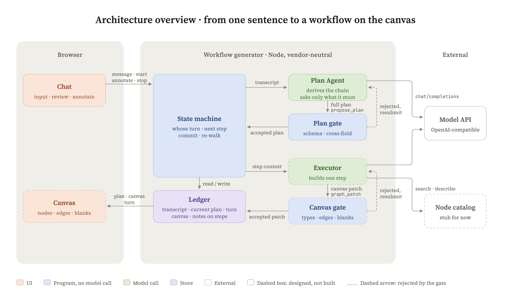

# 2026-09-07 README 存档

这份文档保留首页重写前的设计约定、实现说明与验证记录。它是历史快照，其中的进度和未来计划不代表当前状态；当前介绍与启动方式见[仓库首页](../../README.md)。

---

# Canvas-first Workflow

如果你需要一条可视化工作流来处理数据，你想用 AI 把它建出来，而不是手动拖拽。

问题在于：绝大多数 AI 产品的交互都发生在对话框里，而工作流是一条画布。它不是一份文件，也不是一段文字。

**什么样的架构，才能让 AI 的输出变成一条生长中的工作流，而不是长在对话框里的东西。**

这个仓库是对这个问题的回答：一份架构设计，一段做出来并在真模型上验证过的机制，加一个能看见的原型。

## 要做出来的是什么

一条工作流在你眼前长出来，你随手就能改它。

用户不看 Agent 的对话文字，只看画布，也能感受到自己的自然语言正在被系统持续理解，并逐步变成一条真实工作流。

契约、Gate、状态机、乐观并发，所有这些都是为这件事服务的，不是它本身。

## 已确认的交互方向（2026-09-05，第一步已实现）

画布是用户与 AI 交流的接口：工作流的结构帮助用户掌握全局，文字和指令在相关节点上逐步出现。本轮以数据处理 demo 验证这段协作过程；Plan Agent 与执行 Agent 真实生成和修订画布，节点不接入实际的数据处理软件包或模型来运行数据。

- **底部面向全局。** 底部输入始终针对整条工作流，不随节点展开、方案卡位置或断口状态切换作用对象。
- **局部交流留在节点。** 节点展开后提供局部输入，指令、处理状态和结果在节点内呈现；收起后保留简短状态，便于看全局。
- **右上角承载 Goal。** 持续展示整条工作流的目标、当前构建状态和待处理事项，生成结束后仍然有用。

局部输入无需跳到底部通过 `@` 指定对象。`@` 可留作以后在全局指令中引用节点的辅助能力。本轮已建立“在节点上输入，在节点上得到反馈”的闭环，见[交互秩序改造计划](../../docs/交互秩序改造计划.md)。Goal 面板仍待下一步实施。

**本轮确认的修订机制：** S3 是修改要求的发起点，一次修订的对象是完整工作流。执行 Agent 收到当前完整计划、最新完整画布、用户要求、已应用的局部要求和有关执行记录，审视所有步骤后只提交必要的节点及连线差量，可以连带修改 S5。状态机把差量合入临时画布，对整图执行机器能够完成的检查，再原子提交一个画布版本；不是重跑 S3，也不是从 S1 逐步重走。失败或停止不提交半份修订。

首次构建仍按计划分步生成。全局规划、首次构建和整图修订共用执行权；修订不直接改计划内容或计划版本。步骤影响说明是 Agent 的判断，结构和粗类型检查不能证明字段语义或业务目标一定正确。右上角 Goal 面板的完整改造留到下一步。

可以运行 `npm run web`，完成首次生成后展开任意节点，在卡片底部“说说这里想怎么改…”中发送要求。卡片固定标题和底部输入，中间正文共用一个滚动区，内容在滚动边缘渐隐；长 Prompt 默认展示短预览，数据连接按需展开。节点内以一行状态收起修订记录，展开后在正文中查看处理结果、关联修改和逐步影响说明；失败或停止保留输入，刷新会从当前服务会话恢复已发送记录。手动参数配置现已通过服务保存，后续修订会读取最新参数。

右上角方案卡沿用原型最终版的往返节奏：展开与收起时，卡片的位置、尺寸、正文和画布退后同步变化；首次开始生成则先收窄，再飞到右上角。展开或收起不会重设用户的画布缩放与位置。

左侧栏底部“设置 → 外观”切换浅色与暗色。首次跟随系统外观，手动选择后保存在当前浏览器，刷新与切换会话保持一致；主题在首屏绘制前恢复。

**会话保存（2026-09-05）：** 使用 `npm run web` 启动后打开 `http://127.0.0.1:5174/`，不要直接打开 `web/index.html`。左侧可以新建、切换、重命名工作流；新建时先在命名卡片中填写名称，点击“创建”后进入新画布，取消不创建会话。新建与重命名共用同一套卡片样式。删除后可从“已删除”恢复。每条会话地址带独立编号，切换不停止原会话的处理，也不把它的结果写入其他会话。

已发送的全局对话、Plan Agent 完整对话上下文、历次方案、最新画布、参数配置、批注、构建记录与节点修订记录，按会话保存到本机 `.sessions/`（已忽略版本控制，可用 `SESSION_DIR` 指定目录）。同一目录供一个本机服务进程使用；文件写完整并同步后原子替换。服务重启会恢复已提交结果；进行中的规划、构建或修订标为中断，不自动再次调用模型。保存失败会明确提示并提供重试，损坏存档保留原文件并报告，不冒充空会话。未发送的全局与节点草稿按会话缓存在当前浏览器，刷新或切换后恢复，清除浏览器数据会清除草稿；这不是跨设备同步。

原合同演示会话已从旧服务快照迁移，保留五节点画布和两次修订。旧服务没有导出内部工具对话，因此这一次迁移使用可读对话与实际已确认方案恢复规划上下文；迁移后的新对话均完整保存。

真实验证见 [run14：节点整图修订](../../fixtures/observed/run14-节点整图修订/README.md)：从 S3 提出存储单位变更，一轮同时更新 S3、S5，约 24.6 秒；随后澄清币种含义，约 31.9 秒，保留前轮要求和 S5 的修改。两次均未改变计划，没有运行真实数据处理。

## 架构一句话

> Plan Agent 定义一条数据链路「应该完成什么、怎样才算完整」；Execution Agent 根据平台真实能力决定「具体用什么、怎么把它做出来」。状态机负责把前者逐步交给后者。Gate 决定什么才能成为事实。



四个角色都做出来了：Plan Agent 和它的 Gate 在真模型上验过；状态机测试守着；Execution Agent 插在状态机上，在真模型上走完过一整条链；画布接上了——在界面上打一句话，方案出来，按开始，卡一张张长出来。

Plan Agent 这一段是这么切的：

- **数据形态转变一次，就是一步。** 每一步写清数据进来是什么形态、出去变成什么形态。链路靠「上一环的输出形态逼出下一环」往前推，不是一张动作清单。
- **公有知识放手，私有事实必问。** OCR、切 chunk、数仓分层这类行业通识模型自己会，提示词一个字不教。只存在于用户那边的事实（哪张表、什么口径、抽哪几个字段）必须问，不许用默认值填。判据是：错了用户看不看得出来。
- **方案通过一个工具提交。** 模型在同一条消息里可以先说话再提交。信息不够就只说话不提交，这本身是合法产出，不是失败。
- **Gate 是唯一的保证。** 它以 schema 文件为唯一来源，再加 schema 写不出来的跨字段检查。没过就把错误原样发回让模型重交完整的一份，重试有上限。
- **模型侧只要求 OpenAI 兼容的对话接口。** 不引任何厂商 SDK，换模型只换地址、key、模型名三个配置。
- **每一轮提交完整的一份，不提交增量。** 界面上「原地改还是重来」靠编号：沿用同一个编号就是原地改，换新编号就是这条重来。

每一条背后放弃了什么，在 [docs/取舍.md](../../docs/取舍.md)。

## 现在做到哪儿

诚实的进度，不是路线图。

| | 状态 |
|---|---|
| Plan 契约 `contracts/plan-proposal.schema.json` | 有 |
| Plan Gate `src/plan/validate-plan-proposal.mts` | 有，测试守着 |
| Plan Agent 系统提示词 `prompts/plan-agent.md` | 有，中文原文加英文译本 |
| 提交工具与调用循环 `src/plan/plan-agent.mts` | 有。任何 OpenAI 兼容接口都能接，DeepSeek V4 和 Kimi K3 上都跑过。**一个已知的错位**：Kimi 这个接口原生是 Anthropic 形状的，我们走它的 OpenAI 兼容层，模型偶尔把工具调用当正文写出来，翻译层没东西可翻。两处都就地认出来让它重来了，根因和取舍记在 `docs/观察.md` |
| Plan 阶段的多轮会话 `src/plan/plan-session.mts` | 有。攒对话记录，方案只在过闸时换，回合制，能停 |
| 真模型验证 | 有。deepseek-v4-pro 上跑过三个场景、三次修订轮，原始输出和完整对话记录在 `fixtures/observed/`，行为记录在 `docs/观察.md` |
| 画布原型 `prototype/` | 有。Plan 阶段的内容是真实模型输出，执行阶段是手写的愿景演示 |
| 状态机 `src/state-machine/workflow-session.mts` | 有。首次构建按依赖分波走步；完成后的节点请求走独立整图修订，保存要求、状态和结果，检查完整候选后原子提交。两条路径共用执行权，停止或过期结果不提交 |
| 画布侧 Gate | 两道有了：信封（节点标的是哪一步、名字不撞、线接在存在的节点上、走完整张画布查形状）和对得上节点表（类型在表里、格子存在、要填的填了或留空、挑一个的值在能挑的里、多出口的线写了出口）。第三道「接得上」有了：每个节点要什么，接进来的线上得有，从节点定义推；「能渲染」画得出来了，还没当成闸门 |
| 画布 `web/` + `src/web/server.mts` | 有。底部始终与方案设计者讨论全局；首次生成按步骤长出节点；完成后在展开节点内发送修改，原处显示处理、停止、结果与失败原因，收起后保留状态标记。断口卡保留重走和改方案入口。刷新与事件重连恢复当前服务会话，旧事件不能回滚画布。每次生成与修订实录默认写 `.runs/` |
| 整图修订 `src/executor/reviser.mts` | 有。完整计划、最新全画布、发起节点、当前及已确认要求、相关历史进入上下文；只用 `submit_revision` 提交必要差量或说明无需修改／需要改方案。共享门禁校验完整候选，真实跨步骤修改及连续修订已验证（run14） |
| 我们自己的节点表 `nodes/` | 有，十一张收口：定时触发、读文件、解析文档、OCR、切块、向量化、写向量库、LLM、写数据库、条件分岔、写代码。契约 `contracts/node-definition.schema.json`，读表就校。执行者换到这张表上了：整张表常驻在提示词里，没有搜、没有查，只有交；闸门第二道按表查交回的格子。每张卡写要什么、加什么、按什么算一条——节点之间接的是这份契约，线上印「Text · 按文件」，卡的 Input / Output 行印同一份（`shared/flow.mts`，浏览器和服务端一份代码） |
| Execution Agent 与它的输出契约 | 有。提示词（`prompts/executor.en.md`，英文为主，中文副本待写）、一个工具（交）、交回形状的契约（`contracts/step-submission.schema.json`）、让模型交、被退、再交的循环（`src/executor/executor.mts`）；插进状态机，在真模型上走完过一整条链（`fixtures/observed/run11-执行者走完整条链/`），批注后重走碰到目录里没有的能力时停在那一步（`run12-批注重走/`）。怎么定的和还差什么见 `docs/执行者.md`。`fixtures/doubles/fixed-executor.mts` 是测试用的固定答复，节点名明写「固定答复」，类型是写代码，正文一行注释，只为看状态机怎么动 |

所以现在这个仓库是：**设计者和执行者都做出来了，在真模型上走完过一整条链；状态机做出来了，测试守着；画布接上了——一句话进去，卡一张张长出来，中途停了能看见为什么、也能接着走。`prototype/` 那个演出版留着，它演的是节奏，不是数据。**

## 原型里哪些是真的

原型是一个静态页面，不调用模型。它演的是一次完整的交互：用户打一句话，Plan 卡片长出理解、路线和待确认，用户补一句，卡片原地更新，然后画布上长出工作流。

- 打字之后到「开始生成」之前，卡片上的每一个字都是真的。它们来自 deepseek-v4-pro 提交、Gate 放行的两份方案（`fixtures/observed/run4-*`），由 `src/prototype/build-demo-data.mts` 生成成 `prototype/plan-data.js`。哪些问题被答掉、哪一步原地改，是拿两份方案的编号差异算出来的，不是手标的。
- 「开始生成」之后长出来的六个节点，是手写的愿景演示。节点里的存储路径、字段清单、代码、定时时间都是编的。Execution Agent 还不存在，画布并没有读那份方案。
- 现场出图有两处：`npm run web` 是真的，数据是当场跑出来的；`prototype/` 是演的，节奏做得细，数据是录下来的。

## 跑一下

需要 Node 22.9 以上。

首次拉取或依赖变化后，先运行 `npm ci`。`npm run web`、`npm test` 和已有 Agent 命令会在启动前自动编译共用 TypeScript 模块，编译失败时不会继续启动。

### TypeScript 源码与构建

所有自有 JavaScript 程序已迁移为 TypeScript：后端、应用前端、共用代码、测试、构建工具和可执行原型。严格检查后运行编译结果。唯一保留的 `prototype/plan-data.js` 是生成器输出的演示数据；节点中的业务示例代码也是数据，不是应用实现。HTML 不再内嵌程序。

外部模型消息、计划、HTTP 请求和会话文件先按未知数据检查，再交给内部代码。原存档格式与额外元数据保留；读取检查不要求工作流已完成，损坏存档留在原处并提示。命令行沿用原命令名称，单步入口先检查计划和画布。

模型接入层先适配兼容格式：函数调用缺省的 `type` 补为 `function`，完整对象参数转为 JSON 文本；坏 JSON 字符串保留给 Agent 的纠错循环处理。流式片段组装完成后与非流式共用完整消息检查；缺少编号、工具名或参数、未知调用类型，以及流式混用完整对象和非空参数片段仍报接口错误，不猜测缺失内容。

`npm run build` 先清理 `dist/` 与 `.build-tools/`，再生成类型、编译源码并复制运行资源，避免删除源码后继续运行旧产物。清理脚本由 Node 的类型擦除模式直接启动，不依赖已有编译结果。`npm run web`、测试和 Agent 命令会先构建，统一运行编译结果；提示词、节点表和 Schema 位于编译目录对应层级。默认 `.sessions/` 仍保存在仓库根目录，不随 `dist/` 重建而删除；`EXECUTOR_MODULE=src/...mjs` 等原有内置路径映射至编译结果，外部自定义模块路径不变。

浏览器与后端分别进行环境检查：`tsconfig.browser.json` 只提供浏览器能力，`tsconfig.server.json` 只提供 Node 能力。普通构建先通过这两道检查，再统一生成运行文件；监听模式同步检查两种环境。前端使用的方案草稿和差异类型放在 `shared/plan.d.mts`，不再从后端实现借用。回归测试通过真正的检查器验证前端不能读环境变量或导入文件模块、后端不能使用 DOM。

运行 `npm run typecheck` 检查全部源码和 `test/types/` 中只编译、不执行的类型反例。后端执行上下文要求经过校验的计划，修订结果区分 patch 与无需修改，类型检查会拒绝缺少差量的 patch。生成声明不提交，也不手动维护第二份字段表。

修改源码后重新运行 `npm run build` 并重启服务；`build:watch` 可持续编译源码，修改 Schema、静态资源或删除源码后仍需完整构建。直接使用 Node 时运行 `dist/src/` 下的入口。生成工具的一项第三方声明与严格可选属性不兼容，因此仅工具配置使用 `skipLibCheck`；项目源码的严格检查保持开启。

分阶段 PR 与验收记录见 [TypeScript 迁移记录](../../docs/TypeScript迁移.md)。

跑测试：

```bash
npm test
```

让真模型出一份方案。先把 `.env.example` 抄成 `.env`，填上接口地址、key、模型名，任何 OpenAI 兼容接口都行：

```bash
npm run plan -- "每天定时把新增的合同 PDF 解析出关键字段，写进数据库"
```

模型要么提交一份过了 Gate 的方案，要么只说话向你提问。两种结果都会原样打出来。

提示词默认用中文版。想试英文译本，在 `.env` 里加一行 `PLAN_PROMPT_LANG=en`。

多轮聊，一行一轮，用户补一句模型就整份重推。加 `--save <目录>` 把每一轮的原始输出和完整对话记录存下来，`fixtures/observed/` 里的实录就是这么来的：

```bash
npm run plan:chat -- --save fixtures/observed/我的一次运行
```

同一个命令行里有三个按钮：`/start` 按开始，状态机按方案里的顺序一步一步交给执行者；`/note r1 文字` 在 r1 上批注（编号以方案里印的为准），下次 `/start` 执行者会看到；`/canvas` 看画布。执行者用 `EXECUTOR_MODULE=路径` 插进来（默认导出一个 async 函数）；没插的时候 `/start` 会明说做不了。插真的执行者：

```bash
EXECUTOR_MODULE=src/executor/executor.mjs npm run plan:chat -- --save fixtures/observed/我的一次运行
```

走步时它交了什么、被退了什么一行行印出来；每一步它自己的对话记录存在 `--save` 目录的 `executor/` 下。`fixtures/observed/run11-执行者走完整条链/` 是这么跑出来的。只想看状态机怎么动，插测试用的固定答复：

```bash
EXECUTOR_MODULE=fixtures/doubles/fixed-executor.mjs npm run plan:chat
```

它交回的节点名明写「固定答复」，不是执行者。`fixtures/observed/run9-状态机走步-固定答复/` 是这么跑出来的一份记录：真模型出的方案，固定答复走的步。

校验一份方案文件：

```bash
node dist/src/plan/validate-plan-proposal.mjs fixtures/observed/run1-合同场景/turn-1.plan.json
```

看原型：先运行 `npm run build`，再双击打开 `dist/prototype/index.html` 就行——演出版不跟主体共用代码，也不需要服务，整个 `dist/prototype/` 文件夹拿走就能演。改了 `fixtures/observed/` 里的修订轮方案之后，重新生成演示数据：

```bash
node dist/src/prototype/build-demo-data.mjs
```

## 怎么读

按这个顺序，一小时能看完：

1. [docs/取舍.md](../../docs/取舍.md)：每一条契约决定是被什么麻烦逼出来的，放弃了哪条路。
2. [prompts/plan-agent.md](../../prompts/plan-agent.md) 和 [contracts/plan-proposal.schema.json](../../contracts/plan-proposal.schema.json)：设计者被要求做什么，交出来的东西长什么样。
3. [docs/观察.md](../../docs/观察.md) 和 `fixtures/observed/`：真模型实际做了什么，哪些成立，哪些裁定不是问题。
4. [docs/架构.md](../../docs/架构.md)：整条环的权威描述——五个角色、一步怎么来回、三道验证、分支循环并行、铁律、现在有什么没什么。
5. [docs/执行者.md](../../docs/执行者.md)：执行者的提示词是怎么一条条推出来的，还没做的部分。
5. `prototype/`：看一遍演示，再看 [prototype/修改本.md](https://github.com/Bai-009/canvas-first-workflow/blob/824397ed995dc7e1293a383bf3b90d1bc1cdf63e/prototype/%E4%BF%AE%E6%94%B9%E6%9C%AC.md) 里每一处改动的为什么。

## 目录

```
contracts/   契约：PlanProposal、执行者交回一步的形状、节点定义
prompts/     系统提示词：Plan Agent 中文原文与英文译本；执行者英文为主（中文副本待写）
nodes/       我们自己的节点表，一个节点一个文件
src/
  plan/          设计者这一半：Gate、提交工具定义、调用循环、方案差异、Plan 会话
  state-machine/ 状态机：从方案里读走步顺序与拼上下文、开始/停/批注/走步/画布/记录
  executor/      执行者：节点表怎么摆给模型看、交步的工具定义、一步的来回；默认导出就是插进状态机的插口
  nodes/         读节点表，按契约校；闸门第二道，交回的节点对得上表
  model/         跟模型说话的插座，OpenAI 兼容，两半共用
  cli/           多轮命令 plan:chat、单跑一步 executor:step、把执行者的动作印成人话
  web/           画布这一头的服务：静态页、节点表、说一句、按开始、事件推给页面
  prototype/     给画布原型生成演示数据
test/        按 src 的目录一一对应
fixtures/    手写的设计样例；observed/ 里真模型的原始输出，一次运行一个文件夹；doubles/ 里测试用的固定答复执行者
docs/
  assets/      README 里的架构总览图，src/ 是它的网页源文件
  取舍.md      每一刀背后的麻烦与放弃的路
  架构.md      整条环的权威描述:角色、一步的来回、三道验证、铁律、现在有什么没什么
  状态机.md    回合制、账本、执行阶段的七条规则、代码做成了什么、待确认的洞
  执行者.md    提示词是怎么一条条推出来的、行家的写法、还没做的
  plan-契约.md PlanProposal 各字段为什么长这样
  观察.md      真模型的行为记录
  词表.md      我们的说法和代码里、行业里说法的对照
  设计记录.md  建造过程的逐步记录，早期稿，以上面几份为准
  scenarios/   场景预演，早期稿
web/         画布：卡照节点表画（card.mts）、卡摆哪儿（layout.mts）、镜头与长卡（canvas.mts）、线上流的是什么（shared/flow.mts）
prototype/   画布原型，修改本.md 记着每一处改动
scripts/     render-figures.sh 出图
AGENTS.md    人和 Agent 在这个仓库里怎么协作
CLAUDE.md    Claude Code 每个会话先读的规矩，指向 AGENTS.md
```

预览页也从编译结果加载：`dist/prototype/node-card.html` 同样双击可开；`dist/web/node-conversation.preview.html`、`dist/web/sessions.preview.html` 用的是应用自己的模块，要从工作流服务打开。现有 n8n 描述导出工具使用 `npm run dump:n8n -- <已安装的节点包目录> <输出 JSON>`；它只导出描述，不为应用接入 n8n 或执行工作流。
