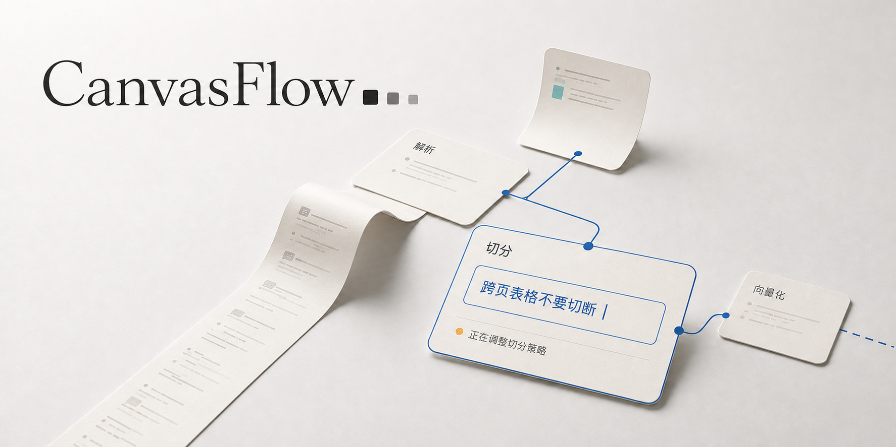
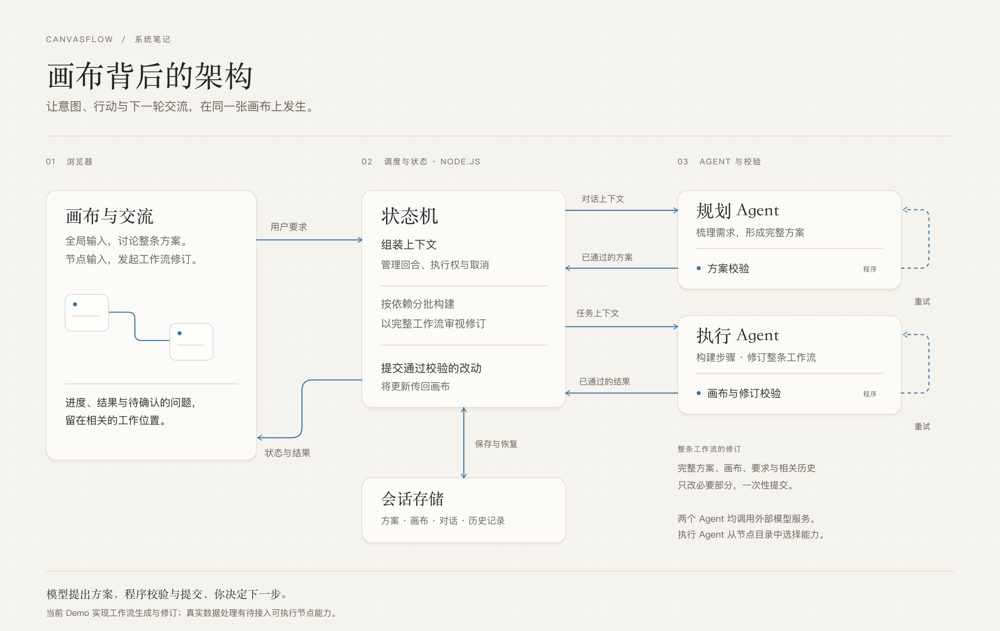

# 交互理念与项目边界

**与 AI 共同构建数据工作流的画布。**

描述你希望数据变成什么。Agent 构建工作流的过程，会逐步呈现在画布上。进入节点提问或提出修改，再看这次交流如何改变工作流。

项目从 Dify、n8n 这类可视化工作流的使用场景出发，目标是帮助用户建立数据处理链路：将原始文档和数据解析、清洗、切分、结构化，准备成适合 AI 使用的数据。围绕这个目标，CanvasFlow 探索画布交互和 Agent 架构如何共同支持人与 AI 的协作。

> 当前已实现方案、节点配置与连线的真实 AI 生成和修订。上传并处理真实数据，需要未来接入相应的节点执行能力；现阶段不运行实际的 OCR、向量化或数据库写入。上方是表达交互方向的概念宣传图，实际界面请运行项目体验。

## 为什么是画布

工作流本来就有结构：哪些步骤先发生、哪里分支、什么依赖什么。CanvasFlow 把常规对话框里的提问、回应、确认和修改，放回相应的节点与连接上，让这份结构承担交流本身。

你可以先看全局，再进入一个节点。要求在哪里提出，处理状态与反馈就在哪里出现。一次回应进入下一轮，画布继续变化，用户也能继续介入。

**画布呈现的是协作的进行过程。** Agent 正在推进哪一步，哪里需要补充信息，刚才的要求改变了什么，都应当能够从画面中理解。我们希望把 Agent 接收要求、行动、校验、反馈、再次调整的循环，转化为用户可以看见并参与的交互。

如果对话框像终端，画布也许可以成为人与 AI 协作的桌面。数据处理给了这套交互具体的对象、依赖和目标。

**尊重用户的注意力，也尊重用户的判断。** 信息何时出现、展开一张卡片的节奏、一次修改能否被看懂，都是产品本身。我们希望用户能理解并决定下一步，而不是被迫适应 Agent 的表达方式。

## 在这里怎样协作

### 从一个目标开始

在底部描述你想完成的事。Plan Agent 整理目标、步骤和需要确认的问题；补充信息后，方案继续更新。确认方案并开始构建，节点和连线逐步出现在画布上。

### 在节点里继续交流

展开一张卡片，查看它的参数与连接，在卡片底部提出要求。处理状态、修改结果和相关说明留在这个节点里。底部输入框始终面向整条工作流，不因选中节点而悄悄更换作用对象。

### 从局部发起，对整体负责

假设一条工作流有五个步骤。你在第三步说“金额改成以分存储”，第五步的汇总也可能需要调整。

这次请求会带上完整计划、最新画布和相关历史。执行 Agent 审视整条工作流后提交必要的修改，系统检查完整候选画布，再一次性应用。这里的“修改第三步”是交流的起点，不是只重跑第三步。

### 留下来，下次接着做

左侧管理工作流会话，支持新建、重命名、切换、删除与恢复。已提交的方案和画布保存在本机，刷新后可以继续查看。长内容按需展开，画布支持缩放与复位，浅色和暗色外观在侧栏设置中切换。

## 当前边界

- **已经可以体验：** 多轮规划、逐步构建、节点内整图修订、本机会话保存、参数配置、停止与失败反馈、浅色与暗色外观。
- **仍在探索：** 右上角从方案卡走向持续的 Goal 面板，以及生成、分支、长内容展开时的交互节奏。独立动效原型不代表正式应用已采用。
- **后续能力方向：** 接入适合的真实节点能力，让用户上传数据并运行处理链路，得到适合 AI 使用的数据。这部分尚未实现。
- **不在当前 Demo 范围：** 跨设备同步、多人协作和面向公网的账户系统。

## 画布背后

前端和后端都使用 TypeScript，分别按浏览器与 Node.js 环境检查。浏览器负责画布和交互，Node.js 服务负责模型调用、状态管理、校验与本地存储，通过 HTTP 和服务端事件流连接。

Agent 架构围绕这段协作过程分工：规划负责整体意图，构建与修订负责具体画布，状态机管理每一轮的上下文和提交，校验器把能够检查的问题退回给 Agent。阶段、结果和需要用户介入的事项再返回画布，成为下一次交流的依据。

| 角色 | 负责什么 |
| --- | --- |
| Plan Agent | 把需求整理成计划，明确数据在每一步如何变化，询问缺失的信息 |
| Execution Agent | 根据节点目录构建画布；修订时结合整图上下文提交必要的差量 |
| 状态机 | 编排构建与修订，组装上下文，管理执行权、停止与提交 |
| 校验器（Gate） | 检查计划与画布契约、节点配置、连接和粗粒度数据形态 |

模型提出方案，代码决定哪些结果可以进入当前画布。首次构建按依赖分批推进；节点修订先合成完整候选画布，检查通过后原子提交，失败或停止不会留下半份修订。

这些检查能拦住一部分结构错误，**不能证明业务语义一定正确**。例如字段单位是否一致，仍需要模型判断和用户审阅。

会话默认存放在 `.sessions/`，运行记录在 `.runs/`，未发送草稿保存在当前浏览器。服务重启后保留已提交结果，进行中的任务会标记为中断，不会自动再次调用模型。模型密钥留在服务端 `.env`。更多存储与开发说明见[开发指南](开发指南.md)。
