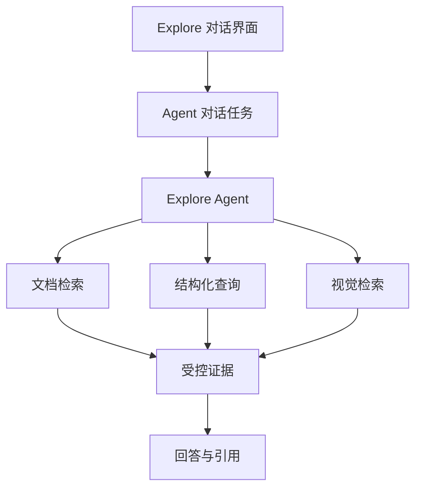

# Agentic RAG 查询架构

## 目标与边界

本篇说明 Explore 如何承载一次 Agent 问答，在知识库允许的范围内选择文档检索、结构化查询或视觉检索，并形成带引用的回答。它不把 Agent 通信协议等同于检索算法。

## 架构全景

## 分层职责

### 会话层

- 对象：Explore 对话界面、Agent 对话任务、流式事件。
- 职责：提交问题、接收过程状态、展示回答与引用。

### 规划层

- 对象：Explore Agent。
- 职责：根据问题、可用数据范围和工具说明选择合适的工具组合。

### 文档证据层

- 对象：文件发现、文本片段检索、解析内容与图片检索。
- 职责：从已授权的文件范围取得可阅读、可定位的文档证据。

### 数据证据层

- 对象：表结构理解、结构化查询。
- 职责：从已授权的业务数据表取得可计算的事实。

### 引用层

- 对象：最终来源选择。
- 职责：只保留最终回答实际使用的文档、图片或数据证据。

## 资源关系

- **Explore → Agent 对话任务**：页面将用户问题连同当前知识库范围提交给 Agent。
- **知识库范围 → Agent 工具**：运行时将可用的文件、业务表和已发布版本限定为 Agent 可访问范围。
- **Agent → 工具集**：Agent 只可调用显式提供的工具，不直接越过知识库边界访问原始数据。
- **文档检索 → 候选集**：全文与向量检索各自产生候选，随后去重、排序、重排序和上下文扩展。
- **工具结果 → 最终引用**：只有回答中实际采用的证据进入最终引用。

## 核心对象与状态合同

- **混合检索**：全文检索擅长精确词和编号；向量检索擅长语义近似表达；两者共同构成文档候选集。
- **重排序**：重排序只比较已经召回的候选，帮助把更符合问题的证据排在前面。
- **上下文扩展**：命中片段可补充同一章节、相邻片段、相关表格或图片，避免孤立语句造成误读。
- **视觉检索**：当知识以图表、页面图片或视觉内容存在时，可结合图片和文本证据检索。
- **混合问答**：当问题同时需要文件解释与业务数据计算时，Agent 应同时使用两类证据，并分别引用。
