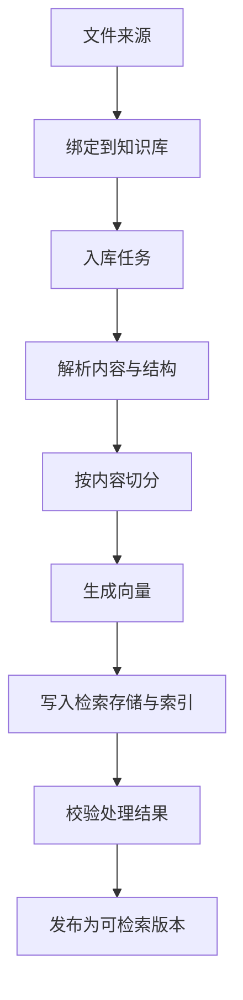

# 文档入库架构

## 目标与边界

本篇说明非结构化文件如何从数据来源成为当前知识库可检索的文档版本。它覆盖文件绑定、解析、切分、向量化、索引和发布；不讨论将结构化文件导入业务表的流程。

## 架构全景

## 分层职责

### 来源与治理层

- 对象：文件来源、绑定关系、入库任务、可检索版本。
- 职责：记录文件属于哪个知识库、应执行什么处理，以及当前哪个版本可用。

### 调度层

- 对象：标准文档处理工作流、任务状态、执行记录。
- 职责：可靠地派发、观察和恢复一次文件处理。

### 内容处理层

- 对象：解析、文档切分、向量化、索引构建。
- 职责：将原文件转化为带来源和结构信息的检索记录。

### 数据层

- 对象：解析产物、文档检索记录、来源关联。
- 职责：保存处理结果，并为发布和引用提供可追溯依据。

## 资源关系

- **文件 → 知识库绑定**：文件先被纳入知识库的受控范围，再进入入库处理；绑定不等于复制原始文件。
- **绑定 → 入库任务**：任务记录一次处理意图、状态和关联版本，支持异步执行与观察。
- **入库任务 → 处理结果**：解析、切分和向量化产生候选检索内容；处理完成不自动表示已经对外可检索。
- **处理结果 → 可检索版本**：系统校验结果属于当前知识库后，再发布一个新的可检索版本。

## 核心对象与状态合同

- **解析**：先把 PDF、办公文档、图片或其他格式转换为带结构的内容表示；复杂文档可保留页面、表格、图片与文本之间的关联。
- **切分**：普通正文按目标长度和重叠范围形成片段；表格、代码、图片说明等应尽量保持完整语义单元，避免被任意截断。
- **多粒度记录**：同一份文件可以同时保留文档、章节和片段三个粒度，以兼顾定位、召回与上下文补充。
- **向量化与索引**：每个可检索片段生成向量，并与文本索引、来源和结构元数据一同写入检索存储。
- **发布**：只有来源、处理结果和版本绑定完整时，新的版本才进入当前知识库的检索范围。
