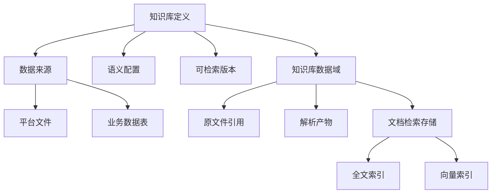

# 知识库资源架构

## 目标与边界

本篇说明知识库的资源归属与物理落点：哪些对象定义知识范围，哪些对象保存处理结果，哪些对象决定内容是否可检索。文件处理时序见[文档入库架构](document-ingestion.md)，问答链路见[Agentic RAG 查询架构](agentic-rag-query.md)。

## 架构全景

## 分层职责

### 知识库配置层

- 对象：知识库定义、数据来源、语义配置、可检索版本。
- 职责：定义知识范围、业务含义与当前可对外使用的处理结果。

### 已纳管数据资产层

- 对象：平台文件、已有业务数据表。
- 职责：作为知识库可绑定的原始数据；原始资产仍保持自己的管理与权限边界。

### 知识库数据域

- 对象：原文件引用、解析产物、文档检索存储。
- 职责：保存知识库处理产生的数据，而不是取代原始数据资产。

### 索引层

- 对象：全文索引、向量索引。
- 职责：为同一份文档检索存储提供不同方式的访问加速。

## 资源关系

- **知识库 → 数据来源**：数据来源记录知识库使用哪些文件或表；它是绑定与治理关系，不是原始数据副本。
- **数据来源 → 平台文件 / 业务表**：文件和表仍按原有方式管理；知识库在授权范围内使用它们。
- **知识库 → 数据域**：每个知识库拥有处理文件和组织检索内容所需的数据域。
- **知识库 → 语义配置**：术语、指标、关系和规则属于知识库配置，用于统一业务理解。
- **可检索版本 → 文档检索存储**：只有被发布为当前版本的处理结果才能进入检索范围。
- **文档检索存储 → 索引**：全文索引和向量索引附属于同一份内容，不是独立数据源。

## 数据域内的主要对象

- **原文件引用**：将平台文件纳入知识库的受控范围，同时保持与原始资产的关联。
- **解析产物**：保存从原文件提取出的文本、结构、页面和图片等可追溯内容。
- **文档检索存储**：保存文档、章节、内容片段、文本、向量、来源和定位信息，是文档问答的主存储。
- **全文索引**：为名称、术语、编号、日期和精确表述等内容提供文本召回。
- **向量索引**：为不同措辞但语义相近的问题提供近邻召回。

业务数据表是可选的数据来源，用于回答结构化事实；它不是文档检索存储自动生成的一部分。
