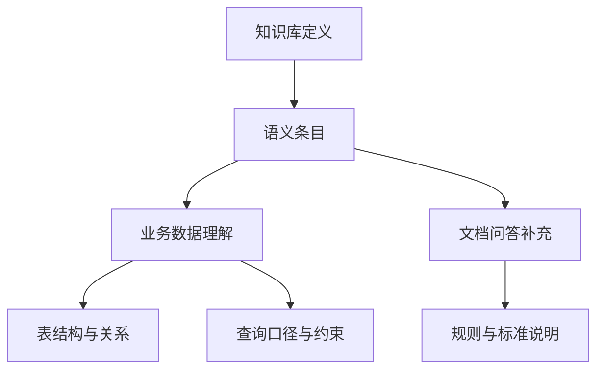

# 语义配置架构

## 目标与边界

本篇说明知识库如何配置业务术语、指标、关系和规则，使文档问答与业务数据问答使用一致的业务语言。语义配置是控制面元数据，不是索引或文档内容本身。

## 架构全景

## 分层职责

### 配置层

- 对象：语义条目。
- 职责：保存语义类别、适用范围、业务对象及其定义。

### 管理层

- 对象：语义配置的维护入口。
- 职责：让知识库管理员创建、更新、删除、导入和导出语义配置。

### 数据问答运行时

- 对象：表结构理解与结构化查询能力。
- 职责：把指标、字段说明、表间关系和业务规则用于查询规划与结果解释。

### 文档问答运行时

- 对象：检索结果的补充语义。
- 职责：只为命中的相关文件补充适用的规则或标准问答，不替代原始证据。

## 资源关系

- **知识库 → 语义条目**：语义条目的作用范围由知识库决定。
- **数据语义 → 表结构理解**：指标、表和字段说明、关系与规则帮助 Agent 理解业务数据。
- **数据语义 → 查询**：实际采用的业务定义约束查询口径，并可被记录为回答依据。
- **文档语义 → 检索结果**：业务规则和标准问答只在关联文件命中时作为补充上下文。
- **语义条目 ≠ 索引**：语义条目不会自动产生向量，也不会替代全文或向量索引。

## 核心对象与状态合同

- **术语与说明**：描述业务对象及字段的业务含义，减少同名异义和技术字段名带来的理解偏差。
- **指标**：定义聚合、计算、过滤条件、公式和同义词，统一数据问答的口径。
- **关系**：描述业务表之间如何关联，为多表查询提供边界。
- **业务规则**：表达单位、时间范围、权威来源或适用条件等业务约束。
- **标准问答**：沉淀相对稳定的业务说明，作为文档问答的补充信息。
