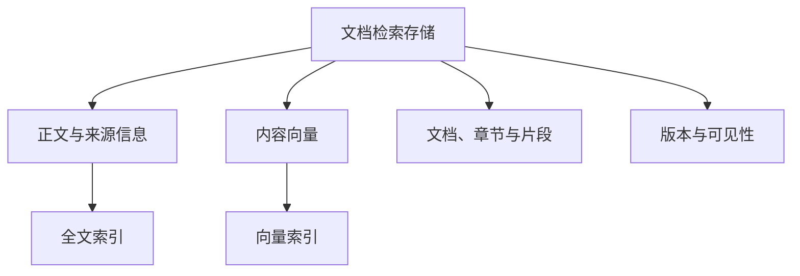

# 存储与索引架构

## 目标与边界

本篇说明文档问答所需的内容、向量与索引如何组织，以及它们与结构化业务表的区别。它不展开文档处理步骤，也不描述 Agent 如何组织最终回答。

## 架构全景

## 分层职责

### 主存储

- 对象：文档检索记录。
- 职责：保存正文、向量、来源、层级结构、版本和定位信息。

### 全文索引

- 对象：正文的倒排访问结构。
- 职责：召回关键词、名称、编号、日期和精确表达。

### 向量索引

- 对象：内容向量的近邻访问结构。
- 职责：召回问题表达不同、但含义相近的内容。

### 业务数据存储

- 对象：结构化业务表。
- 职责：保存可计算、可筛选、可聚合的业务事实；它是可选数据来源，不是文档检索记录。

## 资源关系

- **文档片段 → 检索记录**：一个检索记录同时保存文本、向量、来源、页码或位置、层级和版本信息。
- **检索记录 → 全文索引**：全文索引附属于记录中的正文内容。
- **检索记录 → 向量索引**：向量索引附属于记录中的内容向量。
- **来源版本 → 检索范围**：查询只使用当前知识库中已发布且可见的记录版本。
- **业务表 ≠ 文档检索存储**：业务表不自动转成文档片段；它通过结构化查询能力参与问答。

## 核心对象与状态合同

- **文本与证据**：保存可供回答引用的正文、解析得到的结构化内容和必要元数据。
- **定位信息**：保存文件、章节、页码、片段顺序等信息，支持回到来源并扩展上下文。
- **可见性**：禁用、失效或不是当前版本的内容不应进入检索候选集。
- **覆盖更新**：文件重新处理时，以该文件为边界替换对应的检索记录，避免旧片段与新片段混用。
- **混合召回**：全文检索与向量检索各自提供候选，再由后续排序和上下文扩展选择可用证据。
