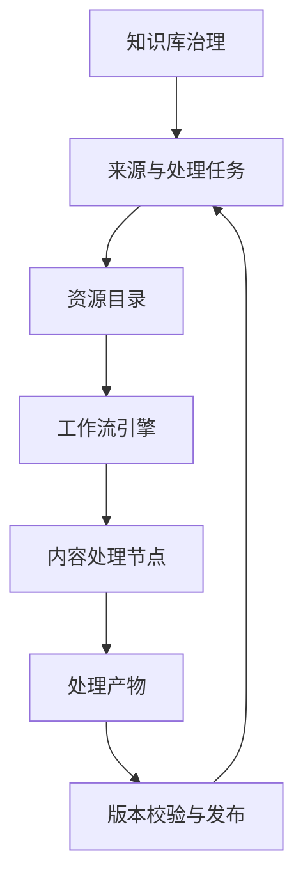

# 工作流与治理架构

## 目标与边界

本篇说明知识库异步处理的职责边界、版本发布和失败恢复。它解释治理服务、资源目录、工作流引擎和处理节点如何协作，不重复讨论具体解析或检索算法。

## 架构全景

## 分层职责

### 治理层

- 对象：数据域、来源、处理任务、可检索版本。
- 职责：创建处理意图、维护知识库状态、发布或保留当前版本。

### 资源目录层

- 对象：文件、数据域、任务投递、执行记录和来源关联。
- 职责：管理资源关系，并保存异步处理的派发与执行投影。

### 调度层

- 对象：工作流、任务、执行单元。
- 职责：维护一次处理的真实运行状态和重试边界。

### 处理层

- 对象：解析、切分、向量化、文件产物与检索记录。
- 职责：执行内容处理并产出结果；不直接改变知识库的发布状态。

## 资源关系

- **来源 → 处理任务**：来源表示资源当前的治理状态；任务表示下一步动作或对外部执行的观察。
- **处理任务 → 资源目录 / 工作流**：治理层通过明确的任务绑定触发或观察处理，不依赖文件名或路径猜测状态。
- **工作流 → 处理节点**：工作流调度各类内容处理；处理节点只产出解析、索引、文件和来源关联结果。
- **处理产物 → 可检索版本**：治理层校验产物属于当前知识库后，才提交一个新的可检索版本。
- **可检索版本 → 来源**：来源记录当前已发布版本，作为检索范围的唯一指针。

## 核心对象与状态合同

- **只读观察**：查看来源与任务不创建任务、不触发处理，也不改变当前可检索版本。
- **推进任务**：治理服务以有限批次领取、触发、观察或发布已持久化的处理任务。
- **文件路径**：文件先绑定到知识库，再进入文档处理工作流，处理完成后关联新的可检索版本。
- **结构化数据路径**：本地结构化文件可进入导表工作流；已有业务表可作为数据来源被纳入知识库范围，两者都不等同于文档 RAG。
- **失败恢复**：一次处理失败不覆盖当前已发布版本；用户可以查看失败状态，并在合适条件下重新处理。
