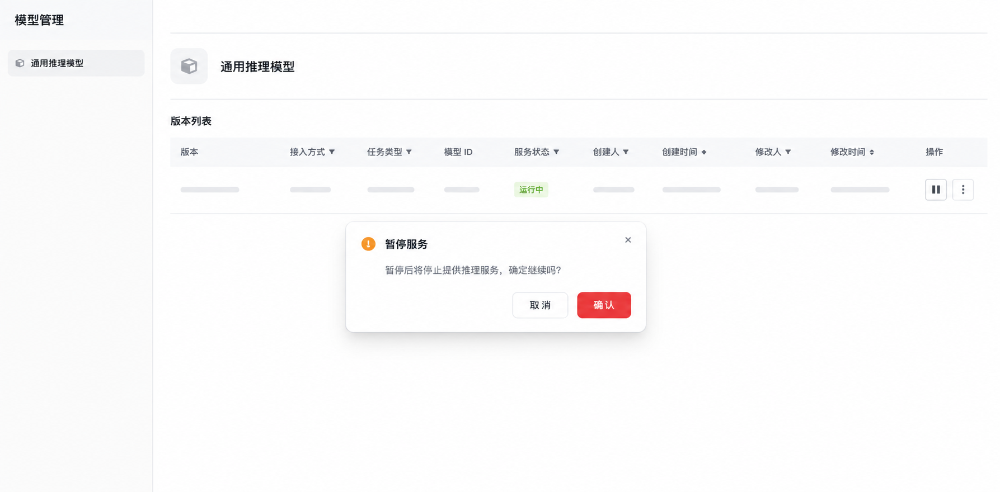

# Catalog 托管模型产品需求文档

## 1. 产品目标

支持将模型仓库导入 Catalog，并按需分配计算资源部署为可调用的推理服务。模型元数据创建与实际部署解耦，模型可按版本管理、查看文件与获取服务 Endpoint。

## 2. 模型配置

| 字段 | 规则 |
|---|---|
| 模型仓库 ID | 必填，用于拉取模型权重与配置 |
| 信任远程代码 | 默认关闭；开启前提示该选项会执行仓库中的自定义代码 |
| 访问令牌 | 可选；访问受限或私有仓库时必填 |
| 模型名称 | 必填，决定模型组归属 |
| 版本号 | 必填；同模型组内唯一 |
| 任务类型与标签 | 可选，用于检索及工作流匹配 |

点击创建仅保存模型对象元数据，初始状态为“断开”，不自动下载或部署模型。

## 3. 生命周期与操作

~~~text
断开
  ├─ 部署 → 部署中 → 运行中
  └─ 编辑 / 删除
运行中 → 停止 → 断开
部署中 → 部署失败 → 断开
~~~

| 状态 | 允许操作 |
|---|---|
| 断开 | 部署、编辑、删除 |
| 部署中 | 查看进度；编辑和删除不可用 |
| 运行中 | 查看 Endpoint、查看模型文件、停止 |
| 停止中 | 等待状态返回断开 |

### 3.1 部署

在断开状态点击部署，选择计算节点与对应资源规格；可选填写运行依赖，例如特定模型所需的 Python 包或版本。系统拉取模型文件、创建推理服务并显示部署进度。部署失败时保存失败原因，状态回到断开。

计算规格应同时展示显存/算力能力与计费或资源占用信息，帮助用户按模型规模选择资源。部署中的模型不得编辑或删除；停止服务时进入“停止中”，待运行时释放资源后才回到“断开”。

### 3.2 运行服务

服务启动后提供 OpenAI 兼容 Endpoint 与访问凭证复制入口。模型文件列表展示已下载文件及总体大小；模型组大小为全部版本本地模型文件的总和。

Endpoint 仅在服务运行时可用；停止后应立即禁用调用入口。模型文件页只展示文件名、相对目录和大小等必要元数据，不暴露令牌或内部存储路径。

## 4. 版本修改与分组迁移

断开状态下允许修改模型名称、版本号、任务标签、远程代码信任和访问令牌。

- 新名称不存在：该版本移出原模型组，成为新模型组的首个版本。
- 新名称已存在：该版本加入目标模型组；如目标组已有同版本号，阻止保存。

## 5. 使用与可观测性

运行中的模型可由工作流选择器调用；工作流记录应保存模型版本。服务监控关注请求量、令牌吞吐、响应延迟和计算资源利用率，用于确认服务健康与资源成本。

模型选择器按任务类型筛选，只允许引用运行中的兼容版本。模型启动、停止、部署失败和调用失败都需要在运行记录中留存时间、状态和脱敏后的错误信息。

## 6. 安全与限制

- 仅在信任模型发布方时允许开启远程代码执行。
- 访问令牌及服务密钥不得在列表或日志中明文显示。
- 部署所需计算规格和计费规则由运行时资源管理模块提供。

## 7. 验收标准

| 编号 | 验收项 |
|---|---|
| AC-01 | 可创建托管模型元数据，且创建不触发下载与部署。 |
| AC-02 | 模型配置支持仓库 ID、访问令牌、任务标签及远程代码风险提示。 |
| AC-03 | 模型在断开、部署中、运行中之间按定义流转，并限制不安全的并发操作。 |
| AC-04 | 部署时可选择计算资源，失败后显示原因并回到可编辑状态。 |
| AC-05 | 运行模型可查看 Endpoint、模型文件与聚合存储大小。 |
| AC-06 | 修改名称或版本时正确执行模型组迁移和版本唯一性校验。 |
