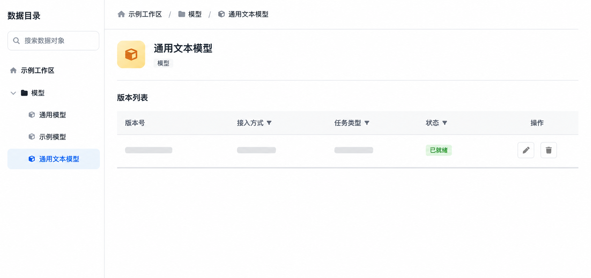

# Catalog 模型对象与 API 接入产品需求文档

## 1. 产品目标

将外部模型服务注册为 Catalog 中与表、卷并列的模型对象，使用户能够自助配置、测试、版本化和调用模型，而无需修改后端配置。

## 2. 数据层级与对象模型

~~~text
目录 → 库 → 表 / 卷 / 模型组 → 模型版本
~~~

| 对象 | 核心字段 |
|---|---|
| 模型组 | 名称、版本数、聚合大小、首次创建时间、最近修改时间 |
| 模型版本 | 版本号、接入方式、模型 ID、基础地址、任务标签、连接状态 |
| API 凭证 | API Key；仅用于调用，不在列表明文展示 |

同名模型在列表中聚合为一个模型组；模型组内版本号不可重复。API 接入模型不占用本地存储，模型组大小显示为 0。

## 3. 模型列表与详情

模型组列表展示名称、类型、版本数、大小、创建/修改时间和操作。支持按时间排序；预置模型不可删除。删除用户模型组时需要二次确认，并检查工作流依赖。

点击模型组进入版本列表，展示：

| 字段 | 说明 |
|---|---|
| 版本号 | 模型名称范围内唯一 |
| 接入方式 | API 接入 |
| 标签 | 任务类型与自定义标签，支持筛选 |
| 模型 ID | 实际请求的模型标识，支持复制 |
| 状态 | 已连接或断开，支持筛选 |
| 创建/修改时间 | 支持排序 |
| 操作 | 编辑、删除 |

## 4. 新建 API 模型

### 4.1 模型配置

| 字段 | 规则 |
|---|---|
| 供应商 | 选择预设供应商或自定义；预设会填充标准基础地址 |
| 基础地址 | 必填；自定义供应商需用户填写完整地址 |
| 模型 ID | 必填，必须与目标服务的模型标识一致 |
| API Key | 可选；无鉴权模型服务可留空 |
| 测试连接 | 发送最小测试请求，返回成功或 HTTP 错误信息 |

支持常见 OpenAI 兼容或其他标准模型服务；供应商选择仅用于协议与默认地址适配，不限制用户的实际模型名称。

### 4.2 导入设置

| 字段 | 规则 |
|---|---|
| 模型名称 | 必填；决定模型组归属 |
| 版本号 | 必填；默认按时间生成；同模型组内不可重复 |
| 任务类型 | 可选择文本生成、图像转文本、语音识别、特征提取、文本分类等 |
| 标签 | 可选择预设标签或输入自定义标签 |

创建后自动执行连接测试：测试通过则状态为“已连接”，失败则为“断开”并保留错误原因。若名称已存在，作为该模型组的新版本加入；否则新建模型组。

## 5. 修改、删除与状态

编辑 API 模型后必须重新测试连接，并据结果更新状态。删除模型版本或模型组时需检查工作流、知识库或其他下游引用；存在引用时需要说明影响范围并阻止或要求先解除依赖。

### 5.1 编辑后的归组规则

编辑模型名称或版本号不是简单改字段，而是一次版本归属变更：

- 新名称不存在时，当前版本从原组移出并创建新的模型组；原组没有其他版本时一并移除。
- 新名称已存在时，当前版本加入目标组，目标组版本数随之更新。
- 目标组中已有同版本号时必须拒绝保存，不能覆盖已有版本。
- 预置模型不可删除；删除组会删除其中全部版本，删除单个版本在仅剩一个版本时等同删除整个组。

### 5.2 列表与安全反馈

模型组列表按最近修改时间默认倒序，支持按创建/修改时间排序；版本列表可按状态和标签筛选。API Key 仅用于调用，任何列表、详情回显和运行日志均不得展示明文。连接测试失败时显示可操作的 HTTP 状态或错误原因，但不得回显请求密钥。

## 6. 下游使用

工作流及知识库的模型选择器改为读取当前库中可用的模型对象：

- 仅展示状态为“已连接”的模型版本。
- 按任务类型过滤可选模型，避免将不兼容模型用于节点。
- 工作流运行记录保存所调用的模型版本，支持后续血缘追踪。

当模型用于结构化数据处理时，调用入口仍引用已注册的具体版本，而非“最新版本”这样的浮动别名；这样一次作业的输入、模型版本和输出可以被稳定复现。

## 7. 验收标准

| 编号 | 验收项 |
|---|---|
| AC-01 | Catalog 可在库下创建、列表展示和查看模型组及其版本。 |
| AC-02 | API 模型可填写供应商、基础地址、模型 ID、密钥并执行连接测试。 |
| AC-03 | 同名模型聚合为模型组，版本号在组内唯一。 |
| AC-04 | 测试成功/失败分别更新为已连接/断开并展示失败原因。 |
| AC-05 | 编辑会重新测试连接；删除受下游依赖检查保护。 |
| AC-06 | 工作流只能选择状态正常且任务类型兼容的模型版本。 |
