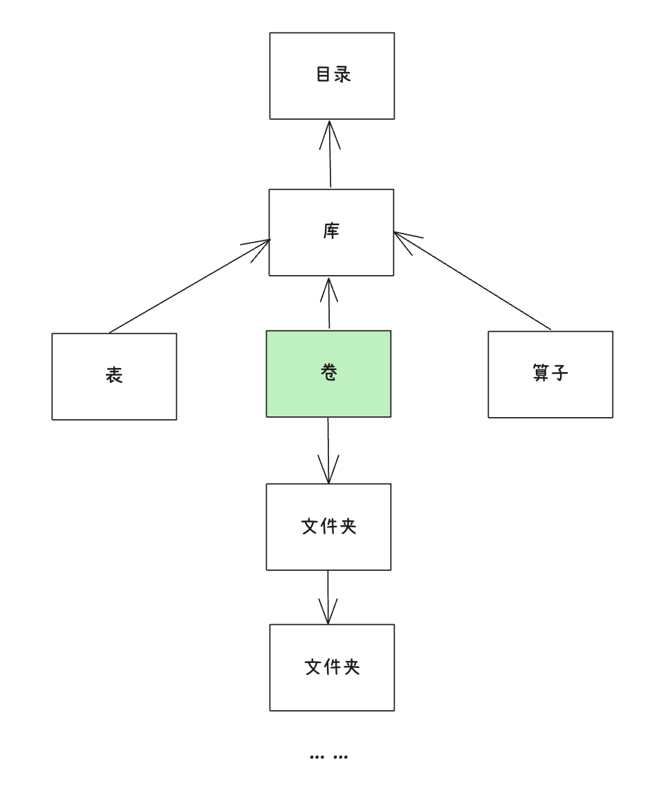

# Catalog 多层结构产品需求文档

## 1. 产品目标

将数据中心组织为目录、库、卷/表及文件夹的多层结构，让用户自主决定原始数据和处理数据的存放位置，并为载入、工作流、导出和权限提供统一的对象选择方式。

## 2. 对象层级

~~~text
工作区
└─ 目录
   └─ 库
      ├─ 卷
      │  └─ 文件夹（可选）→ 文件
      └─ 表
~~~

目录、库、卷和表名称均需满足统一命名规则；库名在工作区内唯一，描述可选且不超过 200 个字符。

## 3. 数据中心管理

| 对象 | 列表信息 | 操作 |
|---|---|---|
| 目录 | 描述、库/卷/文件/表数量、创建与修改时间 | 创建、修改、删除 |
| 库 | 描述、卷/文件/表数量、创建与修改时间 | 创建、修改、删除 |
| 卷 | 类型、子项数、大小、创建与修改时间 | 创建、修改、删除、进入文件列表 |
| 表 | 类型、行数、大小、创建与修改时间 | 查看与管理 |
| 文件 | 名称、类型、创建时间、大小 | 查看、下载、血缘、删除 |

卷保存非结构化数据。原始文件大小为原文件大小；处理文件大小为数据库与对象存储中相关内容的总和。处理文件在处理成功后才出现于列表。

删除目录、库或卷前必须检查未完成的载入、导出和工作流任务；存在引用时禁用删除并展示相关任务入口。

目录和库除名称外可维护描述；卷区分原始数据与处理数据。文件详情沿用文件类型对应的预览方式，并提供下载、血缘和删除入口。处理文件的大小由关联的结构化结果与对象存储内容共同计算，不能只用原始文件大小替代。

## 4. 文件夹

卷可选支持多层文件夹。载入时提供两种落位方式：

| 方式 | 行为 |
|---|---|
| 平铺 | 默认；忽略源目录层级，将文件写入目标文件夹 |
| 保持原始结构 | 保留源目录层级，所选文件或文件夹作为顶层 |

## 5. 关联功能改造

### 5.1 载入任务

“载入位置”改为逐级选择目录、库、卷、文件夹，并可在选择器中快捷创建对象。任务列表与详情展示完整路径及文件夹结构策略。

### 5.2 工作流

“源数据卷”改为“源数据”，“目标数据卷”改为“目标位置”。二者均可选择卷或文件夹；后续可扩展至文件组合。工作流仅处理选择范围内的原始数据，遇到处理产物时跳过。分支产物可在目标位置下按分支名创建文件夹。

### 5.3 导出与权限

导出复用数据中心树选择文件。权限模块从“数据卷”扩展为“数据中心”，按目录、库、卷等对象提供创建、查看、修改、删除权限。

工作流、载入和导出中显示的路径必须是同一套对象路径；任何对象在选择器内创建后应可立即被选中，避免用户在不同页面维护两套目录。源与目标允许位于同一卷的不同位置，但处理任务必须跳过自身已经产生的处理结果，防止循环处理。

## 6. 验收标准

| 编号 | 验收项 |
|---|---|
| AC-01 | 可在目录、库、卷/表层级创建与管理对象，并显示相应统计信息。 |
| AC-02 | 载入、工作流和导出均使用统一的层级选择器与完整路径。 |
| AC-03 | 卷支持平铺和保留源目录结构两种载入策略。 |
| AC-04 | 未完成任务引用对象时，删除被阻止并展示影响任务。 |
| AC-05 | 工作流只处理选定范围内的原始文件，处理产物不会被重复处理。 |
| AC-06 | 权限可按数据中心对象粒度管理。 |
