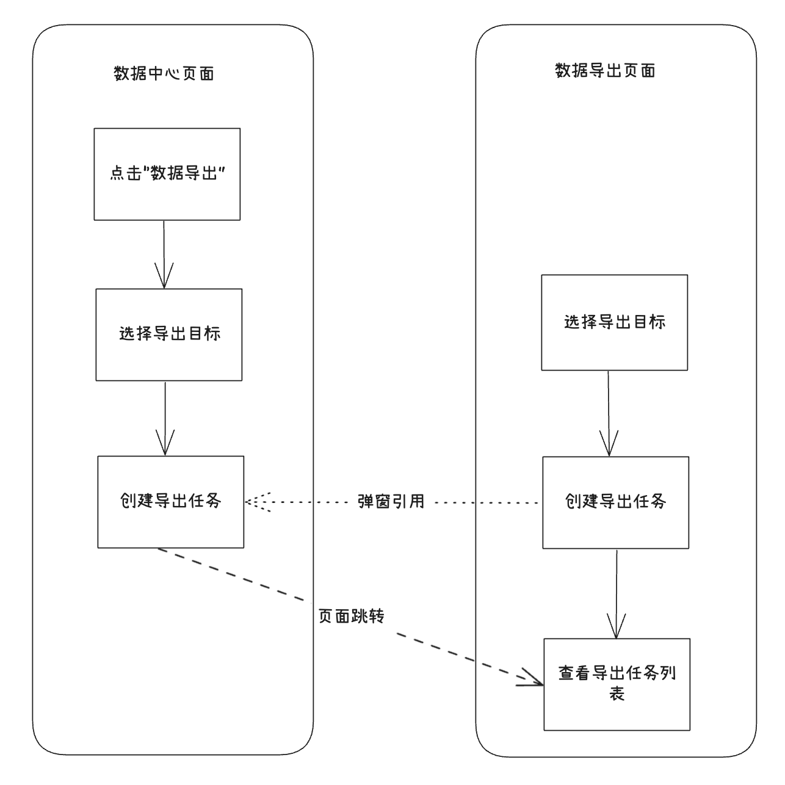
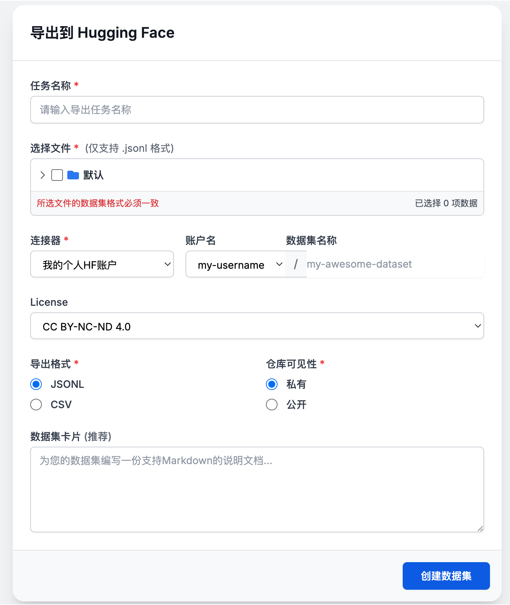

# 数据导出产品需求文档

## 1. 产品目标

将处理后的语料和训练数据集导出至数据库、知识库、数据集平台、微调框架、本地或对象存储，形成面向下游使用的异步导出能力。

## 2. 通用导出任务

导出任务包含任务名称、连接器、源文件范围、目标位置、压缩策略、状态和文件级结果。默认使用压缩输出；任务列表展示等待、进行中、完成、失败状态与错误信息。

| 目标类别 | 支持用途 |
|---|---|
| 数据库 | 导出 |
| 知识库 | 导出 |
| 数据集平台 | 导出 |
| 对象存储、分布式文件系统 | 导出，后续按连接器扩展 |
| 本地 | 导出 |

连接器增加“用途”字段，避免把仅支持导出的目标用于载入任务。

任务详情除任务级状态外必须保留文件级状态、开始/结束时间与失败原因，以支持对部分失败文件进行后续重试。压缩只作用于导出包的最外层，不改变单个结果文件的内部格式。

## 3. 导出到数据库表

数据库导出仅选择解析分段后的语料文件，不导出原始文件、问答数据集或其他自定义文件。

| 配置 | 规则 |
|---|---|
| 目标表 | 选择已有表或创建新表 |
| 已有表 | 选择导出列并进行一对一列映射，类型不匹配时失败 |
| 新表 | 选择所需导出列并创建表 |
| 元数据合并 | 可将选中列写入 `meta` JSON；启用时自动选择 `meta` 列 |
| 重复处理 | 以 `file_id` 为依据，支持覆盖、跳过、保留 |
| 向量索引 | 导出独立 embedding 列时可创建向量索引 |

可导出字段包括 `file_id`、`file_name`、`block_id`、`block_no`、`block_type`、`block_level`、`page_no`、`content`、`embedding`、`image_data`、`created_at`、`updated_at` 与 `meta`。`block_id` 是块主键，不可合并到 `meta`。选择 `embedding` 时可创建 IVFFLAT 向量索引，索引数量按总行数估算。

已有表中每一个源列只能映射到一个目标列；不支持在该流程中新建目标表字段。启用 `file_id` 后才展示重复处理策略：覆盖会先清除该文件既有分块，跳过不写入重复文件，保留则允许并存；若 `file_id` 被映射为目标主键，不允许选择“保留”。

## 4. 导出到知识库

连接器保存知识库 API 地址与密钥。导出时选择目标知识库和多个解析后的文件；重名文件自动添加数字后缀。

目标知识库负责自身的索引构建。若目标尚未配置嵌入模型，导出前需提示选择或配置一个；已配置时仅展示当前配置，不重复创建索引。

知识库导出采用目标系统的导入 API；是否可直接导入分块和向量取决于目标能力。若目标不能接受外部向量，导出端只传递可消费的内容，由目标端重新分块或建立索引，界面应明确说明该差异。

## 5. 导出到数据集平台与微调框架

### 5.1 数据集平台

连接器保存访问令牌并在测试时校验写入权限。导出任务异步创建目标数据集仓库并显示进度；仓库名冲突时明确提示用户更换名称。

令牌仅在创建/测试连接时输入并脱敏保存。连接测试应同时区分“令牌无效”与“令牌有效但缺少写入权限”，避免把鉴权问题误报为网络故障。

### 5.2 微调框架

无 API 的微调框架采用“下载数据 + 注册说明”方式。可合并多个同格式数据集为一个新数据集；格式不一致时阻止导出。当前支持 Alpaca 与 ShareGPT 格式，输出 JSONL，并生成数据注册所需的字段映射说明。

## 6. 本地与对象存储

| 目标 | 配置与限制 |
|---|---|
| 本地 | 选择文件与压缩方式；单次最多 100 个文件、总大小不超过 1 GB；批量下载打包为 ZIP |
| 对象存储 | 选择连接器、展示基础路径、填写子路径并选择压缩方式 |

## 7. 验收标准

| 编号 | 验收项 |
|---|---|
| AC-01 | 可创建异步导出任务，并在列表查看状态、进度与失败原因。 |
| AC-02 | 数据库导出支持新/已有表、列映射、元数据合并、重复策略和向量索引。 |
| AC-03 | 知识库导出仅接受解析语料，并正确处理目标索引与重名文件。 |
| AC-04 | 数据集平台连接器校验写入权限，仓库冲突时给出可操作提示。 |
| AC-05 | 微调框架导出校验数据集格式并提供 JSONL 与注册说明。 |
| AC-06 | 本地导出遵守文件数和大小限制；对象存储支持指定子路径。 |
