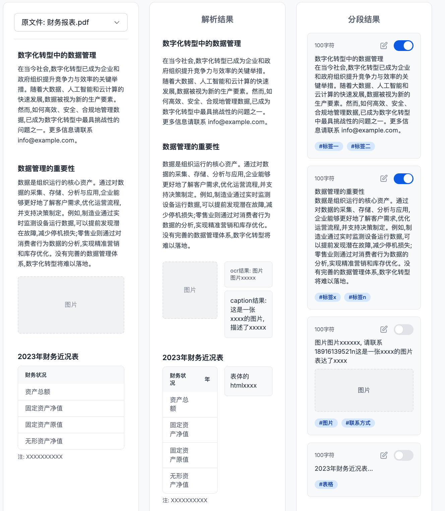

# 数据处理血缘产品需求文档

## 1. 产品目标

为处理后的文件提供从原始输入到最终结果的可视化血缘。用户可查看文件实际经过的工作流节点、各节点配置和前后结果，定位失败节点、验证结果变化并识别性能优化位置。

## 2. 用户流程

~~~text
数据中心中的处理文件
  ↓ 预览
结果血缘页面
  ├─ 工作流拓扑：仅展示该文件实际经过的节点
  └─ 节点结果对比：原始输入 / 上一级输出 / 当前输出
  ↓ 选择节点或结果块
定位对应的中间结果与原始文件位置
~~~

## 3. 页面结构

### 3.1 工作流拓扑

- 默认展开文件实际经过的处理节点，不展示工作流中未执行的分支节点。
- 当一个文件关联多个解析节点时，展示全部相关节点；选择某解析节点后，仅呈现该类型对应的结果。
- 点击节点时，高亮该节点、打开节点配置弹窗，并将结果区切换至该节点。

### 3.2 节点结果对比

结果区最多包含三个区域：

| 区域 | 内容 |
|---|---|
| 原始输入 | 文件进入工作流前的原始内容 |
| 最近血缘 | 上一级节点的输出 |
| 处理结果 | 当前选中节点的输出 |

开始节点后的第一个节点不重复显示“原始输入”和“最近血缘”。每个区域采用滚动加载，不使用分页。

## 4. 结果对象与通用规则

| 对象 | 关键内容 | 是否可编辑 |
|---|---|---|
| 原文件 | 原始文档、媒体或表格内容 | 否 |
| 解析块 | 解析后的文本、图片或结构化块 | 仅作为最终结果时可编辑 |
| 分段块 | `content`、字符数、禁用状态 | 仅作为最终结果时可编辑/禁用 |
| 清洗块 | 清洗后的 `content`、字符数、清洗标记、禁用状态 | 仅作为最终结果时可编辑/禁用 |
| 嵌入块 | 实际送入向量化的文本、字符数、召回次数 | 不可编辑；可禁用 |
| 提取字段 | 字段名、类型、候选值、最终值、引用来源 | 仅作为最终结果时可编辑 |
| 增强结果 | 问答对及禁用状态 | 仅作为最终结果时可编辑/禁用 |

- 所有编辑和禁用操作必须同步更新可下载的最终 JSON。
- 中间结果仅用于查看和定位，不显示编辑、禁用或引用修改能力。
- 当结果块被禁用时，不参与检索，且不出现在下载 JSON 中。

## 5. 节点结果展示

### 5.1 解析

解析节点展示原文件与解析结果。只有解析节点处于工作流末端时，解析结果可编辑；否则作为只读中间结果。

### 5.2 分段

分段节点展示每个 block 的内容与字符数。最终结果支持编辑与禁用；中间结果只读。

当分段节点为末端节点时，页面按“原文件—解析块—分段结果”三栏展示。用户点击某个分段时：

1. 中间区域高亮该分段包含的全部解析块；
2. 原文件定位到相应位置；
3. 不支持从原文件或解析块反向选中分段。

### 5.3 清洗

清洗节点以分段块为基础展示清洗后内容、字符数和变更标记。显示规则如下：

| 清洗类型 | 展示方式 |
|---|---|
| 敏感信息脱敏 | 已脱敏内容以标记样式展示，如 `[邮箱]` |
| 文本标准化 | 标准化后的内容以标记样式展示 |
| 特殊字符删除 | 使用“特殊字符已被清洗”占位 |
| 特殊字符过滤 | 整块过滤时显示原因占位 |
| 敏感词过滤 | 使用“敏感词被清洗”占位 |
| 数据去重 | 整块去重时显示原因占位 |

最终结果可编辑，但上述原因占位不可修改；人工修改后的文本不再保留原有标记样式。点击清洗块时，中间区域高亮对应分段，原文件定位规则与分段一致。

### 5.4 嵌入

嵌入节点只展示最终送入向量化的文本、字符数及召回次数，不展示向量数值，也不允许编辑。点击嵌入块时，高亮其来源的分段或清洗块，并定位原文件。

### 5.5 信息提取

信息提取结果提供“提取结果”和“JSON 预览”两个视图。

| 字段 | 说明 |
|---|---|
| 字段名 / 类型 | 当前提取架构的字段定义 |
| 字段值 | 最终结果展示该字段的候选值；中间结果只展示最终采纳值 |
| 主次选择 | 多个候选值冲突时选择最终保留值 |
| 引用 | 定位到对应解析块与原文件位置；一个字段可以保留多个来源 |
| JSON 预览 | 最终输出结构，不包含未采纳的冲突值 |

最终结果支持字段值编辑，并须进行类型校验（字段值可为空）；编辑须同步 JSON。中间结果不支持编辑或引用定位。

### 5.6 数据增强

增强节点将输入生成问答对；每条问答对作为一个结果块。

| 上游节点 | 中间区域 | 关联定位 |
|---|---|---|
| 分段 | 分段结果 | 点击问答对高亮来源分段并定位原文件 |
| 清洗 | 清洗结果 | 点击问答对高亮来源清洗块并定位原文件 |
| 信息提取 | 提取结果 | 不联动中间区域或原文件 |

最终结果支持编辑答案值和禁用问答对，问题键不可修改；中间结果只读。

## 6. 原文件定位规则

| 文件类型 | 定位目标 |
|---|---|
| DOC、DOCX、PDF | 对应页 |
| TXT、Markdown | 对应文档开头或匹配位置 |
| PPT | 对应幻灯片，视为一页 |
| 图片 | 对应图片 |
| XLS、XLSX、CSV | 对应行 |
| 音频、视频 | 对应时间戳 |
| EML | 按已解析的内容位置定位 |

## 7. 下载结果

最终节点的下载内容随结果类型而变化。经过解析节点的链路需包含完整解析内容；为避免混淆，系统可输出多个 JSON 文件，但每个文件名与内容类型必须明确，并与页面中的编辑、禁用状态一致。

## 8. 验收标准

| 编号 | 验收项 |
|---|---|
| AC-01 | 处理文件可从预览入口进入血缘页面，并展示其实际处理链路。 |
| AC-02 | 拓扑图不展示未经过的节点；多解析路径可分别查看对应结果。 |
| AC-03 | 选择节点后，节点配置、拓扑高亮与结果区同步更新。 |
| AC-04 | 分段、清洗、嵌入、提取和增强节点均按其结果模型展示，并支持来源定位。 |
| AC-05 | 只有最终结果提供编辑、禁用、主次或引用操作；中间结果只读。 |
| AC-06 | 编辑值执行字段类型校验，禁用内容不参与检索且不写入下载 JSON。 |
| AC-07 | 文档、表格、演示文稿、图片和音视频可按对应规则定位来源。 |
| AC-08 | 下载文件名称、内容和页面最终状态一致；解析链路的完整解析内容可下载。 |
