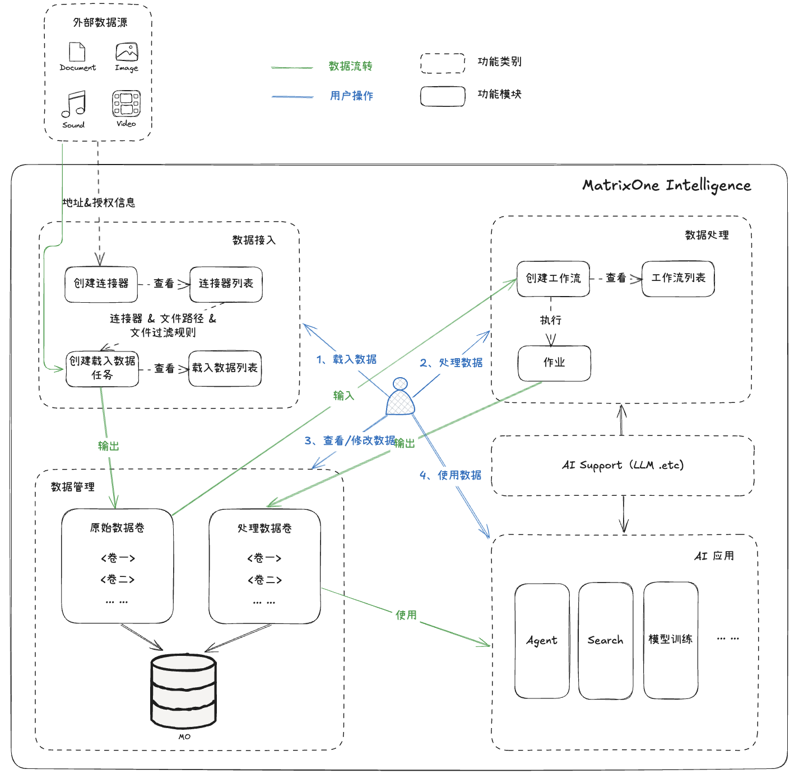

# 数据管道与 Catalog 产品需求文档

## 1. 产品目标

提供从外部数据接入、载入、工作流处理、作业观测到 Catalog 管理的闭环。原始文件进入原始数据卷，经工作流处理为可供检索、智能应用或模型训练使用的处理数据卷。

## 2. 核心对象

| 对象 | 定义 | 关键关系 |
|---|---|---|
| 连接器 | 数据源连接与鉴权配置 | 被载入任务引用 |
| 载入任务 | 将源文件全量或增量写入原始数据卷的任务 | 输出原始数据卷 |
| 原始数据卷 | 保存原始文件及载入元数据的逻辑容器 | 被工作流读取 |
| 工作流 | 对原始文件进行解析、清洗、增强或嵌入的可编排流程 | 输出处理数据卷 |
| 作业 | 一次工作流执行的不可变运行快照 | 记录文件级结果 |
| 处理数据卷 | 保存文本块、图片块、OCR、上下文和向量等处理结果 | 被检索与应用使用 |

## 3. 数据接入

### 3.1 连接器

连接器支持对象存储、网盘等外部数据源。创建时需填写名称、数据源类型和鉴权/路径信息；名称在工作区内唯一且不超过 100 个字符。

| 字段 | 说明 |
|---|---|
| 名称 | 工作区内唯一的连接器名称 |
| 数据源类型 | 选择目标存储或文件服务类型 |
| 连接信息 | Endpoint、访问凭证、路径等，随数据源类型变化 |
| 连通状态 | 已连接或断开；通过连接测试刷新 |
| 创建与更新时间 | 用于审计与列表排序 |

连接测试允许在创建前执行，但测试失败不阻止保存。连接器可能因网络或凭证变化而断开，列表应持续显示最近状态。编辑可修改除数据源类型以外的配置；删除连接器不删除此前通过它载入的数据。

### 3.2 载入任务

| 配置项 | 规则 |
|---|---|
| 数据源 | 选择已创建连接器；本地载入作为独立入口 |
| 目标位置 | 选择或新建原始数据卷；卷名唯一 |
| 载入模式 | 一次载入或周期载入 |
| 周期 | 支持分钟、小时、天级周期；小时内周期按整周期对齐 |
| 文件过滤 | 可按文件名模式、类型、大小、创建时间组合；条件为“且”关系 |
| 文件选择 | 支持文件和文件夹；全选目录时包含子目录文件 |

周期载入仅处理所选目录中新增或发生更新的文件，以文件名与更新时间识别变化。单文件大小上限为 200 MB。

### 3.3 任务管理

任务列表展示任务标识、数据源、目标卷、模式、过滤规则摘要、创建时间、状态与最近完成时间，并支持搜索、筛选和排序。

| 状态 | 含义 |
|---|---|
| 运行中 | 正在执行或等待下一周期 |
| 暂停中 | 当前文件完成后停止 |
| 暂停 | 不再执行，等待继续 |
| 完成 | 一次载入已完成 |

用户可暂停、继续、编辑模式/过滤/文件选择或删除任务。删除任务不删除已载入文件。任务详情按等待、处理中、成功、失败展示文件；失败文件支持单个或批量重试。

## 4. 数据处理

### 4.1 工作流

工作流将一个或多个原始数据卷处理为目标数据卷。

| 配置项 | 规则 |
|---|---|
| 名称 | 工作区内唯一，不超过 100 个字符 |
| 源数据卷 | 可选择一个或多个原始数据卷 |
| 目标数据卷 | 选择或新建处理数据卷；名称唯一 |
| 文件类型 | 按可处理类型多选，默认全部 |
| 处理模式 | 一次处理或周期处理；周期对齐规则与载入任务一致 |
| 处理流程 | 由处理节点组成，输入为源卷，输出为目标卷 |

工作流可包含文件解析、文本分段、上下文增强、OCR、图片描述、文本嵌入、图片嵌入等节点。周期工作流只处理源卷中新增或更新的数据。

### 4.2 作业

每次工作流执行生成一条作业记录。作业列表展示作业标识、工作流、源/目标卷、文件类型、开始与结束时间、时长和已处理/总文件数。作业详情按处理中的、成功、失败展示文件，并支持失败文件重新处理。

工作流列表还应展示名称、描述、源/目标位置、最近运行时间与状态，支持按名称检索及查看详情。一次作业是工作流配置和输入文件范围的不可变快照；后续编辑工作流不得改写既有作业的节点配置或结果。

## 5. Catalog

Catalog 将结构化表和非结构化卷分开管理。本期的重点是原始数据卷与处理数据卷。

### 5.1 原始数据卷

| 字段 | 说明 | 默认展示 |
|---|---|---:|
| 文件 ID | 系统生成的唯一标识 | 否 |
| 文件名、类型、大小 | 文件基础信息 | 是 |
| 修改时间、原始路径 | 源文件信息 | 否 |
| 其他元信息 | 以 JSON 保存的扩展元数据 | 否 |
| 载入开始/结束时间 | 文件级执行时间 | 开始时间是 |
| 操作 | 查看、下载、删除 | 是 |

列表支持文件名搜索、类型筛选、大小/时间排序与范围筛选。图片可在线预览，其他文件可下载；删除支持单个或批量操作并要求二次确认。

### 5.2 处理数据卷

处理数据以块为单位保存。

| 字段 | 说明 | 操作 |
|---|---|---|
| 块 ID、来源文件 ID | 系统块标识与来源关系 | 来源 ID 默认隐藏 |
| 类型 | 文本、图片、表格等 | 可筛选 |
| 文本、上下文、图片描述、OCR | 工作流节点生成的可检索内容 | 支持全文搜索 |
| 文本向量、图片向量 | 嵌入节点生成的向量 | 页面不展示数值 |
| 作业关联 | 生成该块的作业 | 可跳转到作业详情 |

用户可编辑文本、上下文和 OCR；修改需与受影响的下游文本/向量保持原子一致，任一更新失败则全部回滚。块支持单个或批量删除；图片类型块支持预览。

处理文件详情应能回到来源原始文件和产生它的作业。原始文件删除或重新载入时，需要明确处理卷中关联结果的保留/失效策略，不能产生无来源的静默残留块。

## 6. 验收标准

| 编号 | 验收项 |
|---|---|
| AC-01 | 可创建、测试、编辑和删除连接器，并在列表中查看连接状态。 |
| AC-02 | 载入任务支持一次与周期模式、文件过滤、目录递归选择、失败重试和文件级状态。 |
| AC-03 | 周期任务只处理新增或更新文件，并按配置周期执行。 |
| AC-04 | 工作流可从原始卷处理数据并产出处理卷；每次执行产生可追溯作业。 |
| AC-05 | Catalog 可分别浏览原始文件和处理块，支持相应的搜索、筛选、下载、预览与删除。 |
| AC-06 | 编辑处理块时，关联内容与向量更新保持原子性。 |
