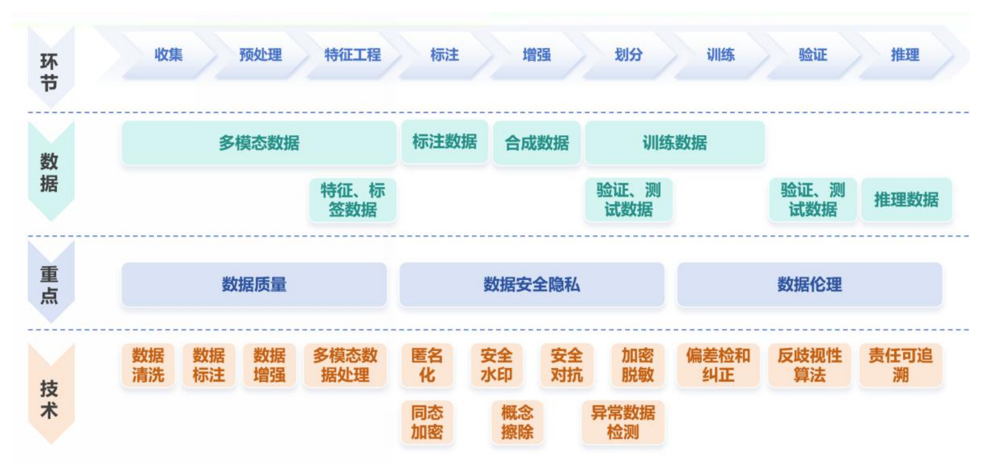
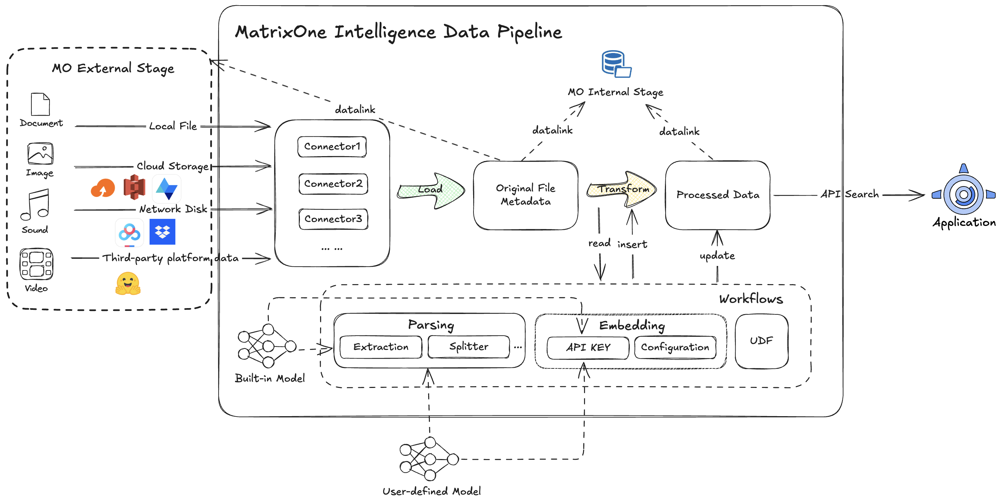
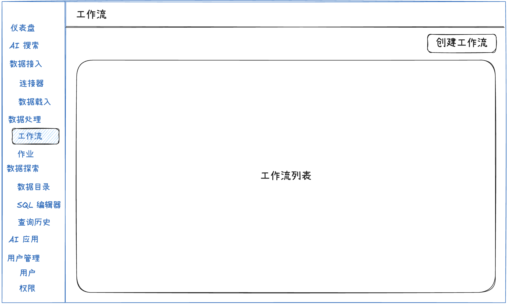

# Data Pipeline 产品需求文档

## 1. 产品目标

Data Pipeline 为结构化与非结构化数据提供从接入、载入、处理、管理到检索和服务化输出的完整链路。用户可以通过界面或 API 配置数据源，将原始文件或记录载入数据资产，在工作流中完成解析、清洗、分段、OCR、嵌入等处理，并将结果交付给搜索、智能体和下游应用使用。

### 目标

- 接入数据库、对象存储、文件系统和第三方 API 等多类数据源。
- 对原始文件提供可观测、可重试、可审计的载入能力。
- 以可视化工作流处理文本、图片和文档，并支持自定义脚本。
- 将原始数据、处理结果、元数据和向量统一纳入 Catalog 管理。
- 向搜索、智能体和外部应用提供可选择、可版本化的数据集。

### 非目标

- 不在本期内建设通用模型训练、模型版本管理和在线推理平台。
- 不在本期内实现所有行业连接器；连接器按需求逐步扩展。
- 不将工作流用于替代通用数据仓库或实时流计算引擎。

## 2. 用户与权限

| 用户 | 核心任务 | 主要入口 |
|---|---|---|
| 数据工程师 | 配置连接器、载入数据、编排处理流程、处理异常任务 | 连接器、数据载入、工作流、作业 |
| 数据科学家 / 算法工程师 | 浏览处理结果、选择数据集、检查特征与向量质量 | Catalog、搜索、API |
| 运维人员 | 查看作业状态、失败原因、资源消耗与告警 | 作业、运行日志、管理后台 |
| 应用开发者 | 查询已处理的数据和元数据，构建搜索或 AI 应用 | API、搜索、Catalog |

## 3. 核心概念

| 概念 | 定义 | 关系 |
|---|---|---|
| 连接器 | 数据源的连接与鉴权配置 | 被载入任务引用 |
| 载入任务 | 将源数据抽取至原始数据卷的规则与执行记录 | 输入为连接器，输出为原始数据卷 |
| 原始数据卷 | 保存原始文件及其载入元数据的逻辑数据单元 | 被工作流读取 |
| 工作流 | 将原始数据转换为处理数据的可配置流程 | 输入为原始数据卷，输出为处理数据卷 |
| 处理数据卷 | 保存切片、OCR、描述、向量等处理结果的逻辑数据单元 | 被搜索、智能体和 API 使用 |
| 作业 | 工作流或载入任务的一次执行快照 | 记录配置、状态、日志和文件级结果 |
| 工作流分支 | 同一工作流的配置版本，用于对比不同处理策略 | 共用工作流身份，独立保存配置与结果 |

## 4. 端到端数据链路

~~~text
对象存储 / 数据库 / 文件系统 / API
        ↓
连接器：连通性与鉴权
        ↓
载入任务：全量、周期或持续载入
        ↓
原始数据卷：文件、路径、载入状态、元数据
        ↓
工作流：解析、分段、OCR、图片描述、嵌入、自定义脚本
        ↓
处理数据卷：文本块、图片块、上下文、向量、处理状态
        ↓
Catalog / AI Search / 智能体 / 外部 API
~~~

## 5. 功能需求

### 5.1 连接器

#### 创建连接器

用户创建连接器时需填写以下信息：

| 字段 | 说明 |
|---|---|
| 名称 | 在当前工作区内唯一，用于后续任务选择 |
| 数据源类型 | 例如对象存储、数据库、文件系统、REST API |
| 连接配置 | Endpoint、区域、桶/路径、主机、端口、数据库等 |
| 鉴权信息 | Access Key、Secret、用户名密码、Token 或 OAuth 授权 |
| 连通状态 | 未测试、连接成功、连接失败、已断开 |

创建前允许执行连接测试。测试失败不阻止保存连接器，但必须在列表和详情页展示失败原因与最近测试时间。

#### 连接器列表

列表支持按名称、类型和连接状态筛选，展示名称、数据源类型、创建时间、最近测试时间和状态。用户可执行查看、编辑、重新测试、删除等操作；被任务引用的连接器删除前必须提示影响范围。

### 5.2 数据载入

#### 创建载入任务

载入任务需包含：

| 配置项 | 说明 |
|---|---|
| 数据源 | 选择已创建的连接器 |
| 目标卷 | 选择或新建原始数据卷 |
| 载入模式 | 单次、周期、持续载入 |
| 调度配置 | 周期、时区、开始时间和启停状态 |
| 文件范围 | 文件夹、文件前缀或表/对象范围 |
| 过滤规则 | 文件格式、大小、修改时间和自定义条件 |
| 冲突策略 | 跳过、覆盖、追加或按版本保留 |

创建后立即执行首次载入。周期与持续任务保留下一次执行时间、最近执行时间和最近执行结果。

#### 文件级状态与重试

每个文件必须记录等待载入、载入中、载入成功、载入失败四类状态。任务详情提供文件级筛选、失败原因查看、单个重试和批量重试。重试只处理用户选中的失败文件，不重复处理已成功文件。

#### 载入日志

每次执行生成一条载入日志，至少记录开始时间、结束时间、文件总数、成功数、失败数、源路径、目标卷和错误信息。日志按执行时间倒序排列并支持查看详情。

### 5.3 原始数据卷

原始数据卷用于保存载入后的原始文件及其元数据。一个业务可创建独立的原始数据卷，实现数据隔离、生命周期管理和权限控制。

#### 原始数据卷字段

~~~sql
CREATE TABLE raw_volume_files (
  id              BIGINT PRIMARY KEY,
  file_name       VARCHAR(255) NOT NULL,
  file_type       VARCHAR(64) NOT NULL,
  file_size       BIGINT NOT NULL,
  file_mod_time   TIMESTAMP,
  metadata        JSON,
  uploaded_by     VARCHAR(64),
  load_start_time TIMESTAMP NOT NULL,
  load_end_time   TIMESTAMP,
  file_path       VARCHAR(1024) NOT NULL,
  file_status     VARCHAR(32) NOT NULL
);
~~~

原始数据卷列表展示文件名、格式、大小、载入时间、状态和路径。用户可以查看或下载原始文件；删除操作需要二次确认，并检查是否影响下游工作流和处理结果。

### 5.4 工作流

#### 工作流定义

工作流用于将原始数据卷转化为处理数据卷。每个工作流包含名称、描述、输入卷、输出卷、支持的文件类型、执行模式、调度配置和处理节点。

工作流支持以下节点：

| 节点 | 输入 | 输出 | 说明 |
|---|---|---|---|
| 文件解析 | 原始文件 | 文本、图片块和文件元数据 | 解析 PDF、Office、文本等文件 |
| 文本分段 | 文本 | 文本块 | 支持按字符、页面、标题或相似性分段 |
| 上下文增强 | 文本块 | 带上下文的文本块 | 为检索和生成提供上下文信息 |
| OCR | 图片块 | OCR 文本 | 从图片或文档图像中识别文字 |
| 图片描述 | 图片块 | 图片描述 | 生成可检索的图片语义描述 |
| 文本嵌入 | 文本或上下文文本 | 文本向量 | 写入向量字段 |
| 图片嵌入 | 图片或描述 | 图片向量 | 写入向量字段 |
| 自定义脚本 | 文档对象集合 | 文档对象集合或结构化结果 | 通过 Python 扩展处理逻辑 |

#### 文档对象约定

~~~python
Document = {
    "content": "文本内容，可为空",
    "blob": "二进制文件内容，可为空",
    "meta": {
        "content_type": "text | image",
        "file_name": "原始文件名",
        "source_volume_id": "原始数据卷 ID",
        "target_volume_id": "处理数据卷 ID"
    }
}
~~~

#### 自定义脚本

脚本节点需明确输入变量、输出变量、运行时版本、依赖和超时时间。脚本执行失败时记录错误日志，且不应影响其他文件的失败定位。

示例：清理文本前后空格。

~~~python
def process_documents(documents):
    processed = []
    for doc in documents:
        if isinstance(doc["content"], str):
            doc["content"] = doc["content"].strip()
        processed.append(doc)
    return {"documents": processed}
~~~

#### 分段策略

| 方式 | 适用场景 | 优点 | 注意事项 |
|---|---|---|---|
| 按字符 | 长文本处理、固定窗口输入 | 实现简单、长度稳定 | 可能切断语义 |
| 按页面 | 文档还原、页级检索 | 保留物理版面 | 语义粒度不稳定 |
| 按标题 | 知识库、摘要、检索 | 语义较完整 | 依赖标题结构 |
| 按相似性 | 主题聚合、上下文检索 | 主题关联强 | 成本高，依赖模型质量 |

#### 工作流分支

用户可基于主分支创建配置分支，用于对比不同解析、OCR、分段或嵌入策略。分支名称在同一工作流内唯一。

- 未修改任何配置时，不允许创建分支。
- 解析和分段配置变化会触发重新处理，不能复用基础分支的对应结果。
- 修改上游节点后，系统必须标记受影响的下游节点，例如 OCR 模型变更会影响 OCR 结果与依赖其输出的嵌入结果。
- 基础分支后续修改不自动覆盖其他分支。
- 搜索默认使用最新的处理数据与主分支；用户可显式选择数据卷和分支版本。

### 5.5 处理数据卷

处理数据卷保存工作流输出的文本、图片、元数据与向量。文件级视图展示处理状态，块级视图展示解析结果。

#### 处理数据卷字段

~~~sql
CREATE TABLE processed_volume_blocks (
  block_id                BIGINT PRIMARY KEY,
  block_type              VARCHAR(16) NOT NULL,
  block_path              VARCHAR(1024),
  file_id                 BIGINT NOT NULL,
  source_volume_id        VARCHAR(64) NOT NULL,
  target_volume_id        VARCHAR(64) NOT NULL,
  content                 TEXT,
  contextualized_content  TEXT,
  caption                 TEXT,
  ocr_text                TEXT,
  text_embedding          VECTOR,
  image_embedding         VECTOR,
  process_status          VARCHAR(32) NOT NULL
);
~~~

处理数据卷的文件列表展示文件 ID、文件名、格式、大小、开始处理时间、完成处理时间和状态。点击文件可查看块列表：

- 文本块展示分段内容和上下文内容。
- 图片块展示缩略图、图片描述和 OCR 文本。
- 支持按块类型、处理状态和内容关键词筛选。
- 编辑识别内容时，系统需要重新计算受影响的下游内容与向量，并以事务方式保存。
- 删除块前需要二次确认。

### 5.6 作业

作业是载入或工作流的一次执行快照。即使原任务被修改或删除，历史作业仍应保留当时的配置、执行时间、文件级状态和日志。

| 字段 | 说明 |
|---|---|
| 作业 ID | 唯一标识，进入作业详情 |
| 名称 | 关联的工作流或载入任务名称 |
| 输入 | 源连接器或原始数据卷 |
| 输出 | 原始数据卷或处理数据卷 |
| 文件类型 | 本次处理的文件类型 |
| 开始与结束时间 | 支持时间范围筛选和排序 |
| 执行时长 | 结束时间减开始时间 |
| 数据量 | 已处理/待处理总数，以及成功/失败数量 |
| 状态 | 排队、运行中、成功、部分失败、失败、已取消 |

作业详情提供配置快照、节点运行状态、文件处理状态、错误日志、失败文件重试与重跑入口。

### 5.7 Catalog

Catalog 同时管理功能元数据和用户业务数据。

- 功能元数据：连接器、载入任务、工作流、作业、调度配置和运行状态。
- 用户业务数据：原始数据卷、处理数据卷及其文件、块、向量和元数据。

Catalog 需要支持数据卷创建、详情查看、文件预览、处理结果预览、下载、权限控制和 API 查询。原始数据卷与处理数据卷可重名，因为二者属于不同逻辑空间。

### 5.8 AI Search

AI Search 基于处理数据卷工作。搜索质量依赖两部分：数据处理工作流和面向查询的检索/回答流程。

#### 功能要求

- 支持从一个或多个处理数据卷检索文本、图片和表格相关内容。
- 默认选择每个原始数据卷下最新的处理数据与主分支，允许用户切换。
- 展示答案、引用来源、文件名、块位置和数据处理版本。
- 保存搜索历史、数据源选择和模型/检索配置。
- 根据用户输入的问题推荐适合的数据处理工作流与搜索配置。
- 支持收集点击、采纳、纠错等反馈，用于优化检索配置。

### 5.9 API

提供面向下游应用的只读查询 API，用于获取已处理的数据与元数据。

| 能力 | 要求 |
|---|---|
| 数据查询 | 按数据卷、文件、块、时间、状态或元数据过滤 |
| 向量与文本 | 可返回文本、上下文文本、向量或引用信息 |
| 版本选择 | 请求中可指定工作流分支和处理版本 |
| 鉴权 | 使用 API Key 或工作区级身份验证 |
| 审计 | 记录调用方、资源范围、时间、响应状态和错误码 |
| 限流 | 按 API Key 或工作区配置速率限制 |

### 5.10 用量与计费

模型和检索消耗需要按工作区、作业、节点和搜索请求进行统计。建议统一折算为平台计量单位，并在作业详情和搜索历史中展示。

| 场景 | 计量维度 |
|---|---|
| 文件解析 | 文件数、页面数或块数 |
| OCR / 图片描述 | 图片数、块数或模型 token |
| 文本/图片嵌入 | 输入 token、向量数量或块数 |
| 重排与搜索 | 查询次数、候选数量或模型 token |
| 自定义脚本 | 运行时长、CPU/内存或执行次数 |

### 5.11 工作区与私有化部署

工作区作为数据接入、处理、Catalog、搜索与 AI 应用的逻辑隔离单元。

| 能力 | 要求 |
|---|---|
| 创建工作区 | 名称唯一，设置管理员与初始密码 |
| 工作区列表 | 展示名称、创建时间、状态和操作入口 |
| 修改与删除 | 修改名称/管理员信息；删除前二次确认并停止运行任务 |
| 数据保留 | 删除后保留可恢复窗口，由部署策略配置 |
| 菜单范围 | 仪表盘、数据接入、数据处理、Catalog、SQL 编辑器、查询历史和 AI 应用入口 |
| 部署 | 支持单机与分布式部署，并提供资源规格与交付说明 |

## 6. 用户旅程

### 6.1 将对象存储文件处理为可检索数据

1. 数据工程师创建对象存储连接器，填写区域、桶、路径与鉴权信息，并执行连接测试。
2. 创建持续载入任务，选择业务文件夹、目标原始数据卷和每日调度。
3. 首次载入完成后，在任务详情检查成功、失败和待处理文件；对失败文件单独重试。
4. 创建工作流，输入为该原始数据卷，输出为新的处理数据卷。
5. 在工作流中配置文件解析、按标题分段、OCR、文本嵌入和图片嵌入。
6. 查看作业详情，检查文件级状态、节点日志和处理耗时。
7. 在处理数据卷查看文本块、图片块、OCR 结果和向量状态。
8. 在 AI Search 选择该处理数据卷，输入自然语言问题并查看答案与引用。

### 6.2 对比两种解析策略

1. 在现有工作流上创建分支。
2. 将分段策略或 OCR 模型替换为候选配置。
3. 执行分支任务，生成独立的处理数据与作业记录。
4. 在 Search 中切换主分支与候选分支，对比召回、引用和答案质量。
5. 选择更优分支作为默认使用版本，并保留其他分支用于追溯。

### 6.3 处理失败文件

1. 在载入任务或作业详情筛选处理失败文件。
2. 查看失败节点、错误信息、文件属性与重试次数。
3. 修复连接器、文件规则或工作流配置。
4. 选中失败文件执行重试。
5. 在新的执行记录中确认结果；仍失败的文件保留完整错误链路。

## 7. 验收标准

### 连接器与载入

- 可创建、测试、编辑和查看连接器状态。
- 可按文件范围和过滤条件创建一次、周期和持续载入任务。
- 文件级成功、失败和重试状态准确可追溯。
- 任务日志包含本次执行范围、成功/失败统计和错误信息。

### 工作流与作业

- 工作流可配置输入卷、输出卷、文件类型、节点与调度。
- 节点失败可定位到文件和执行日志。
- 工作流分支可独立保存配置和运行结果，不影响主分支。
- 作业可保存执行配置快照，支持失败文件重试。

### Catalog、搜索与 API

- 原始数据卷与处理数据卷可查看文件、块和处理状态。
- 处理结果可展示文本、OCR、图片描述、元数据和向量状态。
- 搜索结果可显示使用的数据卷、版本与引用来源。
- API 可按授权范围查询已处理数据并产生调用审计。

## 8. 已知限制与后续项

- 文档、图片、音视频等格式的解析质量取决于具体解析器和模型，需要通过真实样本持续评估。
- 工作流分支涉及数据复用和依赖失效判断，需在执行引擎中维护节点依赖图。
- 编辑处理结果后触发向量和下游结果重算，必须保证事务一致性和可恢复性。
- 大规模实时流、复杂 ETL、模型训练和在线低延迟推理由专项能力或外部服务承接。
- 连接器、权限、计费、告警和私有化交付需要按部署形态逐步完善。
