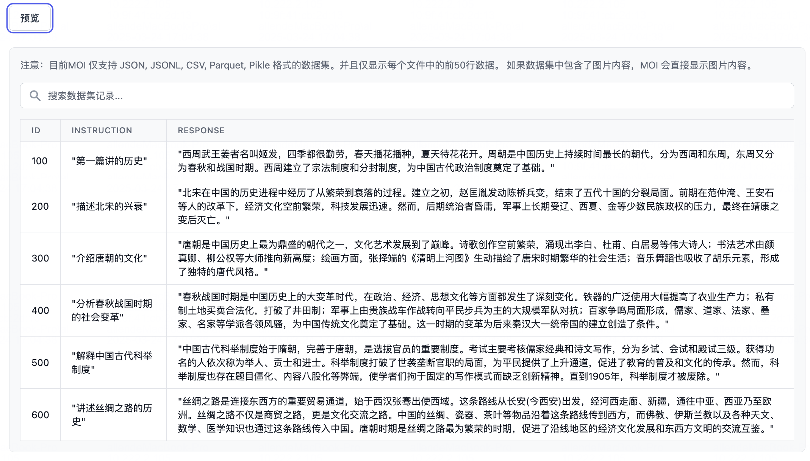

# 数据集管理产品需求文档

## 1. 产品目标

将处理数据卷中的训练或推理数据组织为可预览、可编辑、可版本化、可比较和可导出的数据集，服务于模型训练、精调和下游 AI 应用。

## 2. 数据模型

| 对象 | 核心字段 |
|---|---|
| 数据集 | 名称、标签、描述、生成模型、当前版本、创建时间 |
| 数据集版本 | 版本号、创建时间、版本说明、文件数、行数、总大小 |
| 数据集行 | 唯一 ID、数据内容、标签、来源信息 |
| 数据来源 | 处理数据卷及其选定版本、文件范围 |

## 3. 数据集列表

列表展示名称、标签、最新版本、描述、生成模型和创建时间，支持按名称、标签和描述搜索。可从列表进入详情、新建、编辑、复制、删除和导出。

列表中的“生成模型”记录创建该数据集时所使用的生成能力；没有模型参与生成时显示为空。删除前应提示其版本与下游引用影响，删除后不应留下可访问的历史版本入口。

## 4. 创建数据集

### 4.1 基础信息

| 字段 | 规则 |
|---|---|
| 名称 | 必填，最长 512 个字符，仅允许字母、数字、连字符与下划线 |
| 标签 | 可选择已有标签或新建标签；以逗号分隔 |
| 描述 | 可选，描述数据集用途 |
| 处理数据卷 | 必选；选择数据卷后再选择所需版本与文件范围 |

支持的数据集文件格式为 JSON、JSONL、CSV、Parquet。存在目录结构时，用户可以在树中选择具体文件。创建前显示默认前 50 行的样例预览。

~~~text
选择处理数据卷与版本
  ↓
选择文件范围
  ↓
预览结构与样例行
  ↓
填写名称、标签与描述
  ↓
创建首个数据集版本
~~~

## 5. 数据集详情与版本

详情页展示基础信息、行数、文件数、总大小和版本历史。版本记录按时间排列，包含版本号、创建时间和版本说明。

### 5.1 版本对比

用户最多选择三个版本进行比较。系统以数据行 ID 为连接键，展示行级差异，并支持按标签或内容过滤。只有最新版本可在对比界面中直接编辑。

### 5.2 编辑与复制

| 操作 | 规则 |
|---|---|
| 编辑 | 名称不可修改；支持修改标签、增加或删除数据行、按内容或标签筛选 |
| 保存 | 将修改保存为新的数据集版本，不覆盖旧版本 |
| 复制 | 基于当前数据集创建副本；允许修改副本名称 |
| 删除 | 需二次确认 |
| 导出 | 导出指定版本的数据集内容 |

数据集详情还需展示创建来源、当前版本说明与文件级范围，便于辨识同名版本的差别。导出操作必须选择具体版本，避免随“当前版本”变动而输出不可复现的数据。

## 6. 限制

| 项目 | 限制 |
|---|---|
| 数据模态 | 当前仅支持文本数据集，不支持图片、音频、视频等复杂格式 |
| 单数据集容量 | 建议不超过 50 GB；超过时需先分片或归档 |
| 文件格式 | CSV、JSON、JSONL、Parquet |
| 版本保留 | 默认保留最近 16 个版本；更多版本需手动归档或清理 |

数据集行应有稳定的唯一 ID；版本对比仅以此 ID 对齐，不能用自然语言内容猜测同一行。行编辑只允许作用于最新版本，保存时创建新的版本快照，旧版本保持只读。

## 7. 验收标准

| 编号 | 验收项 |
|---|---|
| AC-01 | 用户可从处理数据卷的指定版本创建数据集，并在创建前预览样例行。 |
| AC-02 | 名称、格式和文件范围遵守创建规则；不符合规则时无法创建。 |
| AC-03 | 数据集详情展示版本、行数、文件数和大小。 |
| AC-04 | 最多三个版本可按行 ID 对比，并支持按内容和标签过滤。 |
| AC-05 | 编辑会生成新版本；复制允许改名；删除需二次确认。 |
| AC-06 | 超过格式、容量或版本保留限制时提供明确提示。 |
