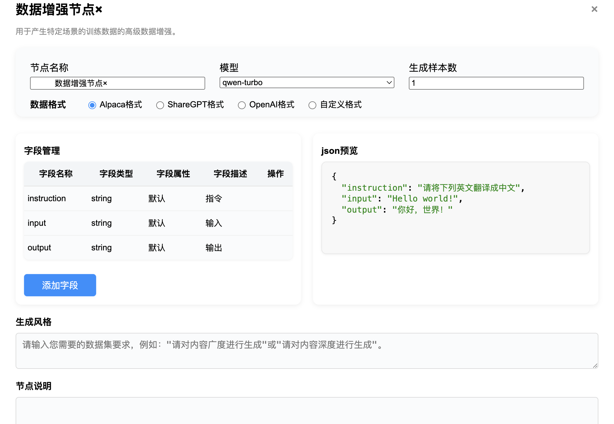

# 数据集输出格式产品需求文档

## 1. 产品目标

在数据增强节点中支持 Alpaca、ShareGPT、OpenAI 和自定义 JSON 数据集格式。用户可以选择预设格式，或通过字段管理器定义嵌套字段结构，并在生成前查看 JSON 样例。

### 目标

- 让同一份处理后的文本适配指令微调、多轮对话、检索增强等下游任务。
- 允许用户控制数据集的字段、类型、层级和生成说明，降低额外格式转换成本。
- 在保存前提供结构和样例预览，避免生成后才发现格式不兼容。

### 非目标

- 本期不提供 OCR 增强能力。
- 本期不负责模型训练、评测或数据集发布。

## 2. 用户与核心概念

| 用户 | 核心任务 |
|---|---|
| 业务用户 | 选择预设格式，补充生成风格，预览并导出数据集 |
| AI 训练工程师 | 配置多轮对话、指令微调等训练样本结构 |
| 开发人员 | 通过自定义字段满足外部系统或专用训练框架的数据契约 |

| 概念 | 定义 |
|---|---|
| 数据增强节点 | 根据输入文本调用模型，生成面向特定任务的数据样本的工作流节点 |
| 预设格式 | 平台内置的 Alpaca、ShareGPT 或 OpenAI 字段模板 |
| 字段架构 | JSON 的字段名称、类型、描述、属性与父子关系 |
| 生成风格 | 用户补充到默认提示词中的生成要求，如领域、难度或问答深度 |
| 样例预览 | 基于当前字段架构展示的 JSON 示例，用于检查最终结构 |

## 3. 配置界面



| 配置项 | 说明 | 规则 |
|---|---|---|
| 节点名称 | 标识当前节点 | 必填 |
| 模型 | 生成数据集时调用的模型 | 从已支持模型中选择 |
| 生成样本数 | 每个输入段落生成的数据组数 | 正整数 |
| 数据格式 | Alpaca、ShareGPT、OpenAI、自定义 | 选择预设后自动写入默认字段 |
| 字段管理 | 编辑 JSON 字段架构 | 支持嵌套管理 |
| JSON 预览 | 展示当前字段架构的样例 | 随配置同步刷新 |
| 生成风格 | 补充生成要求 | 合并到默认提示词 |
| 节点说明 | 描述节点用途 | 可选 |

## 4. 字段架构管理

### 4.1 字段定义

| 字段 | 说明 | 约束 |
|---|---|---|
| 字段名称 | JSON Key | 同一层级非空且唯一 |
| 字段类型 | 值的数据类型 | `string`、`number`、`boolean`、`object`、`array` |
| 字段属性 | 字段来源 | 预设字段或自定义字段 |
| 字段描述 | 供模型理解字段含义的说明 | 最多 100 字 |
| 父字段 | 当前字段所属 object / array-object 字段 | 仅 object 类型字段可作为父字段 |
| 示例值 | 预览中的示例 value | number 仅允许数字；boolean 仅允许 true、false 或空值 |

### 4.2 结构规则

- 字段总数不超过 40 个，嵌套层级不超过 4 层。
- `object` 与 `array<object>` 支持添加子字段；切换为 `object` 时自动创建一个子字段。
- 所有父节点均支持折叠与展开。
- 自定义字段可新增、修改和删除；删除父字段时一并删除其全部子字段。
- `object` 或 `array<object>` 只能在这两类结构之间修改，以防删除已有子字段；其他类型可自由修改。
- 校验失败时禁止保存：字段名为空、同层字段重名、层级或总字段数超限均须给出原因。

## 5. 预设格式

### 5.1 Alpaca

用于指令微调。预设包含 `instruction`、`input`、`output` 字段；用户可以在此基础上增加自定义元数据。

```json
{
  "instruction": "根据输入内容生成摘要",
  "input": "待处理文本",
  "output": "生成结果"
}
```

### 5.2 ShareGPT

用于多轮对话和领域问答。输出为 JSON 或 JSONL；每条样本包含一个对话数组。

```json
{
  "id": "sample-001",
  "conversations": [
    { "from": "system", "value": "你是专业助手。" },
    { "from": "human", "value": "请解释该概念。" },
    { "from": "gpt", "value": "解释内容。" }
  ]
}
```

用户可在根层增加如 `tools` 的字段，也可为对话项增加如 `weight` 的字段。每个对话对象的字段均受同一字段管理器约束。

### 5.3 OpenAI Messages

用于 OpenAI Messages 风格的多轮对话。输出为 JSON 或 JSONL，其中 `messages` 表示一次请求的完整上下文。

```json
{
  "messages": [
    { "role": "system", "content": "你是专业助手。" },
    { "role": "user", "content": "请解释该概念。" },
    { "role": "assistant", "content": "解释内容。" }
  ]
}
```

### 5.4 自定义格式

用户可从空架构创建任意 JSON 结构，包括对象、数组及多层嵌套。模型根据字段描述生成值；样例预览必须与字段树保持一致。

## 6. 生成流程

~~~text
输入文本块
  ↓
选择模型、样本数、格式与生成风格
  ↓
加载预设字段或编辑自定义字段架构
  ↓
校验字段树并生成 JSON 样例预览
  ↓
组装提示词并调用模型
  ↓
校验返回 JSON / JSONL 是否符合字段架构
  ↓
输出训练或问答数据集
~~~

## 7. 验收标准

| 编号 | 验收项 |
|---|---|
| AC-01 | 用户可在四种数据格式之间切换；选择预设时字段表自动填充。 |
| AC-02 | 可创建、编辑、删除自定义字段，并支持最多四层嵌套。 |
| AC-03 | object 与 array-object 字段可以新增子字段；删除父字段会删除全部后代。 |
| AC-04 | 字段名为空、同层重名、字段数超过 40 或层级超过 4 时，页面阻止保存并提示原因。 |
| AC-05 | JSON 预览随格式、字段、示例值和嵌套关系更新。 |
| AC-06 | ShareGPT 与 OpenAI 格式均可输出 JSON 或 JSONL，并保留多轮角色顺序。 |
| AC-07 | 生成结果须通过当前字段架构校验；不符合结构的结果必须标记失败或要求重试。 |
