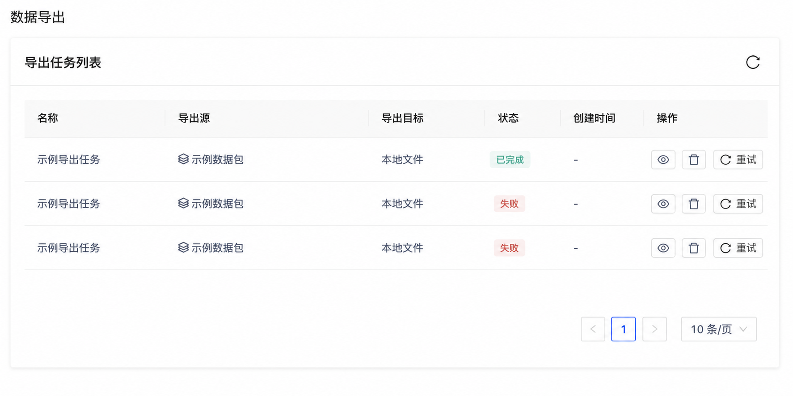

# 导出任务失败重试产品需求文档

## 1. 产品目标

为异步导出任务提供文件级明细和失败重试能力，避免在部分文件导出失败时重新创建并重复执行整个任务。

## 2. 任务与文件列表

任务名称可点击进入文件详情。详情展示任务名称、目标类型、连接器、源位置、目标位置、状态、创建时间与最近完成时间。

文件列表显示：

| 字段 | 说明 |
|---|---|
| 文件名与类型 | 当前导出文件的基础信息 |
| 状态 | 等待导出、导出中、失败、完成 |
| 开始/结束时间 | 最近一次该文件的执行时间 |
| 汇总 | 成功数、失败数与总数比例 |

列表支持按文件状态筛选。

## 3. 重试规则

- 仅目标类型支持重试的失败任务显示重试入口。
- 任务进行中或所有文件均完成时，重试入口不可用。
- 任务状态为失败时，用户点击重试仅重新导出失败文件；成功文件不重复执行。
- 失败文件允许多次重试，直至全部完成或用户停止操作。
- 单次重试更新被重试文件的开始/结束时间；任务创建时间不变，最近完成时间更新。
- 全部文件成功后，任务状态变为完成并禁用重试。

## 4. 验收标准

| 编号 | 验收项 |
|---|---|
| AC-01 | 用户可进入任务详情查看文件级状态、时间和成功/失败汇总。 |
| AC-02 | 失败状态下仅失败文件可被重试，成功文件不重复导出。 |
| AC-03 | 进行中与已完成任务不可重试。 |
| AC-04 | 多次失败允许重复重试，并正确更新时间字段。 |
| AC-05 | 所有文件成功后，任务自动变为完成并禁用重试。 |
