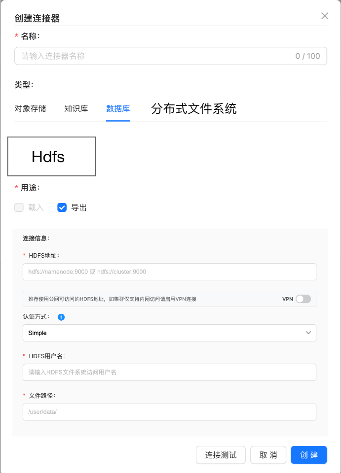

# HDFS 连接器产品需求文档

## 1. 产品目标

在连接器中增加 HDFS 分布式文件系统，以支持私有部署环境中的数据载入，并提供 Simple 与 Kerberos 两种认证方式以及可选 VPN 配置。

## 2. 创建连接器

数据源选择器新增“分布式文件系统”分类及 HDFS 选项。选择 HDFS 后默认显示 Simple 认证配置。

| 字段 | Simple | Kerberos | 说明 |
|---|---:|---:|---|
| HDFS 地址 | 必填 | 必填 | 单机填写 NameNode 地址；集群填写逻辑地址与端口 |
| 认证方式 | Simple | Kerberos | 二选一 |
| 用户名 | 必填 | — | Simple 模式下的访问用户 |
| Principal | — | 必填 | Kerberos 身份标识 |
| Keytab | — | 必填 | 可上传或选择的认证文件 |
| krb5 配置 | — | 必填 | Realm 与 KDC 配置文件 |
| 代理用户 | — | 可选 | 未填写时使用 Principal 对应用户 |
| 文件夹路径 | 必填 | 必填 | 需要访问的数据路径 |
| VPN 配置 | 可选 | 可选 | 开关开启后显示，可折叠 |

Kerberos 表单必须提供认证字段说明和帮助提示，帮助用户理解 Principal、Keytab、krb5 配置及代理用户的用途。

## 3. 编辑与载入

- 编辑页面固定数据源为 HDFS，不允许修改类型；其他连接与认证字段可修改。
- 原连接为 Simple 时显示 Simple 表单；切换或已有 Kerberos 配置时显示全部 Kerberos 字段与已上传文件状态。
- 数据载入页面的数据源类型列表新增 HDFS，后续文件选择、任务创建与任务管理沿用标准连接器载入流程。

## 4. 验收标准

| 编号 | 验收项 |
|---|---|
| AC-01 | 数据源选择器显示 HDFS 分类与入口。 |
| AC-02 | HDFS 连接器支持 Simple 与 Kerberos，并根据认证方式显示正确字段。 |
| AC-03 | Kerberos 支持 Principal、Keytab、krb5 配置和可选代理用户，并提供帮助提示。 |
| AC-04 | VPN 开关开启后可配置并折叠 VPN 连接信息。 |
| AC-05 | 编辑时数据源类型不可变，其他字段可更新。 |
| AC-06 | 数据载入可选择 HDFS 连接器作为数据源。 |
