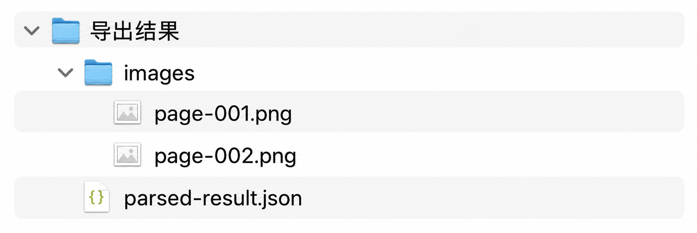

# 解析文件导出格式产品需求文档

## 1. 产品目标

为每个已解析文件输出可复用、可追溯的结构化结果包，统一保存完整 Markdown、块级 JSON 和抽取图片，并以相对路径建立关联。

## 2. 输出目录

每个源文件对应一个目录，目录名由文件名与文件标识组合而成：

~~~text
<file-name>_<file-id>/
├─ <file-name>.md
├─ <file-name>.json
└─ images/
   └─ <image-file>
~~~



- 根目录的 Markdown 为完整解析内容。
- JSON 保存块级结构。
- `images/` 保存从源文件抽取的图片；JSON 中以相对路径引用。

## 3. JSON 数据模型

```json
{
  "filename": "source.pdf",
  "filetype": "pdf",
  "block_count": 2,
  "blocks": [
    {
      "index": 1,
      "id": "block-id",
      "type": "title",
      "level": 1,
      "content": "标题内容",
      "page_number": 1,
      "image_url": "images/figure-1.jpg"
    }
  ]
}
```

| 字段 | 说明 |
|---|---|
| `index` | 从 1 连续递增，反映原始块顺序 |
| `id` | 块的稳定标识 |
| `type` | text、image、title、table、header 等 |
| `level` | 标题层级；文本重要度；图片的 OCR 或 caption 类型 |
| `content` | 解析出的文本或描述 |
| `page_number` | 所在页；无分页文本文件使用 1 |
| `embedding` | 可选向量字段，默认不导出 |
| `image_url` | 仅图片块提供，指向相对路径 |

## 4. 输出规则

- 块必须按 `index` 稳定排序输出。
- 图片块必须在 JSON 中提供可访问的相对路径；非图片块不输出 `image_url`。
- 默认不导出 embedding，以减小体积；在 API 或下载配置中显式选择后才加入。
- 完整 Markdown 始终位于文件包一级目录，与块级 JSON 同名。

## 5. 验收标准

| 编号 | 验收项 |
|---|---|
| AC-01 | 每个解析文件导出独立目录，包含 Markdown、JSON 与所需图片资源。 |
| AC-02 | JSON 包含文件元数据、块数量和按序排列的块列表。 |
| AC-03 | 块类型、层级、页码和内容按定义输出。 |
| AC-04 | 图片以相对路径关联，解压后无需修改路径即可访问。 |
| AC-05 | embedding 默认不包含，显式配置后才输出。 |
