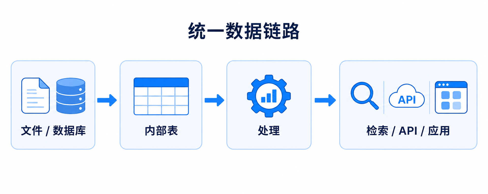

# 结构化数据基础支持产品需求文档

## 1. 产品目标

在同一工作区中统一接入、处理与服务结构化和非结构化数据，避免为两类数据分别建设数据管道与服务层。结构化内容以内部表承载，并能参与后续数据处理和 AI 应用。

## 2. 接入范围

| 数据类别 | 支持格式或来源 |
|---|---|
| 表格文件 | CSV、TSV、XLS、XLSX |
| 标记语言文件 | XML、JSON、YAML |
| 列式与 SQL 数据 | Parquet、SQL 文件 |
| 数据库 | MySQL、Hive |

文档中包含的表格、图表等结构化信息写入内部表，不作为独立文件展示在数据中心；处理节点可以使用表能力读写这些内容。

## 3. 统一处理链路

~~~text
结构化文件 / 数据库表 / 非结构化文件
  ↓
连接器或本地载入
  ↓
内部表 / 原始数据卷
  ↓
工作流或 SQL 处理
  ↓
结构化结果表 / 处理数据卷
  ↓
检索、智能体、应用或外部服务
~~~

## 4. 数据对象

| 对象 | 说明 |
|---|---|
| 表 | 保存结构化行列数据、类型、主键、描述和默认值 |
| 数据库连接器 | 保存数据库连接、鉴权与选表配置 |
| 结构化载入任务 | 定义全量或持续同步的源表、目标表和同步策略 |
| 结构化处理结果 | 工作流或 SQL 对表进行处理后的结果表 |

## 5. 验收标准

| 编号 | 验收项 |
|---|---|
| AC-01 | 可接入列出的结构化文件格式与两类数据库源。 |
| AC-02 | 结构化内容可写入内部表，并在工作区中与非结构化数据共同管理。 |
| AC-03 | 后续处理节点能够读取并产出结构化表结果。 |
| AC-04 | 数据中心不将文档内部表格、图表作为独立原始文件展示。 |
