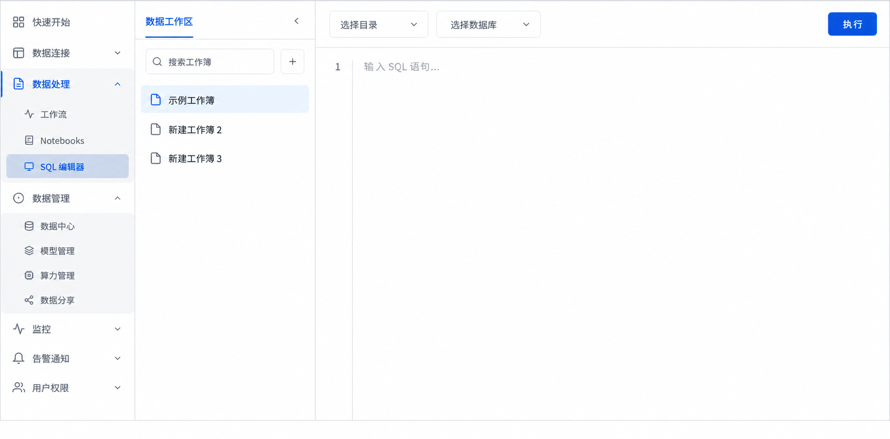

# 工作区结构化数据能力产品需求文档

## 1. 产品目标

在工作区中补齐数据库连接、SQL 编辑、跨工作区数据共享、资源克隆与 SQL 监控能力，使结构化数据与其他数据资产能够被统一管理、访问和复用。

## 2. 数据库连接

工作区列表中的每个工作区提供连接入口。连接弹窗支持复制 MySQL CLI、JDBC、Python 和 Go 的连接示例；本期仅提供公网连接，私网连接作为后续能力。

连接信息按当前登录用户和工作区权限生成；复制入口不得把真实密码或长期密钥直接写入示例。私网入口在未支持时可展示说明，但不可伪装为已可用连接方式。

## 3. SQL 编辑器与监控

### 3.1 SQL 编辑器

- 入口位于数据处理区域。
- 支持工作簿创建、重命名、删除、版本管理、SQL 执行和结果查看。
- SQL 只能操作 `database.table` 两级对象；不支持三层对象名。
- 系统库仅允许只读访问，禁止删改。

### 3.2 SQL 监控

| 模块 | 内容 |
|---|---|
| 查询历史 | 查看已执行 SQL 及历史记录 |
| 仪表盘 | QPS、TPS、平均查询延迟、事务执行/失败次数、SQL 总数/失败数 |

## 4. 跨工作区发布与订阅

### 4.1 发布

拥有发布权限的用户可发布目录、库、卷或自定义函数；当前仅提供只读权限。每次发布只能选择一个对象，但可指定多个目标工作区。

| 字段 | 规则 |
|---|---|
| 发布名 | 必填、不可重复、最长 64 个字符 |
| 发布对象 | 目录、库、卷或函数；不可发布已订阅内容 |
| 发布目标 | 可多选已加入工作区或输入外部工作区标识；不可选择当前工作区 |
| 备注 | 可选 |

目录发布包含其下属资源，库发布包含库内资源，卷发布包含卷内文件。发布列表显示名称、完整资源路径、目标、创建/修改时间和权限，并支持搜索、编辑和删除。删除发布后，已订阅对象的数据被清空但订阅层级可保留，直至订阅方主动删除。

发布者不能发布当前对象已经订阅而来的资源，也不能把当前工作区作为发布目标。编辑发布的目标范围或备注不应改变既有对象的只读属性；权限变更必须在订阅端即时生效。

### 4.2 订阅

可订阅的发布与已订阅记录在同一列表展示。订阅的资源实时同步且只读，不额外计入存储。

| 发布对象 | 订阅位置 |
|---|---|
| 目录 | 无需选择位置 |
| 库 | 选择目录 |
| 卷、表、函数 | 选择目录与库 |

订阅名默认使用发布对象名，可修改；在目标位置必须唯一。订阅表时必须创建新库，不可写入已有库；来自同一源库的多个表可订阅到同一个新建库。取消订阅会删除本地订阅对象；若发布仍存在，列表记录保留并允许再次订阅。

订阅列表需同时区分“可订阅发布”和“已订阅资源”，并展示源对象路径、发布方、状态与更新时间。订阅数据不额外计入订阅工作区的存储配额，但需要如实标注其只读和同步属性。

## 5. 资源克隆

可在同一工作区或指定目标位置克隆目录、库、表、卷与自定义函数。

| 资源 | 克隆范围 | 目标位置 |
|---|---|---|
| 目录 | 目录下全部库与资源 | 当前工作区 |
| 库 | 库下全部资源 | 选择目录 |
| 表、卷、函数 | 单个资源 | 选择目录与库 |

新名称默认追加“副本”，可填写描述；名称在目标层级不得重名。订阅的只读资源允许克隆，克隆结果为可读写本地快照，之后不再随发布端更新。

克隆前展示源、目标和冲突检查结果。目录与库克隆包含其下资源；单表、单卷和函数只复制所选对象。克隆不能覆盖同名目标，用户必须更名或选择其他位置。

## 6. 验收标准

| 编号 | 验收项 |
|---|---|
| AC-01 | 工作区可复制多种数据库客户端连接示例，并提供公网连接。 |
| AC-02 | SQL 编辑器支持工作簿、执行与结果查看，并限制系统库写操作和三层对象名。 |
| AC-03 | 有权限用户可发布并管理目录、库、卷或函数，订阅方只能只读访问。 |
| AC-04 | 订阅根据对象类型要求正确的落位层级与唯一名称，并实时同步。 |
| AC-05 | 取消或删除发布后，订阅资源按定义清空或移除。 |
| AC-06 | 目录、库及子资源均可克隆；订阅资源克隆为独立可写快照。 |
| AC-07 | 查询历史与仪表盘展示规定的 SQL 运行指标。 |
