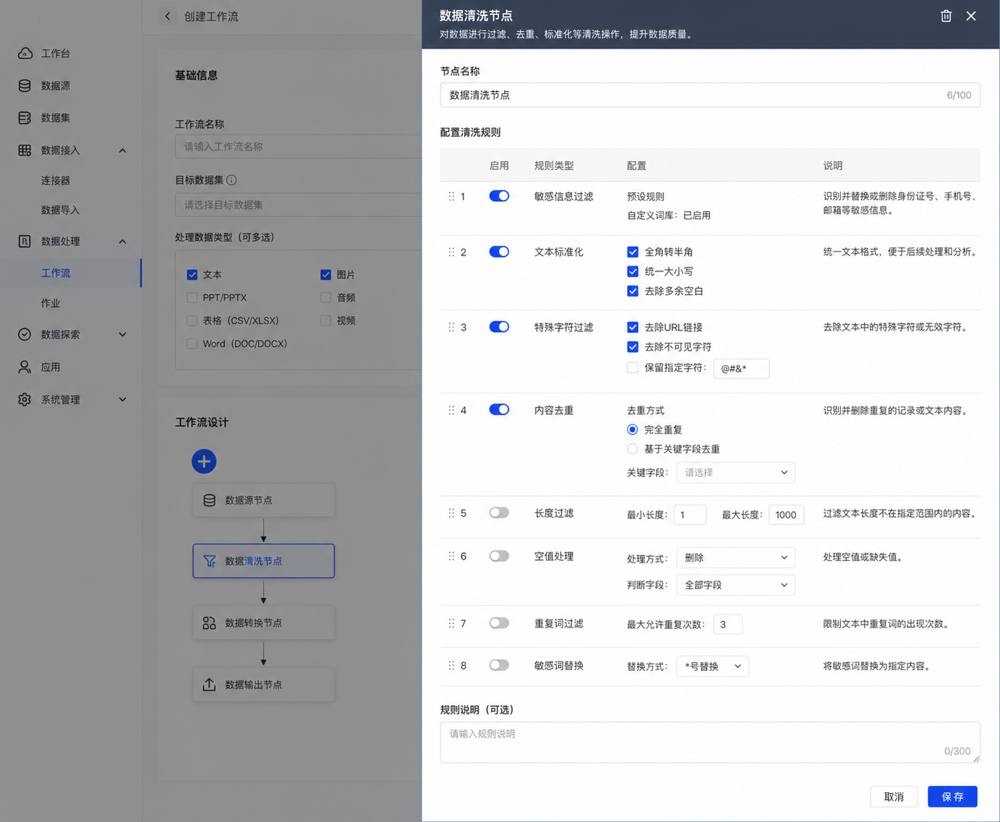

# 复杂工作流管理产品需求文档

## 1. 产品目标

支持由多种解析、清洗和增强节点组成的可视化工作流，用于将文本、图像、音频和视频等原始资料加工为可检索、可标注或可用于训练的数据集。

工作流应支持多输入、分支与汇聚，并向用户提供可配置、可查看、可执行和可追踪的完整体验。

## 2. 用户流程

数据工程师通过以下步骤完成数据准备：

1. 选择一个或多个源数据卷，配置目标数据卷和执行频率。
2. 添加解析节点，将不同格式资料转换为可处理内容。
3. 使用数据清洗节点进行去重、标准化和质量处理。
4. 使用数据增强节点生成适合训练或微调的数据集。
5. 查看运行状态、节点配置和执行详情，并处理失败任务。

## 3. 创建工作流

用户从工作流管理首页的“创建工作流”进入创建页。

### 3.1 基础信息

| 字段 | 要求 |
|---|---|
| 名称 | 必填且唯一，用于调度、监控和检索 |
| 源数据卷 | 可多选，作为起始节点输入 |
| 目标数据卷 | 单选，作为结束节点输出 |
| 处理数据类型 | 可多选，限定该工作流处理的文件类型 |
| 运行频率 | 支持单次和定时两种模式 |
| 单次执行 | 必须选择执行日期与时间 |
| 定时执行 | 配置周期性执行规则 |
| 说明 | 记录用途和特殊配置 |

### 3.2 工作流画布

- 用户在画布中添加、连接并配置节点。
- 节点之间允许出现并行分支和汇聚关系。
- 文件选择属于工作流处理范围配置，不在单个解析节点内部重复配置。
- 开始节点与结束节点为每个工作流的固定边界。
- 保存与执行前校验名称唯一性、必填数据卷、合法拓扑与结束节点单入边；校验失败时定位到对应字段或节点。

### 3.3 数据清洗节点配置示意

## 4. 节点能力

| 节点 | 输入与作用 | 输出或后续用途 |
|---|---|---|
| 开始节点 | 接收源数据卷中的一个或多个数据源 | 将资料交给解析分支 |
| 文本解析 | 从文档、文本类文件中抽取内容，支持结构化输出 | 文本内容与元数据 |
| 图片解析 | 从图像中提取文字、对象和关系等内容 | 图像语义与结构化结果 |
| 音频解析 | 处理 WAV、MP3、AAC、FLAC 等音频 | 转写文本、时间片段与说话人信息 |
| 视频解析 | 处理视频的音频通道；视觉通道为后续能力 | 转写文本及相关元数据 |
| 数据清洗 | 对解析后文本块进行过滤、去重、标准化等处理 | 质量更高的文本块 |
| 数据增强 | 将清洗后资料生成为训练或微调数据 | 结构化训练样本 |
| 结束节点 | 写入目标数据卷 | 可供下游使用的处理结果 |

### 4.1 音频与视频解析

音频解析包括以下处理链路：

1. 降噪或语音增强，提高信噪比。
2. 说话人分离，使用匿名说话人标签标识时间段。
3. 语音活动检测，将连续音频按人声与静默切片。
4. 自动语音识别，为每个片段生成转写文本。

视频解析本期复用音频通道的处理逻辑；字幕和视觉通道可作为后续优先级能力。

### 4.2 数据清洗

数据清洗节点针对解析后的文本块执行处理。所有操作默认关闭，用户主动选择后生效。具体操作应提供名称、说明、参数和效果提示，至少覆盖过滤、去重、格式标准化和缺失处理等类别。

### 4.3 数据增强

数据增强节点将清洗后的资料转换为训练或微调可用数据。支持的场景与参数如下：

| 场景 | 参数 | 说明 |
|---|---|---|
| 通用问答 | 单段生成样本数 | 每个文本切片生成的数据条数 |
| 文本分类 | 相似度阈值 | 用 Rouge-L 等相似度方法过滤重复生成结果 |
| 文本分类 | 任务描述增强占比 | 按比例改写任务描述；取值范围为 0 到 1 |
| 文本分类 | 生成样本数 | 输出样本数量 |
| 文本提取 | 相似度阈值、生成样本数 | 控制去重与生成数量 |
| 文本生成 | 相似度阈值、任务描述增强占比、生成样本数 | 控制扩写数据的去重、多样性与数量 |

输出数据以 JSONL 为主要格式。内置提示词负责定义输入输出结构，首期不提供提示词自定义。

#### 输出示例

~~~json
{"instruction":"提出一个问题","context":"与问题相关的文本内容","response":"基于上下文的回答"}
~~~

### 4.4 自定义脚本节点

自定义 Python 节点在本 PRD 的初始范围外。若启用，应在节点之间传递结构化 JSON 数据，并具备脚本上传、节点命名、说明、依赖与运行时约束等能力。

### 4.5 文件选择与不支持文件

- 单次处理可在运行前按文件清单选择本次输入；周期或关联处理沿用数据卷增量范围，不在解析节点内重复选文件。
- 每个解析节点应仅接收其声明支持的文件类型；不支持文件不进入该节点的处理结果，并在作业明细中可追踪原因。
- 音频首期支持 WAV、MP3、AAC、FLAC；视频首期仅处理音频通道。视觉理解、字幕抽取和转写后纠错属于后续能力，界面不得将其标为已完成。

## 5. 查看、编辑与分支

### 5.1 工作流详情

详情页包含：

- 基础信息：展示工作流名称、数据卷、文件类型、执行信息和说明。
- 工作流配置与拓扑：展示当前分支的节点图；点击节点后在右侧抽屉中查看配置。
- 分支操作：支持切换分支、编辑当前分支、创建分支和比较分支。

复杂工作流的分支创建、编辑、执行与结果管理遵循工作流分支管理能力的规则。

### 5.2 作业详情

作业详情页由三部分组成：

| 区域 | 内容 |
|---|---|
| 作业基本信息 | 作业标识、状态、时间和基础执行信息 |
| 工作流拓扑 | 本次作业实际使用的节点结构；可点击节点查看配置 |
| 执行详情 | 节点执行状态、日志与文件级结果，便于定位异常 |

## 6. 约束与验收

### 6.1 产品限制

- 工作流支持一个或多个数据源作为起点，且以一个目标数据卷作为终点。
- 同时运行的任务上限为 16 个。
- 自定义 Python 节点不属于本期复杂工作流范围。

### 6.2 验收要点

| 场景 | 验收标准 |
|---|---|
| 创建工作流 | 可配置名称、多个源数据卷、一个目标数据卷、数据类型和执行频率 |
| 拓扑编排 | 可添加解析、清洗、增强、开始与结束节点，支持分支与汇聚 |
| 多模态解析 | 音频和视频音频通道的处理要求与文件格式限制清晰可见 |
| 清洗与增强 | 默认不启用清洗；增强可按场景配置去重、多样性和输出数量 |
| 查看与排障 | 详情和作业页均能查看拓扑、节点配置和执行状态 |
| 并发控制 | 同时运行任务超过上限时有明确限制与反馈 |
