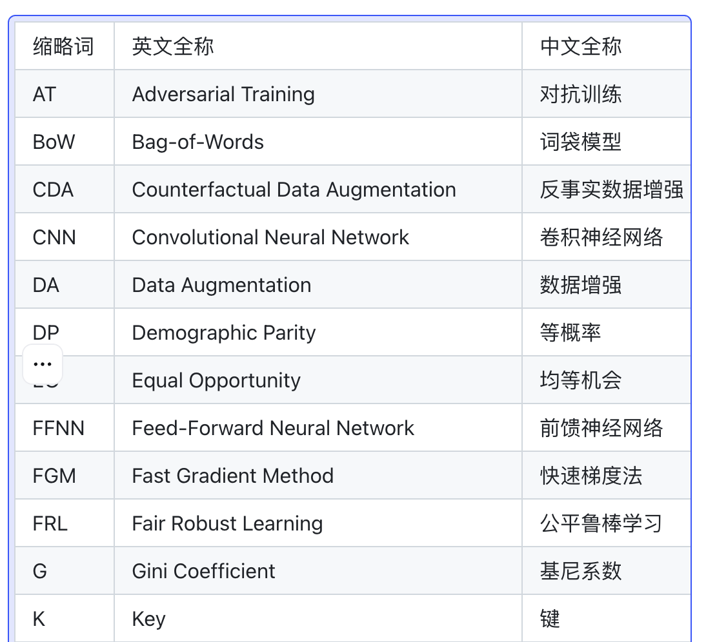

# 文档表格解析产品需求文档

## 1. 产品目标

识别文档中表格的标题、主体与脚注，并将三者按空间关系组合为完整表格，保留 HTML/LaTeX 主体与原始版面关联，供解析展示、下载、分段和检索使用。

## 2. 表格组合算法

### 2.1 识别与匹配

- 模型识别表格主体、标题和脚注三类元素。
- 按元素左上角坐标排序，优先从页面靠前元素开始进行贪心匹配。
- 表格标题优先匹配主体上方元素；脚注可在任意方向匹配。
- 计算边界框距离；若当前配对距离不小于其他表格主体最近距离的 3 倍，则拒绝该配对。
- 每个表格主体都获得一个分组标识，即使没有匹配标题或脚注。

### 2.2 重新组合

- 以分组标识收集主体、全部标题与全部脚注。
- 生成一个统一 `table` 块，使用主体边界框作为整体边界框。
- 统一块的阅读顺序取组内块顺序的中位数。

## 3. 输出模型

~~~json
{
  "type": "table",
  "page_index": 1,
  "image_path": "images/table.png",
  "table_caption": ["表格标题"],
  "table_footnote": ["表格脚注"],
  "table_body": "<table>...</table>"
}
~~~

- 主体优先保留 HTML；如仅识别为 LaTeX 或图片，保留相应表示和图片引用。
- Markdown 输出顺序固定为标题、表格主体、脚注；HTML 主体原样写入 Markdown。

## 4. 前端展示

- 解析结果的查看入口移至操作栏；筛选按钮仅在分段结果页右上角展示。
- JSON 展示支持表格类型和二级类型：表格标题、表格脚注、表格主体。
- 显示文案分别为“表格-表格标题”“表格-表格脚注”“表格-表格主体”。
- 表格主体以 HTML 渲染预览，支持基于表格块的原文关联与查看。

## 5. 下载与接口

- 表格主体块使用 `type: table` 与 `level: table_body`，内容为 HTML。
- 标题和脚注分别使用 `table_caption`、`table_footnote`，一个表格的多个标题/脚注分别作为独立块输出。
- 表格主体增加 `table_url`，指向下载包 `tables` 目录中对应的 HTML 文件。
- Markdown 保存 HTML；在结果页渲染为可阅读表格。

### 5.1 组合失败与编辑约束

- 没有可确认标题或脚注时，仅输出主体；不得把距离更近于另一张表的文字错误挂接到当前表。
- 表格标题、脚注与主体的块级编辑分别保存；编辑主体时校验 HTML，校验失败不覆盖旧主体。
- `table_url` 必须指向导出包内对应 HTML；下载、预览和 JSON 中的表格内容应来自同一个最终版本。

## 6. 验收要点

| 场景 | 验收标准 |
|---|---|
| 关联 | 标题、主体、脚注按空间距离正确分组，远距离错误候选被拒绝 |
| 缺失元素 | 无标题或脚注时表格主体仍生成有效表格块 |
| 输出 | JSON、Markdown、HTML 文件的标题/主体/脚注顺序和数据一致 |
| 展示 | 可区分三类表格块，主体可渲染并关联下载 HTML |
