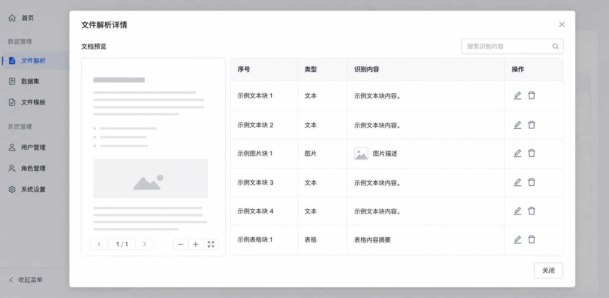

# 文件解析详情展示优化产品需求文档

关联能力：本文件定义早期文本/图片解析核验页，后续扩展的表格、音视频与分段展示见《解析与分段结果展示产品需求文档》。

## 1. 产品目标

提供原文件与解析结果的对照视图，帮助用户验证解析准确性、修正内容、禁用不可信块，并查看结构化提取结果。

## 2. 页面结构

- 点击已解析文件的名称或“查看解析详情”进入详情页。
- 左侧展示原文件的全部页面，支持翻页和页缩略图跳转。
- 右侧展示当前页面的文本与图片解析块，以及结构化解析结果。

## 3. 文本文件

### 3.1 解析块

| 类型 | 内容与操作 |
|---|---|
| 文本 | 块标识、原文文本；支持搜索、编辑、定位、删除、启用/禁用 |
| 图片 | 缩略图、OCR 识别文本、图片描述；支持编辑、删除、启用/禁用 |

- 编辑在弹窗中完成，确认保存后更新内容。
- 删除必须二次确认。
- 禁用块默认仍保留在详情页，但下游检索跳过。

### 3.2 原文高亮

| 颜色 | 含义 |
|---|---|
| 蓝色 | 已识别的文本或图片区域 |
| 灰色 | 未识别区域 |
| 黄色 | 用户通过“定位”选择的当前块 |

高亮反映一次解析的原始结果；之后编辑或删除块不改变原始高亮。

### 3.3 结构化解析

- 展示整个文件的结构化 JSON 结果。
- 支持对字段值进行编辑。
- 原文使用蓝色/灰色区分已识别与未识别内容。

## 4. 图片文件

- 展示 OCR 与图片描述。
- 支持编辑、删除、启用/禁用。
- 对识别成功的区域使用蓝色高亮。

### 4.1 操作失败与可追溯性

- 文本、图片和结构化字段的保存失败时，保留编辑框内容并提供字段级错误提示；取消或关闭不保存。
- 删除、禁用和重新启用操作应写入可审计的状态变更记录；原文高亮持续指向初始版面，避免编辑后坐标失真。
- 原文件缺页、图片资源不可加载或结构化结果无效时，页面仍展示其余可用内容并区分“解析失败”与“无识别结果”。

## 5. 后续扩展

- 支持更多工作流节点输出的详情呈现。
- 支持表格解析和表格可视化。
- 定义结构化结果与自定义节点输出之间的展示契约。
- 评估操作历史展示。

## 6. 验收要点

| 场景 | 验收标准 |
|---|---|
| 页面 | 左右两栏可对照，支持页缩略图跳转 |
| 文本与图片 | 块信息、搜索、编辑、定位、删除、启禁用完整可用 |
| 高亮 | 蓝/灰/黄高亮含义正确，后续编辑不回写原始识别高亮 |
| 结构化结果 | 可查看并编辑字段值 |
