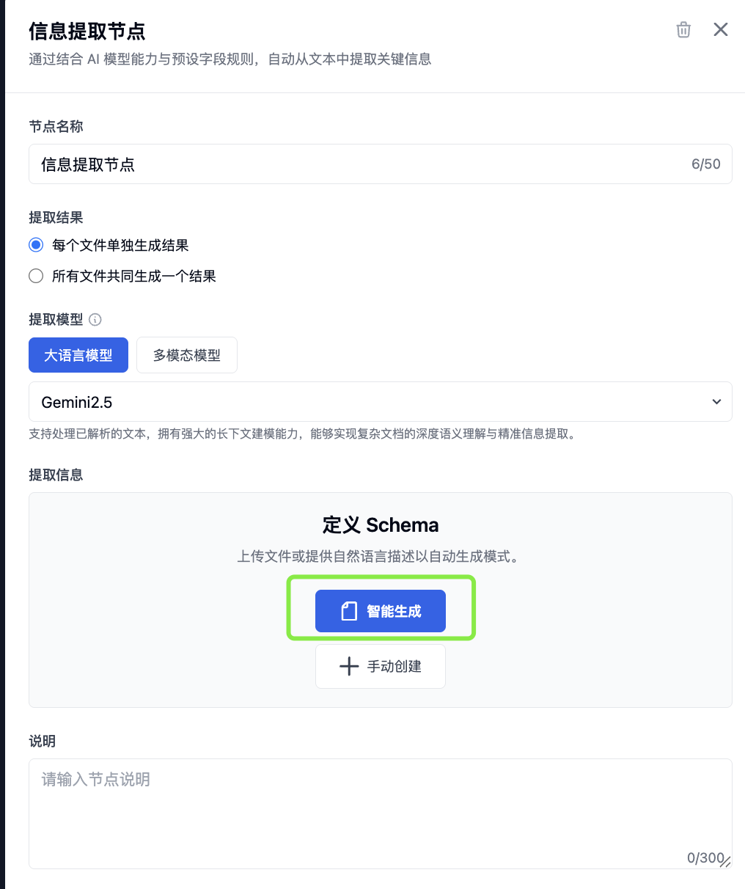

# 信息提取节点功能增强产品需求文档

关联能力：本文件在结构化提取节点基础上扩展多模态提取、预设 Schema 与表格导出；多文件和字段溯源的后续增强见《信息提取节点增强产品需求文档》。

## 1. 产品目标

将“结构化提取节点”升级为“信息提取节点”，使其能利用多模态模型从文本、图片、PDF 和图文混合资料中抽取结构化字段，并把被抽取的表格以 HTML 保真导出。

## 2. 核心能力

- 节点名称统一为“信息提取节点”。
- 支持多模态模型，直接理解图像、表格与图文混排内容。
- 提供可复用的提取模板 Schema，例如报告、票据和简历类字段结构。
- 当提取字段中包含表格时，输出 JSON 的同时导出可查看的 HTML 表格文件。

## 3. 表格 HTML 导出

### 3.1 触发与拆分

仅当字段值包含完整 `<table>` 结构时导出 HTML 文件；普通 HTML 标签（如段落或容器）不单独导出。

- 一个字段包含一个表格：导出一个 HTML 文件。
- 一个字符串或数组项包含多个表格：按出现顺序拆分，每个 `<table>` 单独导出。
- 支持字符串、数组、对象嵌套和数组中的对象字段等任意 Schema 路径。

### 3.2 文件命名

| 情况 | 命名规则 |
|---|---|
| 单个表格 | `字段路径.html` |
| 数组元素 | `字段路径[index].html` |
| 嵌套对象 | 以 `.` 连接完整字段路径 |
| 同字段多个表格 | `字段路径_partN.html`，N 从 0 开始 |

示例：`records[0].table_part1.html` 表示数组首项中 `table` 字段的第二个表格。

### 3.3 下载产物

当信息提取节点是处理链路最后一个节点时，下载包包含：

- 信息提取 JSON。
- 从字段值中拆分出的所有 HTML 表格文件。
- 保持字段路径与文件名之间可追溯的映射关系。

#### HTML 识别与导出失败

- 仅识别成对且可解析的 `<table>...</table>`；转义后的标签、普通富文本或不完整表格不生成额外 HTML 文件。
- 当同一路径生成多个表格时，编号必须以原 JSON 内出现顺序稳定递增；清理字段或重新执行后不得让旧文件残留在下载包中。
- HTML 文件名做路径安全处理，避免字段名中的路径分隔符覆盖其他导出文件；若名称归一化后冲突，追加稳定序号。
- 表格导出失败不得丢弃原始 JSON 字段，下载结果应标明该字段的导出失败原因。

## 4. 提取模板

模板提供预设 JSON Schema，用户可在此基础上配置字段说明和必填字段。

| 模板类型 | 典型字段 |
|---|---|
| 报告（含表格） | 机构名称、报告年度、指标与表格数组 |
| 票据 | 编号、日期、金额、项目与明细表 |
| 简历 | 姓名、联系方式、求职目标、教育与经历 |

对于需要抽取整张表格的字段，Schema 描述应明确要求以完整 HTML 表格字符串输出。

~~~json
{
  "type": "object",
  "properties": {
    "table": {
      "type": "string",
      "description": "提取完整表格并输出为 HTML。"
    }
  },
  "required": ["table"]
}
~~~

## 5. 后续增强项

- 智能 Schema 推理：用户上传样例文件、输入提示词或两者组合，自动生成 JSON Schema。
- 多文件联合提取：聚合多份资料生成一份结构化结果；预览任一参与文件时可查看该统一结果。

## 6. 验收要点

| 场景 | 验收标准 |
|---|---|
| 多模态提取 | 能处理包含文本、图片和表格的输入 |
| 模板 | 可选择预设 Schema 并继续编辑字段 |
| 单表格导出 | 含完整表格的字段生成与字段路径对应的 HTML 文件 |
| 多表格导出 | 多个表格按出现顺序拆分且编号稳定 |
| 嵌套路径 | 对象和数组内的表格文件名正确反映字段路径 |
