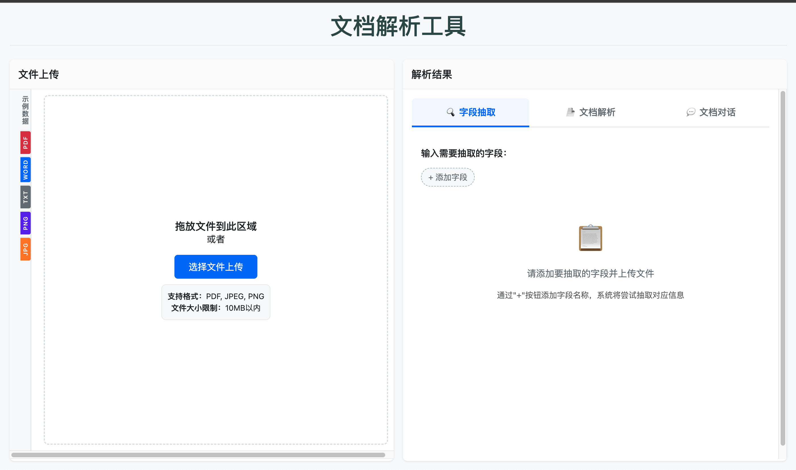

# 多模态解析与结构化信息抽取演示产品需求文档

关联能力：本文件定义面向体验展示的单文件演示流程，不替代工作流内的信息提取节点。

## 1. 产品目标

让用户通过一个演示页面体验文件解析、字段抽取、原文高亮与文档问答，直观看到非结构化资料如何转化为可验证的结构化信息。

## 2. 文件上传

| 项目 | 要求 |
|---|---|
| 格式 | PDF、TXT、MD、DOC、DOCX、PPT、PPTX、JPG、PNG、JPEG |
| 单次上传 | 仅一个文件 |
| 大小 | 单文件不超过 2 MB；超出时提示无法解析 |
| 上传方式 | 选择本地文件或拖拽上传 |
| 样例 | 提供无敏感信息的文档和图片样例，并预填相应提取字段 |

上传成功后，用户点击“开始解析”查看处理进度与结果。

## 3. 字段抽取

- 用户添加需要抽取的字段，初始值为空。
- 解析成功后填入字段值；未提取到内容的字段保持空值。
- 复制和 CSV 下载仅包含成功提取的字段和值。
- 右侧原文只高亮与当前抽取字段相关的解析块；悬停可查看块信息。

## 4. 文档解析与对话

### 4.1 解析结果

- 将文件解析为 Markdown 与结构化分块。
- 在右侧显示解析内容和全部分块高亮；失败或无有效信息时显示明确状态。

### 4.2 文档对话

- 基于已解析分块提供问答。
- 回答展示引用分块；用户点击引用可查看原文块并高亮对应位置。
- 问答引用只使用可追溯的文档分块，帮助用户验证回答来源。

## 5. 首次体验引导

| 步骤 | 引导内容 |
|---|---|
| 1 | 选择或上传一个待解析文件 |
| 2 | 添加需要抽取的字段 |
| 3 | 开始解析并查看字段结果 |
| 4 | 在对话中点击引用分块，查看原文映射 |

### 5.1 状态与异常

- 选择新文件后清空上一个文件的字段值、对话和高亮，避免跨文件展示错误引用。
- 解析期间禁用重复提交；失败时保留文件与字段配置，允许用户修改字段后重试。
- 样例、预设字段和导出内容均使用通用脱敏数据；下载文件名不包含账号、环境或来源标识。

## 6. 验收要点

| 场景 | 验收标准 |
|---|---|
| 上传 | 格式、大小与单文件限制正确校验 |
| 提取 | 成功字段可复制/下载，空字段不导出 |
| 解析 | Markdown、块信息和高亮可查看 |
| 对话 | 回答引用可打开，并与原文准确关联 |
| 引导 | 新用户可依次完成上传、字段、解析和引用核验 |
