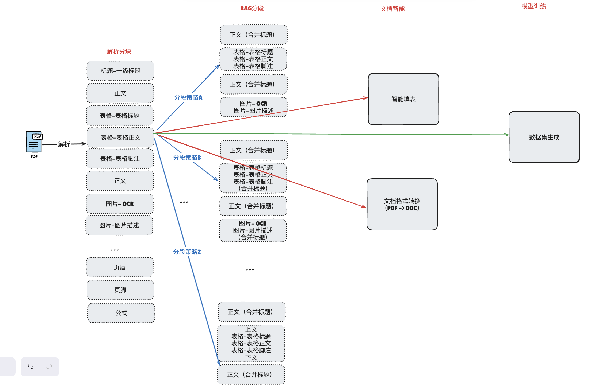
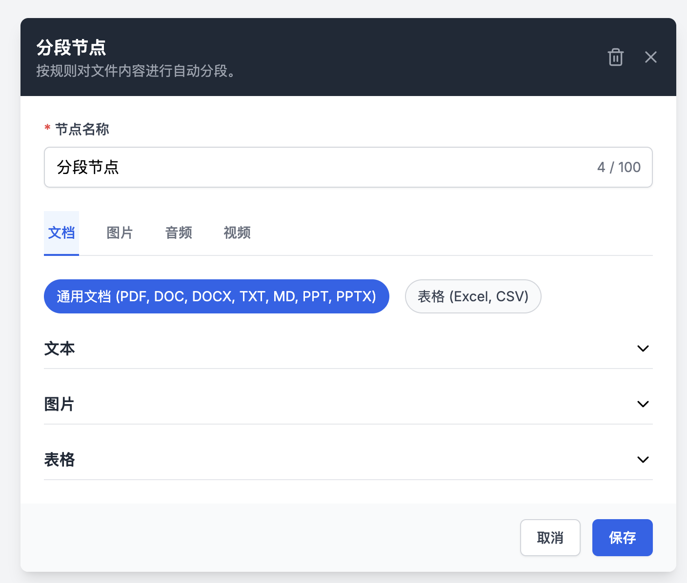

# 解析与分段结果展示产品需求文档

## 1. 产品目标

在处理数据卷中以统一、可编辑、可追溯的方式展示不同文件类型的解析块与分段结果，使用户能对照原文件核验内容、管理分块状态并控制下游智能检索使用的数据。

## 2. 解析结果展示

### 2.1 通用交互

- 左侧展示原文件，右侧展示解析结果；支持多文件下拉切换。
- 文档与图像类原文件以 PDF 形式查看；音视频以播放器查看，音频播放时显示黑色画面。
- 点击解析块可定位原文件的对应页、时间段、工作表或单元格。
- 解析块按照原文顺序展示，并支持选中和编辑。

### 2.2 文档与图像

| 块类型 | 展示与编辑 |
|---|---|
| 文本 | 显示正文，支持编辑 |
| 图片 | 显示缩略图、OCR 和图像描述；支持查看大图和编辑 OCR/描述 |
| 表格 | 显示表格标题、主体、脚注及缩略图；主体编辑 HTML，并实时预览与校验结构 |
| 标题 | 显示并支持编辑 |

- 保存表格时必须校验 HTML；无效结构提示失败，不更新解析结果。
- 图片和表格可从原文件位置关联到对应解析块。

### 2.3 音频与视频

- 右侧展示按时间顺序排列的语音转写块，包含时间段和文本。
- 点击块后，左侧播放器定位到起始时间但默认不自动播放。
- 用户可播放、暂停；播放到块结束时间自动暂停并复原播放按钮。
- 后续优先级支持播放器播放时自动高亮右侧对应块。

### 2.4 表格文件

- 支持在文件和工作表之间切换。
- 解析结果以表格渲染，点击单元格使原文件定位到对应工作表与单元格。
- 单元格支持编辑表头、文本、OCR 与图像描述；根据单元格图文类型显示相应字段。
- 不归属任何单元格的浮动图片单独置于结果末尾，按图片块方式展示和操作。

### 2.5 邮件

- 邮件解析包含元数据（发件人、收件人、抄送、日期、主题）、邮件正文和附件。
- 提供“邮件正文”及各附件的切换器，正文默认展示。
- 正文按虚拟文档的解析块展示，附件按各自文件类型展示。
- 所有解析块均支持选中与编辑。

## 3. 分段节点配置

分段节点根据上游解析类型动态展示文档、图片、音频和视频标签页；只显示当前上游对应的配置。

### 3.1 通用文档

- 文本支持单标志符和多标志符分段，设置标志符、最大长度和重叠长度。
- 图片块将 OCR 与图像描述合并为一个分段，可配置前后文文本重叠；文本块不反向引入图片内容。
- 表格块将标题、主体、脚注合并为一个分段，可配置前后文文本重叠；文本块不反向引入表格内容。

### 3.2 表格文件、图片和音视频

| 类型 | 分段规则 |
|---|---|
| Excel / CSV | 固定按 1 行分段，标题行与内容行合成键值对；配置不可编辑 |
| 图片 | OCR 与图像描述合并为一个分段，无额外配置 |
| 音频 | 合并连续 ASR 块，按字符数控制最大长度，合并后保留完整时间范围 |
| 视频 | 与音频相同，基于音轨的 ASR 块合并 |

## 4. 分段结果管理

### 4.1 通用列表

- 按原文件顺序排序。
- 默认每页 5 条，可切换每页 10 或 20 条，支持翻页。
- 支持按文本内容搜索，结果按原文顺序返回。
- 支持按状态筛选：全部、已启用、已禁用。
- 每个分段显示字符数、智能检索召回次数和关键词标签。

### 4.2 启用、禁用与编辑

- 禁用必须二次确认；启用不需二次确认。
- 禁用后分段置灰，禁止编辑和查看大图。
- 下载与智能检索排除禁用分段；普通检索仍可搜索禁用分段。
- 重新启用后，下载与智能检索再次包含该分段。
- 文本、图片、表格和表格行分段均支持按其数据类型编辑。

### 4.3 分类展示

| 类型 | 内容与操作 |
|---|---|
| 文本 | 默认显示最多 5 行，超出可滚动查看；支持编辑 |
| 图片 | 显示小图、OCR 与描述；支持放大和编辑 |
| 表格 | 显示标题、主体、脚注；支持放大和编辑 |
| 音视频 | 显示文本、字符数、召回次数、关键词、时间段；支持播放、暂停、编辑与启禁用 |
| 表格文件 | 跨工作表按工作表顺序排列；以键值对 JSON 显示，支持编辑与启禁用 |
| 邮件 | 默认正文，可切换附件；正文/附件分别遵循相应文件类型的分段展示 |

## 5. 数据契约

解析块与分段至少包含文件标识、块或分段标识、类型、原文顺序和内容。音视频增加起止时间；表格文件增加工作表名与单元格位置；邮件增加正文/附件来源和附件名称。

~~~json
{
  "chunk_id": "chunk-001",
  "type": "audio/video",
  "content": "转写文本",
  "index": 1,
  "start_time": "00:00",
  "end_time": "01:00"
}
~~~

### 5.1 编辑、保存与状态一致性

- 编辑文本、OCR、图片描述、标题、表格或表格行后，只更新当前解析块/分段及其派生展示；原文件和历史版面坐标不被改写。
- 表格主体编辑采用左侧 HTML 编辑、右侧实时渲染预览；保存时 HTML 校验失败则保持最后一次有效内容。
- 对分段的启用、禁用或编辑需在下载和智能检索索引中一致生效；状态更新失败时不得只更新页面视觉状态。
- 音视频块编辑后仍保留原 `start_time`、`end_time`，播放定位以原始时间范围为准。

## 6. 验收要点

| 场景 | 验收标准 |
|---|---|
| 对照 | 点击文档、音视频、表格块能定位原文件对应位置 |
| 编辑 | 文本、图像、表格、单元格与邮件块按类型正确编辑；表格 HTML 保存时校验 |
| 配置 | 分段设置随上游类型变化；图像、表格和音视频的合并规则正确生效 |
| 管理 | 搜索、排序、分页、状态筛选、启禁用及其下游影响符合规则 |
| 多文件 | Excel 可切换工作表，邮件可切换正文与附件，且默认内容正确 |
