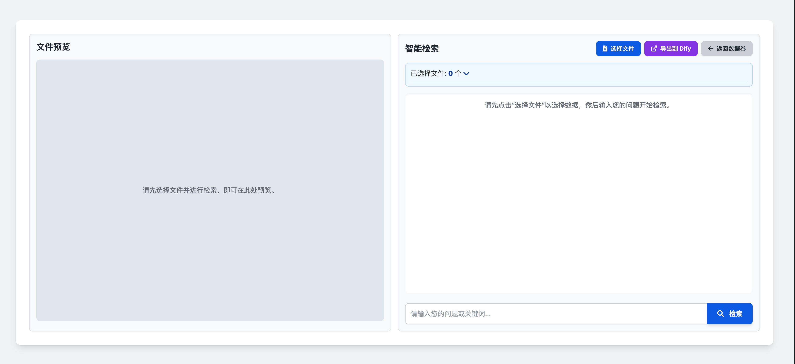

# 文件解析结果与智能检索体验产品需求文档

关联能力：本文件定义早期的处理结果与检索交互方案；更完整的多类型解析/分段管理见《解析与分段结果展示产品需求文档》。

## 1. 处理结果入口

- 在处理数据卷中，“查看”操作进入处理结果详情页，不再仅查看原文件。
- 最终节点为解析或清洗时展示解析结果；数据增强结果继续以问答对形式展示；自定义节点结果按其输出格式展示。
- 结果详情作为二级页面，按图文类与音视频类分别优化。

## 2. 图文类文件结果

### 2.1 双栏结构

- 左侧：将原文件统一以 PDF 形式呈现，支持滚动、翻页和原文分块框。
- 右侧：展示标题、目录、正文、图片、表格、图表等结果块；当前优先支持文本和图片。
- 显示文件名及关联运行信息，并支持返回上层执行页。

### 2.2 列表、筛选与内容

| 功能 | 规则 |
|---|---|
| 排序分页 | 按原文顺序；默认每页 5 条，可选 10 或 20 条 |
| 搜索 | 搜索块标识和文本，按原文顺序返回 |
| 类型筛选 | 支持全部及按类型筛选；初期仅文本/图片单选，后续支持多选 |
| 置信度 | 支持 0–100 的整数范围筛选，起点默认 0、终点默认 100，可单独重置 |
| 文本块 | 显示类型、置信度、标识、文本；超长内容可展开后滚动查看 |
| 图片块 | 显示类型、置信度、标识、缩略图和文字；支持大图预览与展开详情 |

清洗后内容为空时，图片区提示图片已被清洗，文本区显示内容为空的状态说明。

### 2.3 块状态与原文关联

- 禁用需二次确认；禁用后左右两侧置灰，并在下载和智能检索中排除。
- 重新启用无需二次确认，恢复下载和智能检索可用性。
- 点击右侧块：左侧跳至对应页并高亮原文；跨页块同时呈现相关页并居中高亮连接位置。
- 点击左侧块：右侧自动滚动或翻页到对应块并高亮。
- 再次点击已选块取消高亮；禁用块使用不同高亮样式但仍可定位。
- 下载包增加 `layout.json`，保留版面关联信息。

## 3. 音视频结果

- 左侧使用播放器；视频显示画面，音频播放显示黑色背景。
- 播放器支持总时长、进度、静音和全屏。
- 右侧仅展示文本块，包含类型、置信度、标识和时间段，不提供类型筛选。
- 点击块的播放按钮后自动播放对应时间段，到结束时间自动暂停；禁用块也允许播放。

## 4. 多文件智能检索

### 4.1 文件选择

- 从处理数据卷进入智能检索页，选择可检索文件；数据增强为最终节点的输出不可选。
- 未选择文件时不能确认；已选列表按选择顺序分页显示，每页最多 10 项，支持删除与跳转目录。
- 主界面按数据卷和分支分组显示已选文件摘要与详细列表。

### 4.2 检索与结果

- 用户输入问题或关键词后可点击检索或回车执行。
- 未输入问题提示输入内容；未选文件提示先选择文件。
- 检索中保留上一次结果并显示加载状态。
- 结果区域包含用户问题、基于参考块的总结和参考分段卡片。
- 卡片默认折叠；展开一个卡片时折叠其他卡片，并在左侧预览对应文件。

| 分段类型 | 卡片内容 |
|---|---|
| 文本 | 文字摘要，可展开完整内容 |
| 图片 | 缩略图与描述，支持大图预览 |
| 音视频 | 转写、时间段和播放入口 |

卡片同时展示来源文件名、字符数和相关性得分。选择文本/图片结果时，左侧根据坐标高亮原文件；选择音视频结果时，播放器跳转并播放相应时间段。

### 4.3 单文件检索

在文件结果详情中进入智能检索时，默认只选择当前文件，省略文件选择流程，其余交互与多文件检索一致。

### 4.4 请求失败与结果切换

- 检索请求失败时保留当前查询与上一轮可用结果，并显示可重试状态；不得将加载失败显示为“无匹配内容”。
- 切换文件、分支或参考分段时，清空旧的高亮并仅在当前预览中标记有效坐标；缺少坐标的块仍可展示内容但不强行定位。
- 禁用状态只影响下载与智能检索召回，不应阻止用户在结果详情中审阅和播放该块。

## 5. 验收要点

| 场景 | 验收标准 |
|---|---|
| 入口 | 查看处理结果进入二级详情，按最终节点显示对应内容 |
| 图文 | 搜索、筛选、分页、启禁用和双向原文定位正确 |
| 音视频 | 可在块级播放对应时间段并正确暂停 |
| 多文件检索 | 文件校验、已选列表、卡片、预览与高亮正确协作 |
| 单文件检索 | 当前文件自动带入，无需再次选择 |
