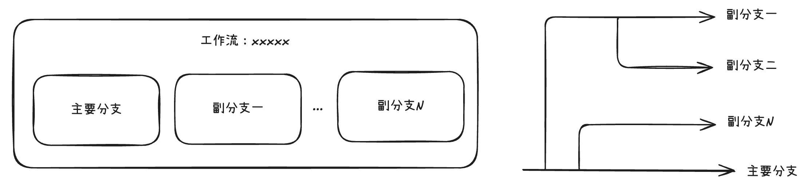
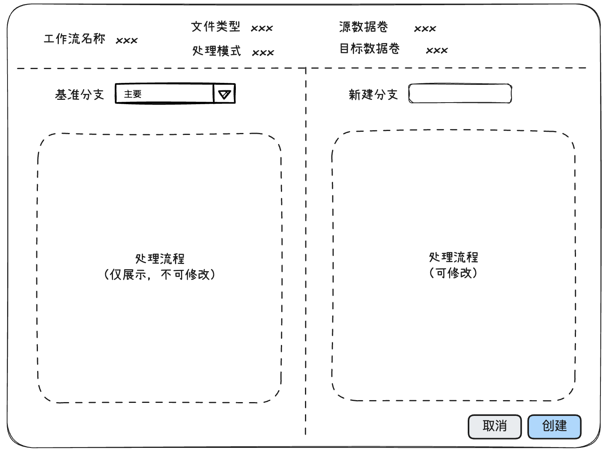
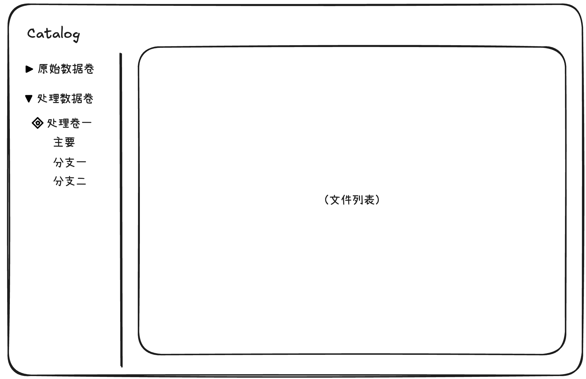

# 工作流分支管理产品需求文档

## 1. 产品目标

为同一份数据处理任务提供可独立演进的工作流分支。用户可以从已有分支复制处理配置，调整解析、清洗、分段或嵌入策略，并在不影响其他分支的情况下比较处理结果。

该能力应降低重复配置、重复执行、重复存储和结果对比的成本。

## 2. 用户与核心场景

| 用户 | 场景 | 需要完成的任务 |
|---|---|---|
| 数据工程师 | 比较不同处理策略 | 从主分支或任一现有分支创建新分支，修改处理流程并执行 |
| 数据工程师 | 管理多个版本 | 查看、编辑、删除或重命名分支，了解各分支作业状态 |
| 数据使用者 | 选择下游数据 | 在同一工作流的多个处理结果间进行对比并选择版本 |

## 3. 核心概念与边界

| 概念 | 定义 |
|---|---|
| 工作流 | 共享基础信息的一组处理流程，包括源数据卷、目标数据卷、文件类型和处理模式 |
| 主分支 | 创建工作流时自动生成的默认分支 |
| 工作流分支 | 基于某个已有分支复制出的处理流程配置，可独立编辑与执行 |
| 基准分支 | 创建新分支时被复制配置的已有分支 |
| 分支结果 | 同一处理数据卷中按分支名称组织的处理结果 |

### 3.1 共享与隔离规则

- 同一工作流的分支共用源数据卷、文件类型、目标数据卷和处理模式。
- 分支只承载处理流程配置；创建后可单独编辑，修改不影响其他分支。
- 同一工作流内分支名称必须唯一，命名规则与工作流名称一致。
- 一个处理数据卷只能被一个工作流使用；创建工作流时，目标数据卷只能选择未被其他工作流占用的数据卷。

## 4. 功能需求

### 4.1 创建分支

创建入口包括：

- 工作流列表行操作中的“创建分支”。
- 工作流详情页中的“创建分支”。

创建页应由左右两部分组成：左侧选择并只读展示基准分支，右侧编辑新分支的处理流程。

| 项目 | 要求 |
|---|---|
| 基准分支 | 用户可选择当前工作流的任一已有分支；默认选择主分支 |
| 初始配置 | 新分支初始处理流程与基准分支一致 |
| 可编辑范围 | 基准分支只读；新分支的处理流程可按正常工作流编辑规则调整 |
| 分支名称 | 必填，在当前工作流内唯一 |
| 基础信息 | 不在分支创建页修改，所有分支共享 |

### 4.2 编辑分支与工作流

工作流基础信息与分支处理流程应分开编辑。

- 一次只能编辑一个分支。
- 用户在未保存修改时切换分支，系统必须提示当前修改将丢失，并提供确认与取消。
- 仅停止状态的工作流允许编辑分支。
- 工作流列表的“编辑”入口默认打开主分支；工作流详情页也提供编辑入口。
- 编辑某个分支不会改变同一工作流的其他分支。

### 4.3 执行与状态

#### 新分支的执行行为

| 创建时的工作流状态 | 新分支行为 |
|---|---|
| 运行中或已完成 | 立即处理历史全部文件 |
| 已停止 | 不立即处理；等待用户重新开始工作流后与其他分支一起执行 |

- 新旧分支的源文件、目标数据卷和执行频率保持一致。
- 每个分支分别创建一条作业记录；作业列表和作业详情必须新增“分支”字段。
- 本期不支持分支级单独启动或停止。停止、重新开始工作流时，所有分支一并受影响。

#### 聚合状态

| 工作流状态 | 判定规则 |
|---|---|
| 运行中 | 至少有一个分支仍在运行 |
| 已完成 | 所有分支均已完成 |
| 已停止 | 用户触发停止，且所有分支均完成停止动作 |

### 4.4 处理结果与资源复用

- 每个工作流分支在目标处理数据卷下拥有以分支名命名的子目录，用户可在目录树中查看各分支文件结果。
- 不同分支中相同文件的相同处理步骤应只执行和存储一次；例如仅嵌入模型不同的两个分支，可复用文本解析结果。
- 解析、清洗、分段等上游配置发生变化时，受影响结果不得错误复用。
- 分支结果应可被下游数据选择、结果浏览和分支对比功能引用。

### 4.5 查看与对比

#### 工作流列表

- 新增“分支数”列，包含主分支，值为正整数。
- 点击工作流名称进入详情页，默认展示主分支。
- “执行详情”保留按工作流筛选的行为，可看到该工作流下所有分支的作业。

#### 工作流详情

- 支持切换分支名称，查看其处理流程与配置。
- 仅当工作流存在多个分支时显示“对比”按钮。
- 对比页默认选中主分支，用户可增加其他分支；列数超出可视区域时支持横向滚动。
- 对比项至少包括处理流程和节点配置；差异高亮为后续增强项。

### 4.6 删除与重命名

#### 删除

删除操作先选择要删除的分支，可多选。

- 默认选中全部分支；删除全部分支时同时删除该工作流。
- 用户可选择是否删除处理数据卷中的对应分支数据。
- 若仅删除分支、不删除数据，数据卷内的分支结果保留。
- 删除前需要确认影响范围；可采用“选择分支与数据”加“最终确认”的两步交互。

#### 重命名

- 分支名称后续支持修改。
- 重命名后，处理数据卷中的分支目录名必须同步更新。
- 删除后重新创建同名分支时，若历史结果目录仍存在，系统应提示用户改用新名称；在不支持删除数据卷的阶段，不得复用旧目录。

### 4.7 并发修改与执行失败

- 创建、重命名或删除分支时再次检查同工作流内名称唯一性，避免并发操作产生同名目录。
- 分支复制完成前不应显示为可执行；复制或初始化失败时清理未完成配置并保留可读的错误信息。
- 工作流级停止应向全部运行中分支发送停止请求；若个别分支停止失败，聚合状态不得误显示为“已停止”。
- 可复用结果需同时匹配源文件版本、上游节点配置和处理器版本。任一条件变化时必须失效并重新处理。

## 5. 验收要点

| 场景 | 验收标准 |
|---|---|
| 基于已有分支创建 | 新分支继承基准配置，基础信息共享，名称重复时不可提交 |
| 分支编辑 | 修改一个分支后其他分支配置不变；未保存切换有明确提示 |
| 分支执行 | 运行中或已完成的工作流创建分支后能处理历史文件；停止状态不自动执行 |
| 状态展示 | 工作流状态能按全部分支的运行情况正确聚合；作业可识别所属分支 |
| 数据查看 | 用户可在同一处理数据卷内切换分支目录并查看对应结果 |
| 删除与重建 | 可选择是否保留结果数据；同名残留目录不会被静默覆盖 |
| 资源复用 | 相同处理步骤可复用结果，处理策略变更后不复用受影响节点 |

## 6. 限制与后续项

- 本期不支持为单个分支独立启动、停止或调度。
- 分支作业暂按分支分别展示，后续可评估合并展示方式。
- 节点差异可视化高亮为增强项。
- 当前以工作流独占目标数据卷简化管理；未来可演进为工作流下的独立目录或命名空间。
