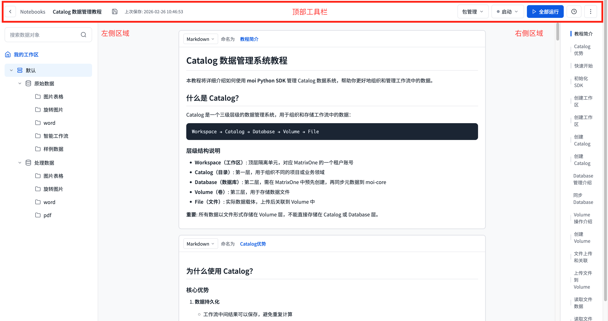

# 工作流开发者模式与 Notebooks 产品需求文档

## 1. 产品定位

Notebooks 是面向数据开发者和分析师的交互式开发环境，与面向业务用户的可视化工作流互补。用户可在同一文件内混合 Python、SQL、Go 与 Markdown，用于数据探索、工作流开发、调试和定时调度。

## 2. 用户路径

1. 从数据处理模块进入 Notebooks 列表，浏览已有 Notebook 或教程模板。
2. 新建空白 Notebook、从模板创建，或导入本地 `.ipynb` 文件。
3. 在编辑器中引用数据资产、编写代码、逐单元格运行与调试。
4. 保存 Notebook，并在需要时创建定时任务使其自动执行。

## 3. 列表与创建

### 3.1 列表页

| 区域 | 要求 |
|---|---|
| 标题栏 | 标题与新建按钮 |
| 模板区 | 展示最多 6 张快捷模板卡，支持查看更多 |
| 搜索与列表 | 支持按名称检索，列表分页展示所有 Notebook |
| 列 | 标题、创建时间、更新时间、编辑与删除操作 |
| 空状态 | 无内容时提示用户创建 Notebook |

删除需要二次确认；确认后删除对象并刷新列表。

### 3.2 新建与导入

- 直接新建：创建空白 Notebook 并进入编辑器，使用系统生成的默认名称。
- 从模板创建：复制模板内容并进入编辑器。
- 导入 `.ipynb` 为后续优先级能力，规则如下：

| 项目 | 规则 |
|---|---|
| 格式校验 | 文件必须是合法 JSON，且顶层包含 `cells` 数组；失败则阻断导入 |
| 标题 | 使用去除 `.ipynb` 后缀的文件名 |
| 内容 | 按顺序拼接每个单元格 `source` 数组为纯文本内容 |
| Markdown | 直接映射为 Markdown 单元格 |
| 代码语言 | 优先识别首行 `%%sql`、`%%go` 等魔法命令；否则读取 kernel 语言 |
| 未识别语言 | 降级为 Python，并在代码顶部添加导入警告注释 |
| 结果 | 成功后创建对象、跳转编辑器并提示成功；失败时留在列表显示具体错误 |

### 3.3 教程模板

| 模板主题 | 难度 | 内容 |
|---|---|---|
| 数据资产管理 | 入门 | 数据组织和资产读写基础 |
| 工作流节点 | 进阶 | 使用 SDK 或 DSL 构建并运行 DAG |
| 文件分类工作流 | 进阶 | 从文件名提取信息、分类并写入不同数据卷 |
| 自定义节点开发 | 高级 | 自定义处理节点与平台数据能力协作 |
| UDF 处理结构化数据 | 高级 | 注册模型函数并在 SQL 中处理结构化数据 |

## 4. 编辑器

### 4.1 顶部工具栏

- 返回列表、显示并编辑 Notebook 名称、手动保存和上次保存时间。
- 打开包管理、管理运行会话、全部运行、管理定时任务、删除当前 Notebook。

### 4.2 数据资产面板

- 左侧面板支持收起与展开，默认展开。
- 支持按对象名称实时搜索。
- 以数据目录、数据库、表的层级浏览对象，并查看表详情与字段元数据。

### 4.3 单元格与导航

| 类型 | 行为 |
|---|---|
| Python | 执行 Python 代码 |
| SQL | 执行查询 |
| Go | 执行 Go 代码 |
| Markdown | 编辑后实时渲染预览 |

- 支持在任意单元格后插入四种类型的新单元格。
- 每个单元格可拖拽排序、切换类型、命名、单独运行并显示耗时与输出。
- 类型切换保留已有内容。
- 单元格名称默认连续编号，双击编辑、回车保存。
- 右侧导航显示单元格名称与运行状态，点击后滚动定位。
- Markdown 无运行状态；代码单元格未运行灰色、聚焦且未运行蓝色、运行完成绿色。
- 后续优先级提供基础语法高亮：Python、SQL、Go 与 Markdown。

### 4.4 运行逻辑

- 单格运行：会话未启动时自动启动，准备完成后执行；运行期间显示加载状态，完成后显示耗时、成功状态和输出。
- 全部运行：按页面顺序执行所有单元格。
- Markdown：编辑完成后或点击运行时渲染预览；可再次进入编辑状态。

### 4.5 运行失败与单元格状态

- 代码单元格除未运行、运行中、成功外，还应有失败状态；失败输出保留在该单元格，后续单元格不因“全部运行”而被静默标记为成功。
- `全部运行` 按顺序执行；遇到失败时停止后续代码单元格并显示失败位置，用户可修正后从该单元格继续运行。
- 切换单元格类型不丢弃内容，但切换到代码类型后须在下次运行时按新语言重新校验。

## 5. 会话与保存

### 5.1 会话管理

| 状态 | 界面与行为 |
|---|---|
| idle | 未启动，显示启动操作 |
| starting | 正在连接运行环境，显示加载状态 |
| active | 环境可执行代码，显示活动状态 |

- 支持启动、重启和结束会话；重启和结束均清除运行变量。
- 离开编辑页时，空闲会话直接退出；启动中或活动会话需让用户选择保持运行、取消或结束会话后退出。

### 5.2 保存

| 触发 | 行为 |
|---|---|
| 手动保存 | 立即保存 |
| 自动保存 | 每 30 秒保存一次 |
| 快捷键（后续） | 编辑器内支持 Ctrl/Cmd + S |

保存 Notebook 名称、保存时间与全部单元格的标识、类型、名称和内容；保存后更新编辑页与列表中的更新时间。

- 自动保存失败时保留本地编辑态并显示非阻塞提示；用户离开编辑器前必须可选择重试保存、放弃未保存更改或继续停留。

## 6. 包与定时任务

### 6.1 包管理

- 支持搜索、安装和选择开源 Python 生态包。
- 显示已安装包的名称与版本，并支持版本切换。
- 运行时提供基础 Python 环境与经评估的默认包集合。

### 6.2 定时任务

| 字段 | 规则 |
|---|---|
| 任务名称 | 必填，不超过 20 个字符 |
| 时区 | 下拉选择，默认当前系统时区 |
| 频率 | 每小时、每天、每周、每月或自定义 Cron |
| 任务列表 | 显示名称、Cron、创建时间、更新时间，支持编辑与删除 |

自定义 Cron 使用 5 段格式（分、时、日、月、周），支持通配、步长、范围、枚举和具体数字；输入不合法时标红并阻止提交。工具栏可显示当前 Notebook 的任务数量徽章。

- 定时任务运行使用保存后的 Notebook 版本；创建、编辑与删除任务后刷新列表并明确反馈成功或失败。
- 任务名冲突、无执行权限或 Cron 解析失败均不得创建半成品任务。

## 7. 数据模型

~~~ts
interface Notebook {
  id: string;
  title: string;
  createdAt: string;
  updatedAt: string;
}

interface Cell {
  id: string;
  type: 'python' | 'sql' | 'go' | 'markdown';
  name: string;
  content: string;
}

interface ScheduleTask {
  id: string;
  name: string;
  timezone: string;
  cron: string;
  createdAt: string;
  updatedAt: string;
}
~~~

## 8. 后续项

- 选择 Notebook 运行环境。
- 版本管理、复制与导出。
- 发布订阅。
- 定时任务执行历史、日志与监控。
