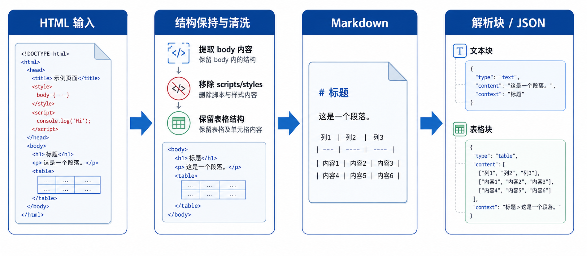

# 工作流 HTML 文件处理产品需求文档

## 1. 产品目标

支持在工作流中处理 HTML 文档，将正文转换为 Markdown，同时保留 HTML 表格结构，以便继续进行解析、分段、信息提取和下游分析。

## 2. 功能范围

### 范围内

- 创建工作流时，文档类型增加 HTML。
- 后端接收 HTML 后抽取正文，转换为 Markdown。
- HTML 表格保持原有 HTML 结构，嵌入转换后的 Markdown 中。
- 解析器提取文本与表格，并为表格分段补充前后文。
- 输出解析结果与分段结果 JSON，供下游节点使用。

### 暂不支持

- HTML 中图片、音频和视频元素的解析与分段。
- 本地上传、原始 HTML 预览与下载能力不属于当前实现范围。

## 3. 处理流程

~~~text
HTML 文件
  → 提取正文
  → 正文转 Markdown（HTML 表格保留）
  → 解析文本与表格块
  → 生成文本块与带上下文的表格块
  → 输出 JSON
~~~

## 4. 解析要求

### 4.1 Markdown 与表格

- Markdown 解析模块必须识别并提取转换文件中的全部文本内容。
- 必须识别、保留并提取 HTML 表格内容。
- 表格块应标记为 `table`，并保留正文中的原始顺序。

### 4.2 表格上下文

表格分段必须关联表格紧邻的上方与下方文本，形成表格的上下文重叠内容。下游接收的表格分段应包含：上文、表格主体、下文。

## 5. 输出数据契约

### 5.1 解析结果

~~~json
{
  "file_name": "example.html",
  "file_type": "HTML",
  "blocks_count": 3,
  "blocks": [
    {"block_id": "block-001", "type": "text", "content": "文本内容", "index": 1},
    {"block_id": "block-002", "type": "table", "level": "body", "content": "<table>...</table>", "index": 2}
  ]
}
~~~

### 5.2 分段结果

~~~json
{
  "file_name": "example.html",
  "file_type": "HTML",
  "chunks_count": 2,
  "chunks": [
    {"chunk_id": "chunk-001", "type": "text", "content": "文本内容", "index": 1},
    {"chunk_id": "chunk-002", "type": "table", "level": "body", "content": "表格上文 + 表格主体 + 表格下文", "index": 2}
  ]
}
~~~

## 6. 验收要点

| 场景 | 验收标准 |
|---|---|
| 创建工作流 | 文档类型可选择 HTML |
| 转换 | 正文转换为 Markdown，HTML 表格不被扁平化为纯文本 |
| 解析 | 文本和全部表格均生成有序解析块 |
| 分段 | 每个表格分段包含其相邻上下文并与表格主体关联 |
| 下游使用 | 解析与分段结果符合 JSON 契约，可被后续节点消费 |

## 7. 转换质量与异常处理

- 只抽取可见正文内容；脚本、样式和不可见页面装饰不应作为正文文本进入分段。
- 转换失败、正文为空或 HTML 结构不合法时，不得输出伪造的 Markdown；作业应保留文件级失败原因。
- 表格上下文以紧邻文本块为准，不能跨越另一张表格或无关章节拼接；原始 HTML 表格应同时保存在块内容与可下载产物中。
