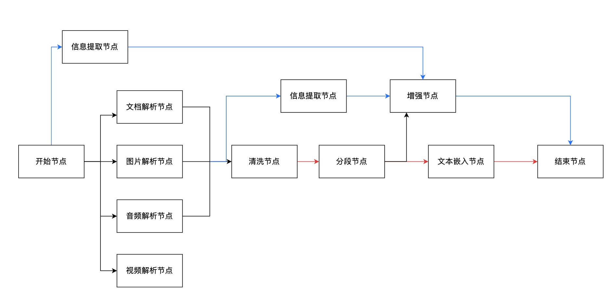

# 工作流节点优化产品需求文档

## 1. 产品目标

将复合解析流程拆分为单一职责节点，使用户能按需组合解析、清洗、分段、嵌入、信息提取和数据增强能力；一个文件在一个工作流中只产生一个最终处理结果。

## 2. 节点职责

| 节点 | 职责 |
|---|---|
| 文档解析 | 识别文档中的文本、图片、表格、标题等结构信息 |
| 图片解析 | 识别图片文字与视觉内容，形成结构化理解结果 |
| 音频解析 | 将语音转写为文本 |
| 视频解析 | 分离视频音频并转写为文本 |
| 分段 | 按规则自动切分文本 |
| 文本嵌入 | 将文本转为语义向量，支持检索 |
| 信息提取 | 使用模型和字段规则抽取关键信息 |
| 数据清洗 | 处理冗余、错误或不规范数据 |
| 数据增强 | 改写、扩充文本块，生成多样训练数据 |

## 3. 分段、提取与嵌入规则

- 信息提取与分段节点互斥；信息提取以整篇文档为单位处理。
- 添加信息提取节点后不得添加分段节点；删除信息提取节点时，其后的数据增强节点一并删除。
- 未添加信息提取节点时，数据增强依赖分段节点；删除分段节点时，其后的数据增强节点一并删除。
- 文本嵌入依赖分段节点；删除分段节点时，同时删除嵌入节点。
- 信息提取节点可直接连接数据增强节点或结束节点。

## 4. 数据清洗

- 一个工作流初期仅支持一个清洗节点。
- 默认开启第一个清洗规则。
- 至少启用一个规则；用户关闭最后一个规则时提示“请至少开启一个清洗规则”。
- 后续优先级支持清洗节点位于解析后或分段后，以及多个清洗节点。

## 5. 下载产物

| 最终节点 | 主要产物 |
|---|---|
| 解析、清洗或分段 | 解析 JSON、Markdown、图片目录、表格目录 |
| 文本嵌入 | 上述产物，另提供包含 embedding 的 JSON，默认携带 embedding |
| 信息提取 | 提取 JSON；经解析路径时保留 Markdown、图片和表格等中间产物 |
| 数据增强 | JSONL；经解析路径时保留 Markdown、图片与表格目录 |

- 同一图片在 OCR 与图像描述结果中只保存一次，两个结果引用同一图片。
- 音视频解析、嵌入、提取和增强的下载结果按各自节点输出类型生成。

## 6. 拓扑约束

| 节点 | 支持的上游 | 支持的下游 |
|---|---|---|
| 开始 | 无 | 文档、图片、音频、视频解析；信息提取 |
| 各类解析 | 开始 | 清洗、分段、信息提取、结束 |
| 清洗 | 解析或分段 | 嵌入、增强、结束 |
| 分段 | 解析 | 清洗、嵌入、增强、结束 |
| 嵌入 | 分段或清洗 | 结束 |
| 信息提取 | 开始或全部解析完成后 | 增强、结束 |
| 数据增强 | 分段、清洗或信息提取 | 结束 |

- 不支持格式的文件在解析节点或开始直连信息提取节点时被过滤，不进入处理数据卷。
- 结束节点只能连接一个上游节点，确保单一最终结果和单一路径。

## 7. 验收要点

| 场景 | 验收标准 |
|---|---|
| 职责拆分 | 用户可独立组合解析、清洗、分段、嵌入、提取与增强 |
| 互斥与依赖 | 信息提取/分段互斥；嵌入和增强的依赖删除逻辑正确 |
| 清洗 | 默认规则开启，不能关闭全部规则 |
| 下载 | 最终节点对应的 JSON、JSONL、Markdown、图片、表格和 embedding 产物齐全 |
| 路径 | 每个文件仅沿一条路径到达结束节点并生成一个最终结果 |

## 8. 执行时的拓扑校验与产物规则

- 画布新增、连线和删除节点时应立即校验依赖；删除分段或信息提取节点造成下游无效时，必须列出将被一并删除的节点并要求确认。
- 开始节点直连信息提取时，仅将模型可理解的文档与图片送入该路径；音频、视频等不支持文件应标记为“未处理”，不写入结果卷。
- 解析后接信息提取时，提取节点必须位于全部解析分支的汇聚点之后，不能只消费其中一条解析分支。
- 结束节点拒绝第二条入边。保存或运行前若存在多条终止路径，应定位冲突节点并阻止执行。
- 下载包按最终节点和原始文件类型补齐：文档类包含 `full.md`、解析 JSON、可选 `images/` 与 `tables/`；图片类不生成无意义的 Markdown；音视频类以 JSON 为主。嵌入产物应同时提供普通 JSON 与含向量 JSON，避免仅导出向量而丢失可读内容。
