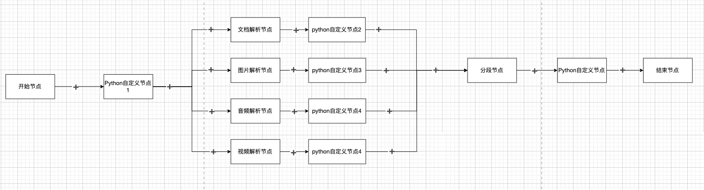
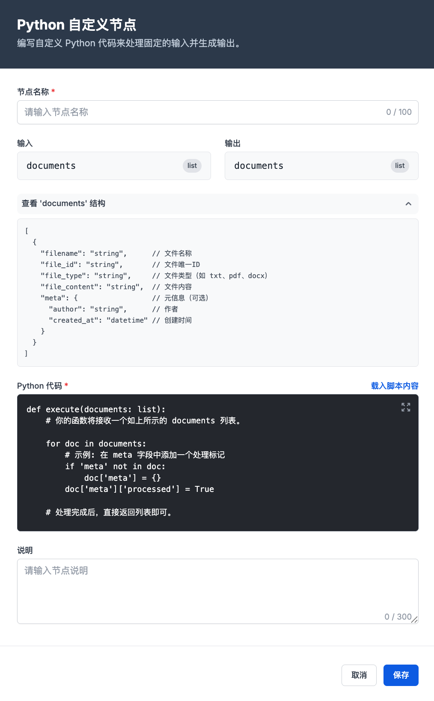

# 工作流 Python 自定义节点产品需求文档

## 1. 产品目标

允许用户在工作流节点之间编写并运行 Python 逻辑，以完成内置节点无法覆盖的文件转换、内容过滤、格式适配和数据结构转换，同时保持上下游数据契约稳定。

## 2. 适用范围

| 场景 | 示例 |
|---|---|
| 文件预处理 | 对原始文件按内容哈希去重、合并图片文件 |
| 解析后处理 | 根据业务规则重切文本分段 |
| 清洗后处理 | 对命中规则的内容进行脱敏或替换 |
| 增强后处理 | 将一种训练数据格式转换为另一种格式 |

## 3. 拓扑规则

- Python 自定义节点可插入任意两个节点之间。
- 不允许连续添加多个相邻的 Python 自定义节点。
- 当解析节点存在并行分支时，每条分支可单独插入 Python 自定义节点。
- 节点应以结构化对象接收上游数据，并返回下游可识别的相同数据类型或约定的数据结构。

## 4. 节点配置

| 配置项 | 要求 |
|---|---|
| 节点名称 | 必填，长度不超过 100 个字符 |
| 输入 | 固定展示当前上下游约定的变量名与类型 |
| 输出 | 固定展示输出变量名与类型；输出须满足下游节点契约 |
| 数据结构 | 用户可展开查看输入对象字段与示例 |
| Python 代码 | 必填，提供可编辑代码区与基础模板 |
| 说明 | 可选，长度不超过 300 个字符 |

### 4.1 基础模板

节点代码应以固定入口函数接收数据并返回处理结果。平台应在运行前校验入口函数和返回结构。

~~~python
def process(input_data):
    """接收上游数据并返回供下游使用的数据。"""
    output_data = dict(input_data)

    # 在此加入业务处理逻辑。
    file_name = output_data.get("file_name")
    if isinstance(file_name, str):
        output_data["file_name"] = file_name.strip().lower()

    return output_data
~~~

## 5. 输入输出数据契约

### 5.1 开始节点之后

- 变量名：`sources`
- 类型：`List[Source]`
- 含义：多个原始文件的元数据列表。

~~~python
sources = [
    {
        "filename": "example.txt",
        "file_id": "file-001",
        "file_type": "txt",
        "file_content": "example content"
    }
]
~~~

### 5.2 非开始节点之后

- 变量名：`documents`
- 类型：`List[Document]`
- 含义：当前处理阶段的一组文档对象；对象可以包含文件信息、文本内容、分段和扩展元数据。

~~~python
documents = [
    {
        "filename": "example.txt",
        "file_id": "file-001",
        "file_type": "txt",
        "file_content": "example content",
        "meta": {}
    }
]
~~~

### 5.3 可插入位置

自定义节点可位于以下任意处理阶段之间：

- 开始节点与文档、图片、音频或视频解析节点之间。
- 任一解析节点与分段、信息提取、数据清洗、数据增强或结束节点之间。
- 分段、文本嵌入、信息提取、数据清洗、数据增强等后续节点之间。

不同上下游组合下，文档对象字段可能不同；界面必须展示当前组合的实际字段结构，不得使用与上下游不一致的通用示例替代。

## 6. 使用示例

### 6.1 按 MD5 去除重复原始文件

适用位置：开始节点与解析节点之间。对于每个拥有二进制内容的文件计算 MD5，仅保留首次出现的内容。

~~~python
import hashlib

def deduplicate(documents):
    seen_hashes = set()
    unique_documents = []

    for document in documents:
        content = document.get("file_binary")
        if not isinstance(content, bytes):
            continue

        digest = hashlib.md5(content).hexdigest()
        if digest not in seen_hashes:
            seen_hashes.add(digest)
            unique_documents.append(document)

    return unique_documents

documents = deduplicate(documents)
~~~

### 6.2 将 PNG 文件合并为 PDF

适用位置：开始节点与解析节点之间。筛选指定路径下的 PNG 文件，转换为 RGB 后生成一个 PDF 文件，移除原 PNG 条目并将新 PDF 文档加入列表。

~~~python
from PIL import Image
import io

png_files = [
    doc for doc in documents
    if doc.get("file_type") == "png"
    and str(doc.get("file_path", "")).startswith("./files/")
]

if png_files:
    images = [Image.open(io.BytesIO(doc["file_binary"])).convert("RGB") for doc in png_files]
    buffer = io.BytesIO()
    images[0].save(buffer, format="PDF", save_all=True, append_images=images[1:])

    documents = [doc for doc in documents if doc.get("file_type") != "png"]
    documents.append({
        "file_id": "generated-pdf-001",
        "filename": "merged_images.pdf",
        "file_type": "pdf",
        "file_binary": buffer.getvalue(),
        "file_path": "./files/merged_images.pdf"
    })
~~~

### 6.3 按句号重新分段

适用位置：解析节点与清洗节点之间。遍历文档分段，若文本包含句号则切分为新的分段，并生成新的分段标识。

~~~python
for document in documents:
    file_id = document["file_id"]
    segments = []
    counter = 1

    for segment in document.get("segments", []):
        content = segment.get("content", "")
        parts = [part.strip() + "." for part in content.split(".") if part.strip()]
        for part in parts or [content]:
            segments.append({
                "chunk_id": f"{file_id}-{counter:03d}",
                "type": "text",
                "content": part
            })
            counter += 1

    document["segments"] = segments
~~~

### 6.4 按规则对文本片段脱敏

适用位置：清洗节点与增强节点之间。示例使用占位符替换命中词；实际规则应由项目的数据安全规范配置。

~~~python
terms_to_mask = {"示例姓名甲", "示例姓名乙"}

for document in documents:
    for segment in document.get("segments", []):
        content = segment.get("content", "")
        for term in terms_to_mask:
            content = content.replace(term, "***")
        segment["content"] = content
~~~

### 6.5 将 Alpaca 格式转换为 ShareGPT 格式

适用位置：数据增强节点之后。遍历每个分段中的问答对，并写入 `sharegpt` 字段。

~~~python
for document in documents:
    conversations = []
    for segment in document.get("segments", []):
        for qa in segment.get("qa_pairs", []):
            prompt = qa.get("instruction", "").strip()
            input_text = qa.get("input", "").strip()
            if input_text:
                prompt = f"{prompt}\n{input_text}"

            conversations.append([
                {"from": "human", "value": prompt},
                {"from": "gpt", "value": qa.get("output", "")}
            ])
    document["sharegpt"] = conversations
~~~

## 7. 执行与错误处理

- 运行环境应只向脚本暴露约定的输入数据和允许的依赖。
- 代码运行失败时，作业日志必须记录节点名称、失败原因和可定位的上下文。
- 单个文件或文档处理失败时，应保留文件级失败信息，避免掩盖其他文件的处理结果。
- 平台应校验输出变量的类型和必需字段；不兼容的输出不得继续传递给下游节点。
- 运行环境不应暴露宿主机文件系统、网络凭据、内部服务令牌或未声明的环境变量；依赖安装、资源上限和超时策略由平台统一控制。
- 脚本应使用固定入口函数并返回与当前插入位置匹配的 `sources` 或 `documents` 集合；示例中的处理逻辑应封装在该入口中，避免顶层语句造成不同运行器行为不一致。
- 运行中止、超时或依赖不可用时，节点状态标为失败并保留已完成文件的独立结果；重试仅重跑失败范围，除非用户明确选择全量重跑。

## 8. 验收要点

| 场景 | 验收标准 |
|---|---|
| 插入节点 | 可在任意两个兼容节点间添加；连续添加会被阻止；并行解析分支可独立添加 |
| 配置节点 | 用户可填写名称、说明和代码，并查看当前输入输出结构 |
| 数据契约 | 开始节点后使用 `sources`，其他位置使用 `documents`；结构不匹配时阻止执行或给出明确错误 |
| 脚本执行 | 支持文件去重、格式转换、分段改写、脱敏和训练格式转换等逻辑 |
| 失败定位 | 错误能定位到自定义节点及受影响文件，且日志可查看 |
