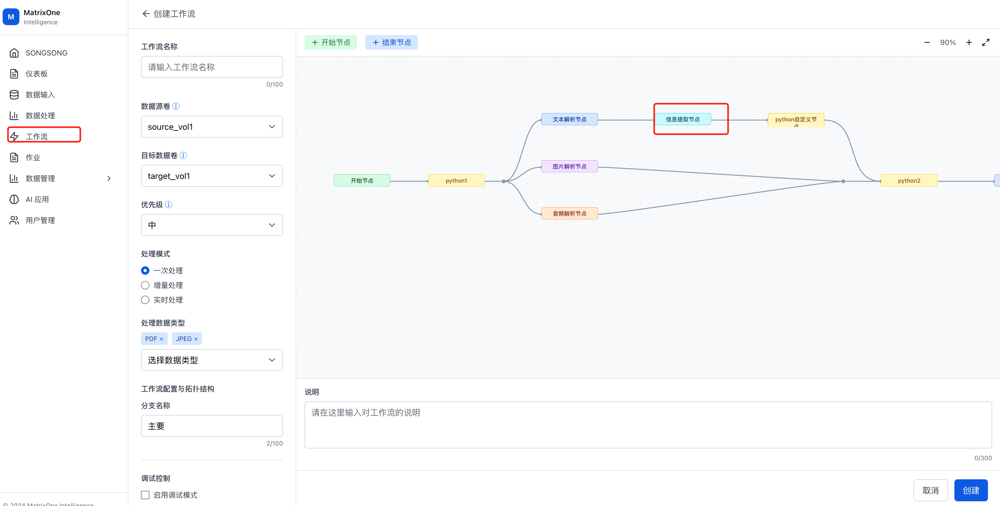

# 工作流结构化提取节点产品需求文档

## 1. 产品目标

通过 JSON Schema 与模型能力，从文本、文档和图片中抽取符合预定义结构的字段，减少人工格式转换并为报表、检索和训练数据提供标准化输出。

## 2. 节点关系与限制

| 项目 | 要求 |
|---|---|
| 上游 | 可接开始节点；仅处理模型支持的文本与图片类型。可接解析节点，但须位于同一工作流全部解析节点之后 |
| 下游 | 数据增强节点或结束节点 |
| 数量 | 每个工作流最多一个信息提取节点 |
| 长度 | 开始节点直连时，单文件上下文不得超过所选模型上限 |
| 输出 | 整个信息提取结果 JSON 作为一个可供下游消费的分块 |

## 3. 节点配置

| 字段 | 要求 |
|---|---|
| 节点名称 | 必填，遵循工作流节点命名规则 |
| 提取模型 | 必选，下拉选择 |
| 提取字段 | 必填；支持表单配置和 JSON 编辑器（后续优先级）双向同步 |
| 说明 | 可选 |

字段结构限制：字段总数不超过 40、嵌套深度不超过 4；字段名可包含文字、下划线、中划线和空格。图片处理使用 OCR 文本，不使用图像描述。

## 4. 表单模式

| 配置项 | 规则 |
|---|---|
| 字段名称 | 必填，同层唯一，最多 50 字符 |
| 字段类型 | String、Number、Boolean、Object、Array；数组元素可为上述基础类型或 Object |
| 字段描述 | 可选，最多 200 字符；作为提取提示的一部分 |
| 必填 | 每个字段可设置是否必须提取；映射为 JSON Schema 的 `required` |
| 字段操作 | 任意层级增加、删除、折叠与展开；删除需二次确认 |

- Object 类型改为 Object 或 Array；Array/Object 不可改为其他类型。
- 其他基础类型可相互切换。
- Object 字段创建时自动添加一个嵌套子字段。
- 同层字段名为空或重复时，不允许保存。

### JSON Schema 示例

~~~json
{
  "type": "object",
  "properties": {
    "record_id": {"type": "string"},
    "created_at": {"type": "string"},
    "status": {"type": "string"}
  },
  "required": ["record_id", "created_at"]
}
~~~

## 5. JSON 编辑器

- 根节点必须为 `object`，且必须声明 `properties` 和 `required`。
- 每一层对象均需显式声明 `type: object`、`properties` 与 `required`。
- 默认禁止未声明字段。
- 支持语法实时校验、编辑器放大和表单/JSON 双向同步。
- 仅在 JSON 语法与 Schema 约束均正确时允许保存；错误时提供明确提示。

## 6. 结果查看与下载

- 在处理数据卷的文件预览中展示结构化输出，并支持在完整 JSON 中搜索。
- 若节点位于解析节点之后，下载结果包含 `full.md` 与结构化 JSON。
- 输出以简洁的数据实体格式展示，不附加无关的演示层。

### 6.1 保存、校验与失败反馈

- 配置切换或保存前，系统同时检查模型是否已选择、字段是否存在、同层字段名是否重复，以及 Schema 是否满足根对象约束。
- 删除字段需显示字段名并二次确认；取消操作不得改变当前配置。
- 模型上下文不足、输入文件类型不受支持或提取结果不符合 Schema 时，作业应记录节点级失败原因；不得生成看似成功的空结果。
- 提取结果为空但执行成功时，保留合法空对象/数组，并在预览中明确显示“未提取到符合字段规则的内容”。

## 7. 验收要点

| 场景 | 验收标准 |
|---|---|
| 拓扑 | 只能按允许的上、下游连接；同一工作流不能添加第二个提取节点 |
| 表单 | 字段、类型、必填与层级限制正确校验 |
| Schema | JSON 编辑器实时校验，表单与 JSON 切换后结构一致 |
| 图片 | 使用 OCR 内容作为提取输入 |
| 结果 | 可预览、搜索并按处理路径下载结构化结果 |
