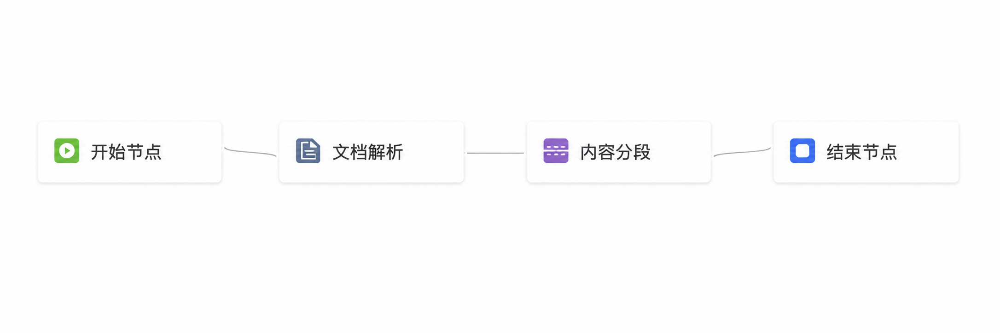

# 工作流模板国际化产品需求文档

## 1. 产品目标

为预设工作流模板提供英文界面内容与说明，使不同语言用户能理解模板用途、输入输出和使用路径，并基于同一模板配置创建工作流。

## 2. 国际化模板

| 模板 | 英文名称 | 处理目标 |
|---|---|---|
| 图文混合文档 RAG 数据准备 | RAG Data Preparation for Text-Image Documents | 解析图文文档并生成适合检索的多模态知识数据 |
| 人才简历信息提取 | Talent Resume Information Extraction | 从简历中提取个人信息、教育、经历和技能等结构化字段 |
| 法律知识微调数据生成 | Legal Knowledge Fine-Tuning Data Generation | 解析法律资料并生成适合指令微调的结构化数据 |

## 3. 模板详情

每个语言版本的详情页均包含：

- 模板名称与功能说明。
- 通用、脱敏的处理效果示例。
- 只读工作流拓扑图与节点配置说明。
- 从上传文件、运行处理到下游应用的使用说明。
- “使用模板”入口，进入创建工作流页面。

### 3.1 模板拓扑示意

## 4. 使用规则

- 使用模板时预填模板中的工作流配置，用户选择目标数据卷后创建工作流。
- 多语言版本必须表达相同的处理目标、输入输出与节点语义。
- 不在模板详情中暴露生产工作流标识、作业标识、内部文档链接或特定样例文件链接。
- 示例文件和效果图必须使用无个人信息、无账号信息的通用资料。
- 翻译键应覆盖模板列表、详情、节点说明、样例输入/输出和创建入口；语言切换不得改变模板拓扑、默认参数或可用节点。
- 缺失译文时回退到默认语言并记录待补齐项，不得显示内部键名或空白标签。

## 5. 验收要点

| 场景 | 验收标准 |
|---|---|
| 文案 | 三个模板均有完整英文名称与说明 |
| 等价性 | 中英文版本的处理流程、节点语义和输出目标一致 |
| 详情页 | 可查看拓扑、说明和使用入口，不泄露生产标识或内部链接 |
| 创建 | 使用任一语言版本都能预填同一模板配置并进入创建流程 |
