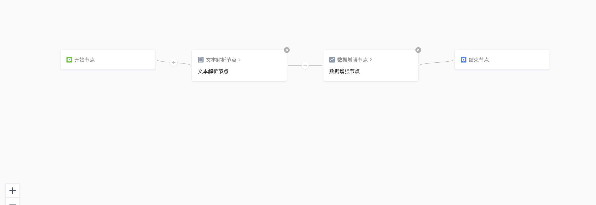

# 工作流模板产品需求文档

## 1. 产品目标

提供可复用的预设工作流模板，使用户不必从零配置节点和参数，即可快速建立面向知识检索、结构化提取和训练数据生成等场景的数据处理流程。

## 2. 模板中心

### 2.1 入口与列表

- 在数据处理模块新增“模板”二级入口。
- 以卡片形式展示每个模板。
- 每张卡片展示模板正式名称、简要说明、“查看详情”和“使用模板”操作。

| 卡片字段 | 要求 |
|---|---|
| 模板名称 | 展示正式名称；可提供中英文名称 |
| 模板说明 | 说明适用文件、处理能力和预期用途 |
| 查看详情 | 进入只读模板详情页 |
| 使用模板 | 进入创建工作流页，并预填模板配置 |

### 2.2 模板详情

模板详情页应包含：

| 模块 | 要求 |
|---|---|
| 模板名称与说明 | 明确模板用途、输入类型和输出目标 |
| 处理效果示例 | 展示原文件、处理结果与应用效果的示意；支持放大查看 |
| 工作流拓扑图 | 只读展示；用户可查看节点配置但不能在详情页修改 |
| 使用说明 | 描述从文件上传、执行处理到下游应用的完整路径 |
| 使用模板 | 进入工作流创建页 |

### 2.3 样例数据

模板样例文件存放于默认工作区的原始数据“样例数据”卷。

- 样例数据卷只读。
- 支持预览和下载样例文件。
- 不能在数据载入任务中选择样例数据卷。
- 不能将样例数据卷作为处理数据卷。
- 前端应禁用相应选择项，而不是在提交后报错。

### 2.4 使用模板

- 点击“使用模板”后直接进入工作流创建页。
- 除目标数据卷外，系统预填模板中的全部工作流配置。
- 工作流名称默认使用模板名称；名称冲突时提示用户修改。
- 用户选择目标数据卷后，仍可按权限与规则调整预填配置并创建工作流。

## 3. 预设模板

### 3.1 图文混合文档 RAG 数据准备

| 项目 | 内容 |
|---|---|
| 输入 | 包含段落与插图的图文混合文档 |
| 处理 | 文本与图像解析、内容分段、可选的上下文或多模态处理 |
| 输出 | 面向检索与问答使用的高质量知识数据 |
| 适用场景 | 图文知识库、内部文档检索、资料摘要 |

使用路径：上传图文文档，运行解析和分段流程，将处理结果接入知识库、检索或问答应用。

### 3.2 人才简历信息提取

| 项目 | 内容 |
|---|---|
| 输入 | 候选人简历文件 |
| 处理 | 文档解析与结构化信息提取 |
| 输出 | 基本信息、教育背景、工作经历、项目经历与技能等结构化字段 |
| 适用场景 | 招聘系统、人才管理、候选人筛选和画像分析 |

使用路径：上传简历，运行信息提取流程，将结构化结果写入下游数据存储；结果可被查询和筛选应用使用。

### 3.3 法律知识微调数据生成

| 项目 | 内容 |
|---|---|
| 输入 | 法律文本、法规材料或案例资料 |
| 处理 | 文本解析、分段、指令数据增强与结构化输出 |
| 输出 | 适合监督微调的数据样本，例如 Alpaca 风格 JSONL |
| 适用场景 | 法律领域问答、指令数据准备、模型训练与评估 |

#### 生成风格

- 使用正式、严谨的表达与准确术语。
- 在需要时引用相关条文或解释。
- 输出结构清晰、逻辑完整、客观中立，避免口语化措辞。

示例输出格式：

~~~json
{
  "instruction": "解释劳动合同解除的条件。",
  "input": "",
  "output": "劳动合同解除应满足法律规定的条件，或由双方协商一致。"
}
~~~

## 4. 配置与维护规则

| 事项 | 规则 |
|---|---|
| 模板拓扑 | 在详情页只读；用户通过“使用模板”创建自己的工作流后再编辑 |
| 节点配置 | 模板可以提供固定默认值；模板能力依赖的节点未就绪时，不应提供不可执行配置 |
| 样例效果 | 使用不含个人信息、账号、内部标识的通用示例 |
| 文档说明 | 维护面向用户的操作文档，描述输入、处理、输出和下游使用方式 |
| 语言版本 | 中英文模板保持等价的处理目标与配置语义 |

### 4.1 创建失败与模板演进

- 目标数据卷无权限、已被占用或名称冲突时，保留用户已编辑的配置并定位错误；不应让用户回到空白创建页。
- 模板更新不回写已由用户创建的工作流。模板详情可演进，用户工作流保留创建时的独立节点配置。
- 模板示例中的文件、图像和输出需经脱敏审查；无法确认安全性的图片不在模板详情中展示。

## 5. 验收要点

| 场景 | 验收标准 |
|---|---|
| 浏览模板 | 可在模板入口查看卡片并进入详情 |
| 查看详情 | 名称、说明、效果示例、只读拓扑、使用说明与操作入口完整显示 |
| 样例数据 | 可预览或下载，且不能作为载入源或处理目标选择 |
| 使用模板 | 创建页预填配置，用户仅需选择目标数据卷并处理名称冲突 |
| 三类模板 | 图文 RAG、简历提取、法律微调数据生成均有明确输入、输出与处理路径 |
