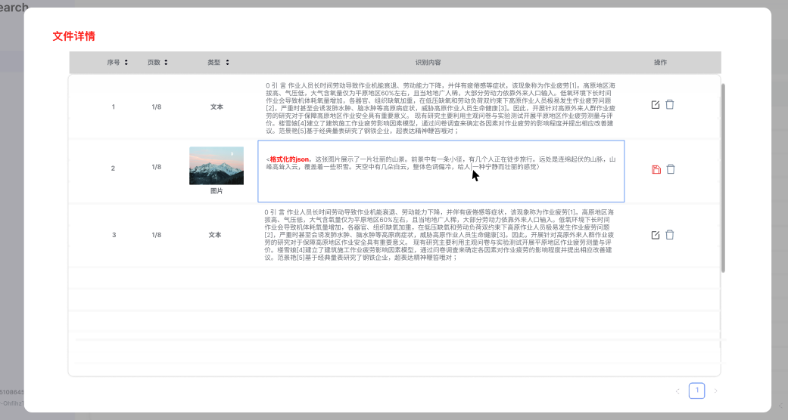

# AI Search Beta 产品需求文档

## 1. 产品目标

AI Search Beta 提供外部数据接入、文件与表数据管理、可视化标注、图文检索、对话式分析和以图搜图能力。用户先连接数据源并导入内容，再校验解析结果，最后在文档、图片与结构化数据上完成搜索和分析。

### 本期重点

- 建立文件、对象存储与数据库的连接及导入链路。
- 为非结构化文档和图片提供可编辑的解析结果。
- 提供图文检索、数据库问答与图像相似搜索的基础体验。
- 展示数据向量化及检索结果的可观测信息。

## 2. 核心对象

| 对象 | 说明 |
|---|---|
| 连接器 | 保存数据源类型、连接配置、授权状态和最近更新时间 |
| 数据源 | 本地文件、第三方云盘、对象存储或数据库连接 |
| 文件 / 数据表 | 导入后的可管理对象，记录来源、格式、大小、状态与时间 |
| 解析块 | 文档或图片解析得到的文本、图像、表格等可标注内容 |
| 标注 | 用户对识别内容、图片语义或检索关键词的修订 |
| 搜索会话 | 图文检索或结构化数据分析的一次查询及其引用 |

## 3. 连接器

### 3.1 连接器列表

列表展示名称、数据源类型、更新时间、授权账号摘要和操作。支持编辑、删除和测试连接；删除必须二次确认。修改或删除连接器不应篡改已导入数据的内容与历史记录。

### 3.2 创建与测试

数据库连接需配置名称、主机、端口、账号与密码等必要字段；第三方服务通过授权流程获得账号信息。创建前可测试连接：

- 测试成功时展示成功状态与可识别的服务信息。
- 测试失败时展示可行动的失败原因，而不只显示笼统错误。
- 允许保存未通过测试的连接器；实际导入前需再次验证可用性。

## 4. 数据管理

### 4.1 数据概览

数据页按来源展示文件数量、数据总量和对象类型统计。非结构化内容可按文本、图片等类型查看；数据库展示表数量和数据规模。统计应支持多个已授权账户，后续可扩展至按账户分组。

### 4.2 导入流程

~~~text
选择数据源 → 选择连接 → 后台验证 → 选择文件或数据表
→ 确认导入 / 同步 → 跳转列表查看上传与解析状态
~~~

- 本地文件支持直接上传。
- 外部文件源支持多选文件；不支持的媒体格式应在选择阶段明确提示。
- 数据库支持选择一个或多个表并发起同步。
- 连接验证失败时，返回连接选择页并提供前往编辑的入口。
- 导入进行中对象不可查看或删除；失败对象允许查看错误、删除或重新导入。

### 4.3 文件与数据表列表

| 字段 | 文件对象 | 数据表对象 |
|---|---|---|
| 来源 | 本地或连接器名称 | 连接器名称、数据库 |
| 标识 | 文件名、格式 | 表名 |
| 规模 | 文件大小 | 数据大小 |
| 时间 | 上传完成时间、标注更新时间 | 同步完成时间 |
| 状态 | 上传中、上传完成/失败、解析中、解析完成/失败 | 同步中、同步完成/失败 |
| 操作 | 进入详情、删除、失败后重试 | 查看表详情、删除、失败后重试 |

文件名点击后进入解析与标注；数据库表展示结构详情，不进入非结构化标注流程。

## 5. 可视化标注

可视化标注用于人工修订解析结果，提升内容完整性和后续检索质量。

### 5.1 文档与图片

解析块列表展示顺序、类型、缩略图或文本、识别内容和操作。用户可编辑或删除单个块；编辑状态下保存修订内容并更新标注时间。图片语义识别结果以结构化格式展示，支持人工修正。

### 5.2 数据表

数据表详情展示字段名、数据类型、默认值、可空性、键类型以及最大、最小值等元数据。表格详情以查看为主，不在本期引入文本块标注。

### 5.3 体验规则

- 解析块采用分页查看，避免长文档一次性加载。
- 原始内容与识别内容应能对照，便于定位错误。
- 标注保存失败时保留编辑内容并提示重试。

## 6. 搜索与分析

### 6.1 图文检索

用户可输入文字或上传一张符合格式和体积限制的图片。系统在文本和图像数据中检索，返回总结性内容、相关图片以及可展开的引用来源。文本查询若只命中文本，结果只展示文本；命中图像时同时返回关联图片与说明。

### 6.2 结构化数据问答

数据库分析模式仅接收文字输入，面向已同步的数据表进行检索和分析。结果包含解释性文字、数据结果、图表及引用信息；输出须注明数据范围与指标口径。

### 6.3 混合检索与向量可观测

系统支持在后续版本中组合结构化数据、文档和图片信息完成复合问题回答。数据侧可展示向量聚合和分布等概览；结果侧可展示命中内容与其向量检索相关性，帮助定位检索质量问题。

### 6.4 以图搜图

用户拖入图片后，系统返回语义相近或视觉相似的图片结果。后续迭代可完善输入提示、结果筛选和图片结果解释。

## 7. 状态、异常与验收

### 7.1 状态与异常

- 上传、同步、解析和标注状态必须区分展示，不能以单一“处理中”替代。
- 连接、导入、解析或搜索失败时，展示失败原因和可执行的重试入口。
- 已导入对象在连接器变更后保持历史可见；新导入按最新连接配置执行。

### 7.2 验收标准

- 用户可创建、测试、编辑和删除连接器，并从有效连接导入文件或数据表。
- 文件和数据表列表正确展示来源、规模、时间和细粒度状态。
- 用户能进入文件详情查看、编辑和删除解析块；数据表可查看结构信息。
- 图文检索、结构化数据问答与以图搜图均能返回与模式一致的结果和来源信息。
- 失败状态提供具体原因与重试路径，避免静默失败。
